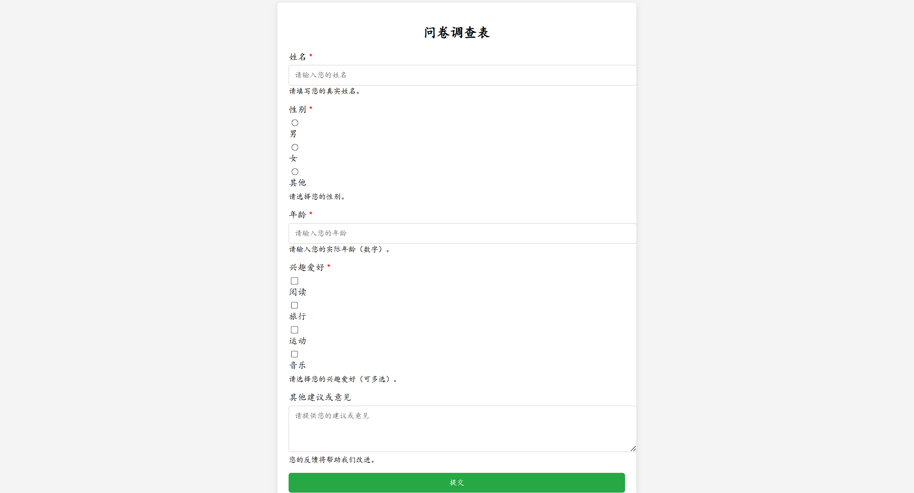

# 问卷调查表项目实验报告

## 摘要

本实验设计并实现了一个基于HTML、CSS和JavaScript的问卷调查表。通过前端技术的综合应用，构建了用户友好的表单界面，涵盖姓名、性别、年龄、兴趣爱好及反馈意见等多个输入项。实验过程中，深入理解了表单验证、响应式设计以及用户交互的实现方法，掌握了前端开发中的关键技术。实验结果表明，该问卷调查表具备良好的用户体验和数据有效性，能够满足基本的调查需求。

**Abstract**

This experiment designed and implemented a survey form based on HTML, CSS, and JavaScript. By integrating front-end technologies, a user-friendly form interface was constructed, covering multiple input fields such as name, gender, age, hobbies, and feedback. During the experiment, a deep understanding of form validation, responsive design, and user interaction was attained, mastering key front-end development technologies. The experimental results demonstrate that the survey form offers excellent user experience and data validity, meeting basic survey requirements.

## 关键词

问卷调查表；前端开发；表单验证；响应式设计；用户交互  
**Keywords**  
Survey Form; Front-end Development; Form Validation; Responsive Design; User Interaction

## 一、实验目的

1. 掌握HTML、CSS和JavaScript在前端开发中的基本应用。
2. 理解和应用表单构建与验证的基本原理。
3. 设计并实现一个功能完备且用户友好的问卷调查表。
4. 提升前端项目的综合设计与实现能力，增强代码的可读性和可维护性。

## 二、实验要求

1. 使用HTML构建问卷调查表的基本结构，包括各类输入控件。
2. 运用CSS进行页面布局和样式设计，确保表单界面美观且具有良好的用户体验。
3. 使用JavaScript实现表单的前端验证，确保用户输入的有效性。
4. 确保问卷调查表在不同浏览器和设备上的兼容性和响应式设计。
5. 编写清晰、规范的代码，注重代码的可读性和可维护性。

## 三、实验步骤

### 1. 项目初始化

- 创建项目文件夹，包含`index.html`、`styles.css`和`script.js`三个文件。
- 设置HTML文档的基本结构，引用CSS和JavaScript文件。

### 2. 构建HTML结构

- 在`index.html`中，创建一个`div`容器用于包裹整个问卷表单。
- 添加标题“问卷调查表”以明确表单的用途。
- 使用`form`标签构建表单结构，包含多个`div.form-group`用于不同的输入项：
  - 姓名输入框（文本输入）
  - 性别选择（单选按钮）
  - 年龄输入框（文本输入）
  - 兴趣爱好选择（复选框）
  - 反馈意见（文本区域）
- 添加提交按钮以提交表单数据。

### 3. 设计CSS样式

- 在`styles.css`中，设置页面的基础样式，包括字体、背景色、布局等。
- 为容器、表单组、标签、输入控件及按钮设计样式，确保界面美观且响应式。
- 使用盒模型、边框、圆角、阴影等CSS属性增强视觉效果。
- 添加悬停效果和按钮的交互样式，提升用户体验。

### 4. 编写JavaScript功能

- 在`script.js`中，获取表单元素并添加提交事件监听器。
- 实现表单验证功能：
  - 检查所有必填字段是否已填写。
  - 验证年龄输入为数字。
  - 根据验证结果调整输入框样式并提示用户。
- 如果表单验证失败，阻止表单提交并提示用户填写完整信息。

### 5. 测试与优化

- 在不同浏览器（如Chrome、Firefox、Edge）和设备（如手机、平板、桌面）中测试问卷调查表的功能和样式。
- 优化代码结构，提升性能和可读性。
- 根据测试结果进行必要的调整和修正，确保表单在各种环境下均能正常运行。

## 四、知识点说明

### 1. HTML结构设计

通过合理的HTML标签组织，构建出问卷调查表的基本布局。使用`form`元素包裹整个表单，`div.form-group`组织各个输入项，`label`与输入控件关联，提高表单的可访问性。使用不同类型的输入控件（文本框、单选按钮、复选框、文本区域）满足不同的数据输入需求。

### 2. CSS样式应用

运用CSS进行页面美化，包括设置字体、颜色、布局、响应式设计等。使用盒模型、边框、圆角、阴影等属性增强视觉效果。通过类选择器和伪类选择器实现输入控件的不同状态（如悬停、焦点）。采用弹性盒布局（Flexbox）或网格布局（Grid）实现响应式设计，确保表单在不同设备上均能良好显示。

### 3. JavaScript动态功能

使用JavaScript进行表单验证，确保用户输入的有效性。通过事件监听器（如`submit`事件）捕捉用户操作，使用DOM操作获取和修改表单元素的属性和样式。利用正则表达式或内置方法验证输入数据，如检查年龄是否为数字。通过动态提示和样式调整，引导用户正确填写表单。

### 4. 表单验证与用户交互

掌握前端表单验证的基本方法，通过JavaScript检查用户输入的数据是否符合要求。通过动态修改CSS样式（如边框颜色）和弹出提示（如`alert`）反馈验证结果，提升用户体验。确保用户在提交表单前，已正确填写所有必填项，减少服务器端的验证压力。

## 五、实验结果

实验成功实现了一个功能完备的问卷调查表，具备以下特点：

1. **结构清晰的表单布局**：各类输入项井然有序，用户易于理解和填写。
2. **美观且响应式的界面设计**：表单在不同设备和浏览器中均能良好显示，提供一致的用户体验。
3. **有效的前端表单验证**：确保用户填写的必填项完整且有效，提升数据的准确性。
4. **良好的用户交互体验**：通过动态样式调整和提示信息，引导用户正确填写表单。
5. **简洁且规范的代码结构**：代码可读性强，便于维护和扩展。

### 实验截图

## 六、实验分析与讨论

### 功能实现分析

通过HTML、CSS和JavaScript的协同工作，成功实现了问卷调查表的基本功能。HTML负责构建结构，CSS负责样式设计，JavaScript负责表单验证和用户交互。前端验证确保了数据的初步有效性，提升了用户体验和数据质量。

### 存在的问题

1. **年龄输入验证不足**：目前仅检查年龄是否为空和是否为数字，未限制年龄的合理范围（如1-120）。
2. **表单提交后的处理**：未实现实际的数据提交和后端处理，表单提交后页面刷新，未提供进一步的反馈信息。
3. **可访问性不足**：虽然使用了`label`与输入控件关联，但在键盘导航和屏幕阅读器支持方面仍有提升空间。
4. **缺乏高级功能**：如动态添加或删除兴趣爱好选项、实时输入提示等功能尚未实现。

### 改进建议

1. **增强年龄验证**：在JavaScript中增加年龄范围的检查，确保用户输入的年龄在合理范围内。
2. **实现表单数据提交**：通过与后端服务器的接口对接，实现数据的实际提交和存储，并在提交后提供成功反馈。
3. **提升可访问性**：增加ARIA属性，优化键盘导航，确保表单对所有用户友好。
4. **增加高级功能**：如添加实时验证提示、动态兴趣选项管理、表单自动保存等功能，提升表单的实用性和用户体验。
5. **优化表单布局**：采用更先进的布局技术（如CSS Grid），进一步提升表单在复杂设备上的适配能力。

## 七、实验结论

本实验通过设计和实现一个基于前端技术的问卷调查表，深入理解了HTML、CSS和JavaScript在实际项目中的应用。实验不仅巩固了前端开发的基础知识，还提升了综合设计和问题解决能力。尽管存在一些不足，但整体成果达到了预期目标，为进一步的功能扩展和优化打下了良好的基础。未来工作将着重于增强表单验证、实现数据提交与处理、提升可访问性以及增加更多实用功能，进一步完善问卷调查表的功能和用户体验。

## 八、心得体会

通过本次实验，我深刻体会到前端开发的复杂性与趣味性。HTML、CSS和JavaScript作为前端开发的三大基石，各自发挥着不可或缺的作用。特别是在设计用户友好的表单时，需要综合考虑布局、样式和交互，确保表单既美观又实用。表单验证的实现不仅提升了数据的准确性，也增强了用户体验，避免了不必要的错误提交。同时，实验过程中也认识到代码结构和优化的重要性，只有编写清晰、规范的代码，才能提高项目的可维护性和扩展性。通过不断的学习和实践，我对前端开发的理解更加深入，未来将继续探索更多前端技术，提升自身的开发能力。