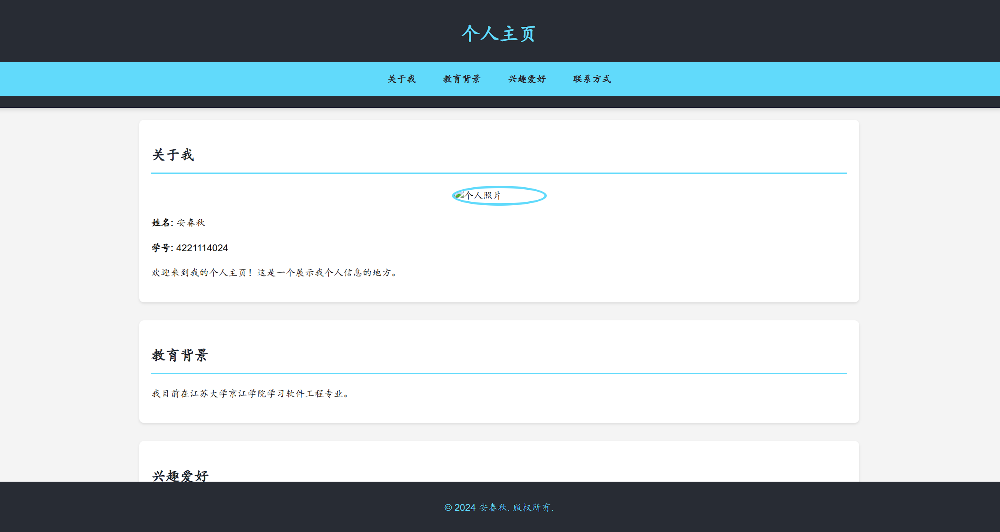

# 个人主页项目实验报告

## 摘要

本实验设计并实现了一个基于HTML和CSS的个人主页。通过前端技术的综合应用，构建了一个结构清晰、美观且响应式的个人主页，涵盖关于我、教育背景、兴趣爱好及联系方式等多个部分。实验过程中，深入理解了HTML语义化标签的使用、CSS布局与样式设计以及响应式网页设计的基本原理。实验结果表明，该个人主页具备良好的用户体验和视觉效果，能够有效展示个人信息，并在不同设备上保持良好的适配性。

**Abstract**

This experiment designed and implemented a personal homepage based on HTML and CSS. By integrating front-end technologies, a clear-structured, aesthetically pleasing, and responsive personal homepage was constructed, covering sections such as About Me, Education Background, Interests, and Contact Information. During the experiment, a deep understanding of the use of semantic HTML tags, CSS layout and styling, and the fundamentals of responsive web design was attained. The experimental results demonstrate that the personal homepage offers excellent user experience and visual appeal, effectively showcasing personal information while maintaining good adaptability across different devices.

## 关键词

个人主页；前端开发；HTML；CSS；响应式设计  
**Keywords**  
Personal Homepage; Front-end Development; HTML; CSS; Responsive Design

## 一、实验目的

1. 掌握HTML和CSS在前端开发中的基本应用。
2. 理解并运用HTML语义化标签构建结构化网页。
3. 掌握CSS布局技术，如盒模型、Flexbox布局及媒体查询。
4. 设计并实现一个美观且响应式的个人主页。
5. 提升前端项目的综合设计与实现能力，增强代码的可读性和可维护性。

## 二、实验要求

1. 使用HTML构建个人主页的基本结构，包括多个信息展示部分。
2. 运用CSS进行页面布局和样式设计，确保主页界面美观且具有良好的用户体验。
3. 实现响应式设计，确保主页在不同设备和屏幕尺寸下均能良好显示。
4. 使用语义化的HTML标签，提高网页的可访问性和SEO效果。
5. 编写清晰、规范的代码，注重代码的可读性和可维护性。

## 三、实验步骤

### 1. 项目初始化

- 创建项目文件夹，包含`index.html`和`styles.css`两个文件。
- 设置HTML文档的基本结构，引用CSS文件。

### 2. 构建HTML结构

- 在`index.html`中，创建一个`header`部分，包含主页标题和导航栏。
- 使用`nav`标签创建导航菜单，链接到不同的页面部分（关于我、教育背景、兴趣爱好、联系方式）。
- 创建`main`部分，包含多个`section`标签，每个`section`对应一个信息展示区域：
  - **关于我**：包括个人照片、姓名、学号及简介。
  - **教育背景**：展示教育信息。
  - **兴趣爱好**：使用无序列表展示兴趣。
  - **联系方式**：提供电子邮件和电话信息。
- 添加`footer`部分，包含版权信息。

### 3. 设计CSS样式

- 在`styles.css`中，设置全局样式，包括字体、行高、背景色、边距和填充。
- 为`header`设计背景色、文字颜色、内边距及阴影效果。
- 为导航栏`nav`及其链接`a`设置样式，包括颜色、文本装饰、内边距及悬停效果。
- 设计`main`部分的布局，设置最大宽度和居中显示。
- 为个人照片设置圆形效果、边框及居中对齐。
- 为各个`section`设置背景色、内边距、圆角及阴影效果，增强视觉层次感。
- 设置`footer`的样式，包括背景色、文字颜色、内边距及固定在页面底部。
- 使用媒体查询实现响应式设计，调整导航栏布局和个人照片大小以适应不同屏幕尺寸。

### 4. 测试与优化

- 在不同浏览器（如Chrome、Firefox、Edge）和设备（如手机、平板、桌面）中测试个人主页的显示效果和功能。
- 优化代码结构，确保CSS样式简洁且高效。
- 根据测试结果进行必要的调整和修正，确保主页在各种环境下均能正常运行。
- 检查并修正可能存在的兼容性问题，确保跨浏览器一致性。

## 四、知识点说明

### 1. HTML语义化标签设计

通过使用语义化的HTML标签（如`header`、`nav`、`main`、`section`、`footer`），构建出结构清晰且易于理解的网页布局。这不仅提高了网页的可读性和可维护性，还增强了SEO效果和可访问性，使得辅助技术（如屏幕阅读器）能够更好地解析网页内容。

### 2. CSS布局与样式设计

运用CSS进行页面美化，包括设置字体、颜色、背景、边距和填充等基础样式。使用盒模型理解元素的宽高、内边距、边框和外边距的关系，掌握Flexbox布局技术，实现响应式和灵活的页面布局。通过添加圆角、阴影和过渡效果，提升网页的视觉层次感和用户体验。

### 3. 响应式网页设计

采用媒体查询（@media）实现响应式设计，根据不同的屏幕宽度调整页面布局和元素样式。确保个人主页在移动设备、平板和桌面设备上均能良好显示，提供一致且优化的用户体验。调整导航栏布局和个人照片大小，以适应不同的显示环境。

### 4. CSS伪类与交互效果

使用CSS伪类（如`:hover`）为导航链接和按钮添加悬停效果，提升用户的交互体验。通过过渡效果（transition）实现平滑的样式变化，增强视觉吸引力。利用CSS选择器精准定位和样式化特定元素，提高样式表的效率和可维护性。

### 5. 固定布局与流式布局

在设计`footer`时，使用固定定位（position: fixed）将其固定在页面底部，确保版权信息始终可见。通过流式布局（流动布局）实现页面内容的自适应排列，使网页在不同设备和屏幕尺寸下保持良好的布局结构。

## 五、实验结果

实验成功设计并实现了一个功能完备的个人主页，具备以下特点：

1. **结构清晰的页面布局**：使用语义化标签组织网页结构，各部分信息展示井然有序，便于用户浏览。
2. **美观且响应式的界面设计**：主页在不同设备和浏览器中均能良好显示，提供一致且优化的用户体验。
3. **良好的用户交互体验**：通过导航栏链接快速跳转到不同部分，悬停效果提升了页面的互动性。
4. **优化的视觉效果**：使用圆角、阴影和颜色搭配，增强了网页的视觉层次感和美观度。
5. **简洁且规范的代码结构**：HTML和CSS代码结构清晰，注释适当，便于维护和扩展。

### 实验截图

## 六、实验分析与讨论

### 功能实现分析

通过HTML和CSS的协同工作，成功实现了个人主页的基本功能。HTML负责构建网页的结构，CSS负责样式设计和布局调整。使用语义化标签提高了网页的可读性和可维护性，Flexbox布局技术确保了页面的灵活性和响应性。媒体查询的应用使得主页在不同设备上均能保持良好的显示效果，提升了用户体验。

### 存在的问题

1. **导航栏固定问题**：当前导航栏未固定在页面顶部，用户在滚动页面时需要多次滚动才能访问导航链接。
2. **图片路径问题**：个人照片的路径为`/1.jpg`，在实际部署时可能需要调整为相对路径或使用绝对路径以确保图片正确显示。
3. **缺乏动态交互**：主页目前缺少动态交互效果，如滚动动画、点击效果等，用户体验有待提升。
4. **SEO优化不足**：未添加Meta标签、关键词和描述等SEO优化元素，影响网页的搜索引擎排名。
5. **可访问性提升空间**：虽然使用了语义化标签，但未充分利用ARIA属性和其他无障碍技术，需进一步提升网页的可访问性。

### 改进建议

1. **固定导航栏**：通过CSS的`position: fixed`属性将导航栏固定在页面顶部，方便用户在滚动时随时访问导航链接。
2. **优化图片路径**：调整个人照片的路径为相对路径或使用绝对路径，确保图片在不同环境下均能正确显示。
3. **增加动态交互效果**：引入CSS动画或JavaScript，实现滚动动画、点击效果等动态交互，提升用户体验。
4. **加强SEO优化**：添加Meta标签、关键词和描述，使用适当的标题层级（如`h1`至`h6`），优化网页的搜索引擎排名。
5. **提升可访问性**：添加ARIA属性，优化键盘导航，确保网页对所有用户友好，尤其是依赖辅助技术的用户。
6. **内容丰富化**：在教育背景和兴趣爱好部分添加更多详细信息，如具体课程、项目经验或兴趣项目，增强个人主页的内容深度。
7. **性能优化**：压缩CSS文件，优化图片大小，提升网页加载速度和性能。

## 七、实验结论

本实验通过设计和实现一个基于HTML和CSS的个人主页，深入理解了前端开发中的结构化设计、样式布局和响应式设计的基本原理。实验不仅巩固了HTML语义化标签和CSS布局技术的应用，还提升了综合设计和问题解决能力。尽管存在一些不足，但整体成果达到了预期目标，为进一步的功能扩展和优化打下了良好的基础。未来工作将着重于增强导航栏的功能、增加动态交互效果、加强SEO和可访问性优化，以及丰富主页内容，进一步完善个人主页的功能和用户体验。

## 八、心得体会

通过本次实验，我深刻体会到前端开发的多样性与挑战性。HTML和CSS作为前端开发的基础技术，各自承担着网页结构和样式设计的重要角色。语义化标签的使用不仅提升了网页的可读性和可维护性，还增强了SEO和可访问性，体现了良好的开发习惯。CSS布局技术，如Flexbox和媒体查询，使得网页设计变得更加灵活和高效，能够适应不同设备和屏幕尺寸的需求。实验过程中，面对布局调整和样式优化的挑战，不仅提升了我的技术水平，也增强了解决实际问题的能力。

此外，通过此次项目，我认识到前端开发不仅仅是技术的堆砌，更需要良好的设计思维和用户体验意识。一个优秀的网页设计需要兼顾美观与实用，结构与样式的平衡，以及技术与用户需求的融合。未来，我将继续深入学习前端技术，探索更多先进的设计理念和开发方法，不断提升自身的开发能力和项目实现水平，为创造更优质的用户体验而努力。