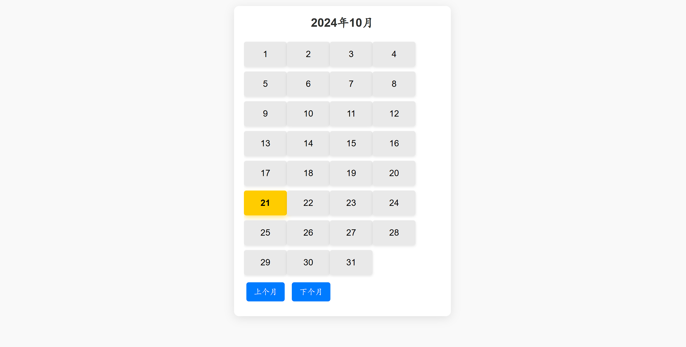

# 电子日历项目实验报告

## 摘要

本实验设计并实现了一个基于HTML、CSS和JavaScript的电子日历应用。通过前端技术的综合运用，实现了日期的动态显示、月份的切换以及当前日期的高亮显示。实验过程中，深入理解了前端开发的基本原理和实践方法，掌握了DOM操作、事件处理以及样式设计等关键技术。实验结果表明，该电子日历具备良好的用户交互性和视觉效果，能够满足基本的日历功能需求。

**Abstract**

This experiment designed and implemented an electronic calendar application based on HTML, CSS, and JavaScript. By integrating front-end technologies, it achieved dynamic date display, month navigation, and highlighting of the current date. During the experiment, a deep understanding of fundamental front-end development principles and practical methods was attained, mastering key technologies such as DOM manipulation, event handling, and style design. The experimental results demonstrate that the electronic calendar possesses excellent user interactivity and visual effects, meeting the basic functional requirements of a calendar.

## 关键词

电子日历；前端开发；HTML；CSS；JavaScript  
**Keywords**  
Electronic Calendar; Front-end Development; HTML; CSS; JavaScript

## 一、实验目的

1. 掌握HTML、CSS和JavaScript在前端开发中的基本应用。
2. 理解和应用DOM操作及事件处理机制。
3. 设计并实现一个具有基本功能的电子日历应用。
4. 提升前端项目的综合设计与实现能力。

## 二、实验要求

1. 使用HTML构建日历的基本结构。
2. 运用CSS进行页面布局和样式设计，确保日历界面美观且用户友好。
3. 使用JavaScript实现日期的动态显示、月份的切换以及当前日期的高亮功能。
4. 确保日历在不同浏览器和设备上的兼容性。
5. 编写清晰、规范的代码，注重代码的可读性和可维护性。

## 三、实验步骤

### 1. 项目初始化

- 创建项目文件夹，包含`index.html`、`shizhong.css`和`shizhong.js`三个文件。
- 设置HTML文档的基本结构，引用CSS和JavaScript文件。

### 2. 构建HTML结构

- 在`index.html`中，创建一个`div`容器用于显示日历。
- 添加标题显示当前月份和年份。
- 创建用于显示日期的容器，并添加“上个月”和“下个月”按钮。

### 3. 设计CSS样式

- 在`shizhong.css`中，设置页面的基础样式，包括字体、背景色、布局等。
- 为日历容器、日期块和按钮设计样式，确保界面美观且响应式。
- 添加悬停效果和当前日期的高亮样式。

### 4. 编写JavaScript功能

- 在`shizhong.js`中，获取HTML元素并初始化当前日期。
- 实现`renderCalendar`函数，动态生成当前月份的日期。
- 添加按钮的点击事件，实现月份的切换功能。
- 高亮显示当前日期，并确保在切换月份时正确更新。

### 5. 测试与优化

- 在不同浏览器中测试日历的功能和样式。
- 优化代码结构，提升性能和可读性。
- 根据测试结果进行必要的调整和修正。

## 四、知识点说明

### 1. HTML结构设计

通过合理的HTML标签组织，构建出日历的基本布局。使用`div`元素作为容器，`h2`显示月份和年份，`button`实现月份切换功能，`div.day`展示具体日期。

### 2. CSS样式应用

运用CSS进行页面美化，包括设置字体、颜色、布局、响应式设计等。使用盒模型、浮动布局和阴影效果增强视觉效果。通过类选择器实现日期的不同状态（如今日高亮）。

### 3. JavaScript动态功能

使用JavaScript操作DOM，实现日历的动态渲染。通过`Date`对象获取当前日期信息，计算月份天数和第一天星期。添加事件监听器，实现按钮点击后的月份切换。利用模板字符串动态生成日期元素。

### 4. 事件处理与DOM操作

掌握事件监听的基本方法，通过`onclick`事件绑定按钮功能。使用`innerHTML`动态更新页面内容，实现日期的刷新和更新。

## 五、实验结果

实验成功实现了一个功能完备的电子日历，具备以下特点：

1. **动态显示当前月份和年份**：页面加载时自动显示当前日期信息。
2. **月份切换功能**：用户可以通过“上个月”和“下个月”按钮浏览不同月份的日期。
3. **当前日期高亮**：当天的日期以特殊样式突出显示，便于用户识别。
4. **响应式设计**：日历界面在不同设备和浏览器中均能良好显示，用户体验友好。

### 实验截图

## 六、实验分析与讨论

### 功能实现分析

通过HTML、CSS和JavaScript的协同工作，成功实现了电子日历的基本功能。JavaScript的日期处理和DOM操作是关键，确保了日历的动态性和交互性。

### 存在的问题

1. **日期对齐问题**：由于去除了空白日期的生成，导致日历在月份第一天不是星期日时，日期排列不够整齐。
2. **功能有限**：目前的日历仅支持日期显示和月份切换，缺乏事件添加、提醒等高级功能。
3. **性能优化**：在日期较多的月份，DOM操作可能影响性能，需进一步优化。

### 改进建议

1. **完善日期对齐**：重新引入空白日期的生成，确保日期在日历中的正确位置对齐。
2. **增加高级功能**：如事件添加、提醒、主题切换等，提升日历的实用性。
3. **优化代码结构**：采用更高效的DOM操作方法，如文档片段（DocumentFragment），减少页面重绘次数。

## 七、实验结论

本实验通过设计和实现一个基于前端技术的电子日历，深入理解了HTML、CSS和JavaScript在实际项目中的应用。实验不仅巩固了前端开发的基础知识，还提升了综合设计和问题解决能力。尽管存在一些不足，但整体成果达到了预期目标，为进一步的功能扩展和优化打下了良好的基础。

## 八、心得体会

通过本次实验，我深刻体会到前端开发的魅力与挑战。HTML、CSS和JavaScript作为前端开发的三大基石，各自发挥着重要作用。特别是在项目中需要灵活运用这些技术，实现动态功能和美观界面时，逻辑思维和创造力显得尤为重要。同时，实践过程中也认识到代码结构和优化的重要性，只有不断学习和实践，才能在前端开发领域取得更大的进步。

---

