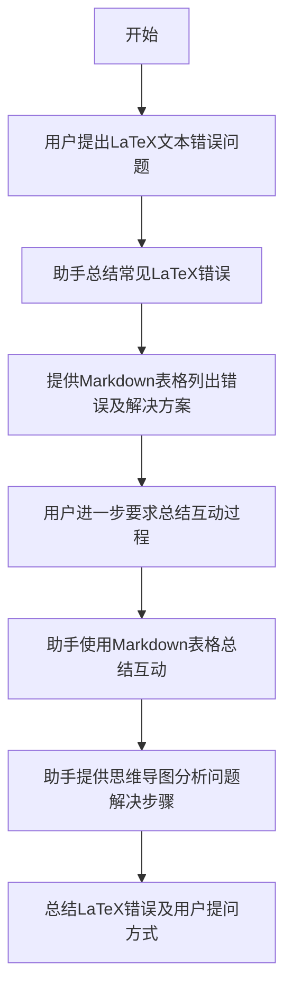

### LaTeX文本错误问题分析与总结

#### 一、用户提问与解决过程总结

对于LaTeX文本错误所提出的
- 问题
- 要求
- 解决步骤
==Markdown表格==
##### 1. 互动过程概览

>[!info] 1. 互动过程概览
| 步骤 | 用户提问/要求 | 助手回应 | LaTeX错误及解决方案 |
|------|--------------|---------|--------------------|
| 1    | 请求分析文章，删除重复内容，并总结LaTeX语句编写方面的错误。 | 提供了LaTeX文本错误的总结，使用Markdown表格和思维导图分析常见错误及解决方法。 | 列举了常见的LaTeX错误，如环境嵌套错误、数学模式错误、引用错误等，提供了详细的解决方案。 |
| 2    | 要求使用Markdown表格和思维导图，帮忙分析从第一个问题到现在，所有关于LaTeX文本错误的问题，以及如何一步步提问和书写要求的总结。 | 提供了从第一个问题开始的互动总结，使用Markdown表格列出用户的提问和助手的回应，以及LaTeX错误的处理过程，并以思维导图的形式分析了问题的演进和解决步骤。 | 总结了互动过程中出现的LaTeX错误，分析了用户的提问方式和助手的解决策略。 |

##### 2. LaTeX错误及解决方案总结

>[!info] 2. LaTeX错误及解决方案总结
| 错误类型          | 发生场景                         | 可能原因                                | 解决方案                             |
|-------------------|----------------------------------|-----------------------------------------|--------------------------------------|
| 环境嵌套错误      | 在列表或盒子环境中使用`table`或`figure` | 浮动体不能嵌套在某些环境中             | 将`table`或`figure`移出不允许的环境   |
| 数学模式错误      | 文本中使用了数学符号或命令       | 未使用数学模式包围数学内容              | 使用`$...$`或`\[...\]`包围数学内容    |
| 未定义的引用错误  | 使用了未定义的标签进行引用       | 标签未定义或拼写错误                    | 检查并确保所有标签都已正确定义        |
| 环境未闭合错误    | 缺少`\end{...}`                  | 忘记结束环境                           | 补充缺少的`\end{...}`                |
| Overfull/Underfull hbox | 内容超出或不足页面宽度          | 表格或段落过宽，或内容过少导致排版问题  | 调整内容宽度，使用合适的排版命令      |
| 图片插入错误      | 插入图片时发生错误               | 图片路径错误，文件不存在或格式不支持    | 检查图片路径和格式，确保正确无误      |
| 参考文献错误      | 参考文献未正确显示               | 未正确编译参考文献，或`.bib`文件缺失    | 运行`bibtex`编译，确保`.bib`文件存在  |

#### 二、问题解决的思维导图

#### 三、总结与建议

在整个互动过程中，您主要关注了以下几点：

1. **LaTeX文本错误的识别与解决**：针对常见的LaTeX错误，如环境嵌套错误、数学模式错误、引用错误等，寻求解决方案。

2. **提问和要求的逐步深入**：从最初的问题分析，到要求使用Markdown表格和思维导图，对整个过程进行总结和分析。

3. **对LaTeX编写规范的重视**：通过了解常见错误和解决方法，进一步规范LaTeX文档的编写，提高排版质量。

**建议**：

- **加强LaTeX基础知识学习**：熟悉LaTeX的基本语法和常见环境的使用方法，避免常见错误的发生。

- **善用工具进行调试**：在编写LaTeX文档时，使用专业的编辑器和编译器，可以更方便地发现和解决问题。

- **多参考官方文档和社区资源**：遇到问题时，查阅LaTeX官方文档或寻求社区帮助，可以更快地找到解决方案。