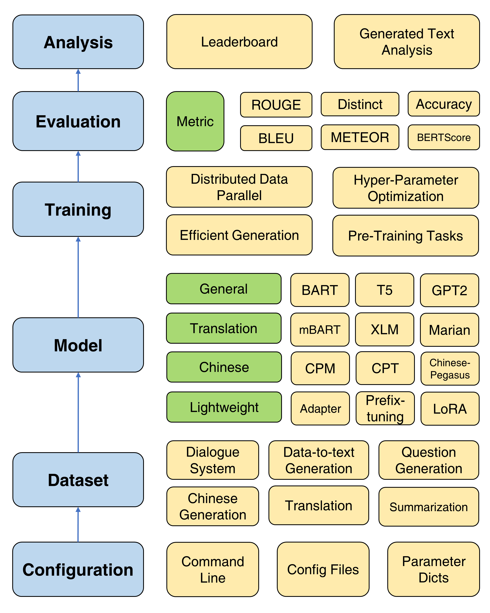

# TextBox 2.0（妙笔）

*“李太白少时，梦所用之笔头上生花后天才赡逸，名闻天下。”——王仁裕《开元天宝遗事·梦笔头生花》*

[*TextBox 2.0：一个基于预训练语言模型的文本生成库*](https://arxiv.org/abs/2212.13005)

TextBox 2.0 是一个基于Python和PyTorch的最新文本生成库，专注于构建一个统一和标准化的流水线，将预训练语言模型应用于文本生成：

- 从**任务**的角度来看，我们考虑了13种常见的文本生成任务，如翻译、故事生成和风格转换，以及它们对应的83个广泛使用的数据集。
- 从**模型**的角度来看，我们整合了47个预训练语言模型/模块，涵盖了通用、翻译、中文、对话、可控、简化、提示和轻量模型（模块）。
- 从**训练**的角度来看，我们支持4种预训练目标和4种高效且稳健的训练策略，如分布式数据并行和高效生成。

与TextBox的上一个版本相比，此扩展主要专注于构建一个统一、灵活和标准化的框架，以更好地支持基于PLM的文本生成模型。TextBox 2.0有三个优点：

- 它是一个重大创新，专注于全面的任务和PLMs。
- 它的实现和接口设计得很统一。
- 它能忠实地复现现有工作中报告的结果。



<!-- ===================== 安装 ===================== -->

## 安装

考虑到会安装修改版的transformers，建议创建一个新的conda环境：
```bash
conda create -n TextBox python=3.8
```

然后，你可以克隆我们的仓库并一键安装。
```bash
git clone https://github.com/RUCAIBox/TextBox.git && cd TextBox
bash install.sh
```

如果在安装`files2rouge`时遇到`ROUGE-1.5.5.pl - XML::Parser dependency error`问题，你可以参考这个[问题](https://github.com/pltrdy/files2rouge/issues/9)。

## 快速开始

这是一个运行TextBox 2.0端到端管道的脚本模板：

```bash
python run_textbox.py --model=<model-name> --dataset=<dataset-name> --model_path=<hf-or-local-path>
```

用你的选择替换`--model=<xxx>`、`--dataset=<xxx>`和`--model_path=<xxx>`。

`model`和`model_path`的选择可以在[模型](asset/model.md#model-list)中找到。我们在该页面提供了每个模型的详细说明。

`dataset`的选择可以在[数据集](asset/dataset.md#dataset-list)中找到。你应该在[https://huggingface.co/RUCAIBox](https://huggingface.co/RUCAIBox)下载数据集，并像[samsum](https://github.com/RUCAIBox/TextBox/tree/2.0.0/dataset/samsum)那样将下载的数据集放在`dataset`文件夹下。如果你想使用自己的数据集，请参考[这里](asset/dataset.md#new-dataset)。

下面的脚本将在`samsum`数据集上运行Facebook的`BART-base`模型：
```bash
python run_textbox.py --model=BART --dataset=samsum --model_path=facebook/bart-base
```

<!-- ===================== 训练 ===================== -->

## 训练

### 基础训练

对于基础训练，我们提供了一个详细的教程（[这里](asset/basic_training.md)），设置常用参数如优化器、调度器、验证频率、提前停止等。

### 预训练

TextBox 2.0提供了四种预训练目标，以帮助用户从头开始预训练模型，包括语言建模、遮蔽序列到序列建模、去噪自动编码和遮蔽跨度预测。请参阅[预训练文档](asset/pretraining.md)以获取详细教程。

### 高效训练

我们提供了四种有用的训练方法来改进PLMs的优化：分布式数据并行、高效解码、超参数优化和重复实验。详细说明请参阅[这里](asset/efficient_training.md)。


<!-- ===================== 模型 ===================== -->

## 模型

为了支持PLMs在文本生成上的快速进展，TextBox 2.0整合了47个模型/模块，涵盖了通用、翻译、中文、对话、可控、简化、提示和轻量模型（模块）。有关详细[使用每个模型的说明](asset/model.md#model-list)、[预训练模型参数](asset/model.md#pre-trained-model-parameters)和[生成参数](asset/model.md#generation-parameters)的信息，请参见[模型文档](asset/model.md)。

<!-- ===================== 数据集 ===================== -->

## 数据集

现在我们支持13个生成任务（例如，翻译和故事生成）及其对应的83个数据集。我们还提供了每个数据集的描述、基本统计数据、训练/验证/测试样本和排行榜。详细信息请参阅[这里](asset/dataset.md)。


<!-- ===================== 评估 ===================== -->

## 评估

TextBox 2.0支持4个类别的17个自动度量标准和几个可视化工具，以从各个维度探索和分析生成的文本。有关评估详情，请参见[评估文档](asset/evaluation.md)。


## 发布


| 发布 |    日期    |   功能           |
| :------: | :--------: | :------------------: |
|  v2.0.1  | 24/12/2022 |    TextBox 2.0       |
|  v2.0.0  | 20/08/2022 |    TextBox 2.0 Beta  |
|  v0.2.1  | 15/04/2021 |    TextBox           |
|  v0.1.5  | 01/11/2021 | 基础 TextBox        |

## 贡献

如果你遇到错误或有任何建议，请通过[提交问题](https://github.com/RUCAIBox/TextBox/issues)告诉我们。

我们欢迎所有贡献，从错误修复到新功能和扩展。

我们期望所有贡献都在问题追踪器中讨论，并通过PRs进行。

我们感谢[@LucasTsui0725](https://github.com/LucasTsui0725/)为HRED模型和几个评估指标做出的贡献。

我们感谢[@wxDai](https://github.com/Dai-Wenxun)为PointerNet和超过20个transformers API中的语言模型做出的贡献。

## 团队

TextBox由[AI Box](http://aibox.ruc.edu.cn/)开发和维护。

## 许可证

TextBox使用[MIT许可证](./LICENSE)。

## 引用

如果你发现TextBox 2.0对你的研究或开发有用，请引用以下论文：

```
@inproceedings{tang-etal-2022-textbox,
    title = "{T}ext{B}ox 2.0: A Text Generation Library with Pre

-trained Language Models",
    author = "Tang, Tianyi  and  Li, Junyi  and  Chen, Zhipeng  and  Hu, Yiwen  and  Yu, Zhuohao  and  Dai, Wenxun  and  Zhao, Wayne Xin  and  Nie, Jian-yun  and  Wen, Ji-rong",
    booktitle = "Proceedings of the The 2022 Conference on Empirical Methods in Natural Language Processing: System Demonstrations",
    month = dec,
    year = "2022",
    address = "Abu Dhabi, UAE",
    publisher = "Association for Computational Linguistics",
    url = "https://aclanthology.org/2022.emnlp-demos.42",
    pages = "435--444",
}


@inproceedings{textbox,
    title = "{T}ext{B}ox: A Unified, Modularized, and Extensible Framework for Text Generation",
    author = "Li, Junyi  and  Tang, Tianyi  and  He, Gaole  and  Jiang, Jinhao  and  Hu, Xiaoxuan  and  Xie, Puzhao  and  Chen, Zhipeng  and  Yu, Zhuohao  and  Zhao, Wayne Xin  and  Wen, Ji-Rong",
    booktitle = "Proceedings of the 59th Annual Meeting of the Association for Computational Linguistics and the 11th International Joint Conference on Natural Language Processing: System Demonstrations",
    month = aug,
    year = "2021",
    address = "Online",
    publisher = "Association for Computational Linguistics",
    url = "https://aclanthology.org/2021.acl-demo.4",
    doi = "10.18653/v1/2021.acl-demo.4",
    pages = "30--39",
}
```


# TextBox 2.0 (妙笔)

*“李太白少时，梦所用之笔头上生花后天才赡逸，名闻天下。”——王仁裕《开元天宝遗事·梦笔头生花》*

[*TextBox 2.0: A Text Generation Library with Pre-trained Language Models*](https://arxiv.org/abs/2212.13005)

TextBox 2.0 is an up-to-date text generation library based on Python and PyTorch focusing on building a unified and standardized pipeline for applying pre-trained language models to text generation:

- From a **task** perspective, we consider 13 common text generation tasks such as translation, story generation, and style transfer, and their corresponding 83 widely-used datasets. 
- From a **model** perspective, we incorporate 47 pre-trained language models/modules covering the categories of general, translation, Chinese, dialogue, controllable, distilled, prompting, and lightweight models (modules).
- From a **training** perspective, we support 4 pre-training objectives and 4 efficient and robust training strategies, such as distributed data parallel and efficient generation.


Compared with the previous version of TextBox, this extension mainly focuses on building a unified, flexible, and standardized framework for better supporting PLM-based text generation models. There are three advantages of TextBox 2.0:

- It is a significant innovation focusing on comprehensive tasks and PLMs.
- It is designed to be unified in implementation and interface.
- It can faithfully reproduce the results reported in existing work.


<!-- ===================== Installation ===================== -->

## Installation

Considering that a modified version of transformers will be installed, it is recommended to create a new conda environment:
```bash
conda create -n TextBox python=3.8
```

Then, you can clone our repository and install it with one-click.
```bash
git clone https://github.com/RUCAIBox/TextBox.git && cd TextBox
bash install.sh
```

If you face a issue `ROUGE-1.5.5.pl - XML::Parser dependency error` when installing `files2rouge`, you can refer to this [issue](https://github.com/pltrdy/files2rouge/issues/9).

## Quick Start

This is a script template to run TextBox 2.0 in an end-to-end pipeline:

```bash
python run_textbox.py --model=<model-name> --dataset=<dataset-name> --model_path=<hf-or-local-path>
```

Substitute `--model=<xxx>` ,  `--dataset=<xxx>` and `--model_path=<xxx>` with your choices.

The choices of `model` and `model_path` can be found in [Model](asset/model.md#model-list). We provide the detailed instruction of each model in that page.

The choices of `dataset` can be found in [Dataset](asset/dataset.md#dataset-list). You should download the dataset at [https://huggingface.co/RUCAIBox](https://huggingface.co/RUCAIBox) and put the downloaded dataset under the `dataset` folder just like [samsum](https://github.com/RUCAIBox/TextBox/tree/2.0.0/dataset/samsum). If your want to use your own dataset, please refer to [here](asset/dataset.md#new-dataset).


The script below will run the Facebook `BART-base` model on the `samsum` dataset:
```bash
python run_textbox.py --model=BART --dataset=samsum --model_path=facebook/bart-base
```

<!-- ===================== Training ===================== -->

## Training

### Basic Training

For basic training, we provide a detailed tutorial ([here](asset/basic_training.md)) for setting commonly used parameters like optimizer, scheduler, validation frequency, early stopping, and so on. 

### Pre-training

TextBox 2.0 provides four pre-training objectives to help users pre-train a model from scratch, including language modeling, masked sequence-to-sequence modeling, denoising auto-encoding, and masked span prediction. See the [pre-training doc](asset/pretraining.md) for a detailed tutorial.

### Efficient Training

Four useful training methods are provided for improving the optimization of PLMs: distributed data parallel, efficient decoding, hyper-parameter optimization, and repeated experiments. Detailed instructions are provided [here](asset/efficient_training.md).


<!-- ===================== Model ===================== -->

## Model

To support the rapid progress of PLMs on text generation, TextBox 2.0 incorporates 47 models/modules, covering the categories of general, translation, Chinese, dialogue, controllable, distilled, prompting, and lightweight models (modules). See the [model doc](asset/model.md) for information on detailed [usage instructions of each model](asset/model.md#model-list), [pre-trained model parameters](asset/model.md#pre-trained-model-parameters), and [generation parameters](asset/model.md#generation-parameters).

<!-- ===================== Dataset ===================== -->


## Dataset

Now we support 13 generation tasks (e.g., translation and story generation) and their corresponding 83 datasets. We also provide the description, basic statistics, training/validation/testing samples, and leaderboard for each dataset. See more details [here](asset/dataset.md).


<!-- ===================== Evaluation ===================== -->

## Evaluation

TextBox 2.0 supports 17 automatic metrics of 4 categories and several visualization tools to explore and analyze the generated texts in various dimensions. For evaluation details, see the [evaluation doc](asset/evaluation.md).


## Releases


| Releases |    Date    |   Features           |
| :------: | :--------: | :------------------: |
|  v2.0.1  | 24/12/2022 |    TextBox 2.0       |
|  v2.0.0  | 20/08/2022 |    TextBox 2.0 Beta  |
|  v0.2.1  | 15/04/2021 |    TextBox           |
|  v0.1.5  | 01/11/2021 | Basic TextBox        |

## Contributing

Please let us know if you encounter a bug or have any suggestions by [filing an issue](https://github.com/RUCAIBox/TextBox/issues).

We welcome all contributions from bug fixes to new features and extensions.

We expect all contributions discussed in the issue tracker and going through PRs.

We thank [@LucasTsui0725](https://github.com/LucasTsui0725/) for contributing HRED model and several evaluation metrics.

We thank [@wxDai](https://github.com/Dai-Wenxun) for contributing PointerNet and more than 20 language models in transformers API.

## The Team

TextBox is developed and maintained by [AI Box](http://aibox.ruc.edu.cn/).

## License

TextBox uses [MIT License](./LICENSE).

## Reference

If you find TextBox 2.0 useful for your research or development, please cite the following papers:

```
@inproceedings{tang-etal-2022-textbox,
    title = "{T}ext{B}ox 2.0: A Text Generation Library with Pre-trained Language Models",
    author = "Tang, Tianyi  and  Li, Junyi  and  Chen, Zhipeng  and  Hu, Yiwen  and  Yu, Zhuohao  and  Dai, Wenxun  and  Zhao, Wayne Xin  and  Nie, Jian-yun  and  Wen, Ji-rong",
    booktitle = "Proceedings of the The 2022 Conference on Empirical Methods in Natural Language Processing: System Demonstrations",
    month = dec,
    year = "2022",
    address = "Abu Dhabi, UAE",
    publisher = "Association for Computational Linguistics",
    url = "https://aclanthology.org/2022.emnlp-demos.42",
    pages = "435--444",
}


@inproceedings{textbox,
    title = "{T}ext{B}ox: A Unified, Modularized, and Extensible Framework for Text Generation",
    author = "Li, Junyi  and  Tang, Tianyi  and  He, Gaole  and  Jiang, Jinhao  and  Hu, Xiaoxuan  and  Xie, Puzhao  and  Chen, Zhipeng  and  Yu, Zhuohao  and  Zhao, Wayne Xin  and  Wen, Ji-Rong",
    booktitle = "Proceedings of the 59th Annual Meeting of the Association for Computational Linguistics and the 11th International Joint Conference on Natural Language Processing: System Demonstrations",
    month = aug,
    year = "2021",
    address = "Online",
    publisher = "Association for Computational Linguistics",
    url = "https://aclanthology.org/2021.acl-demo.4",
    doi = "10.18653/v1/2021.acl-demo.4",
    pages = "30--39",
}
```


---