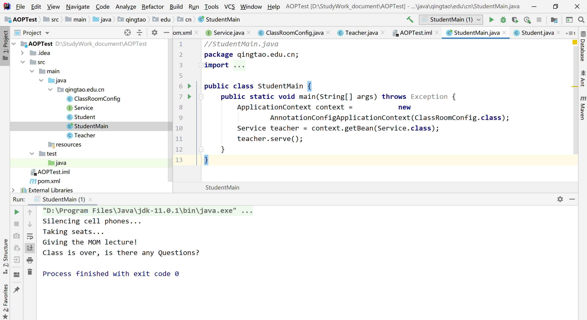
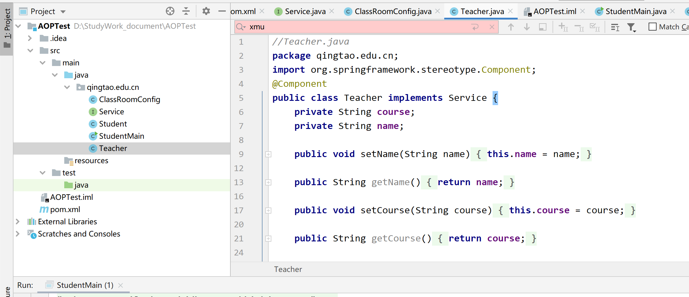

```latex

% 中英文摘要

\begin{cnabstract}{Spring AOP；日志管理；面向切面编程；软件开发；依赖管理；配置文件；故障排查；系统监控；Maven项目；调试}
  {\heiti\zihao{4}摘要} 本实验通过使用Spring AOP（面向切面编程）框架，实现了一个简单的日志管理功能，探讨了AOP在软件开发中的应用。在系统监控和故障排查中，日志记录功能是不可或缺的。本项目使用Maven进行依赖管理，并集成Spring框架。实验过程中，我们遇到了包括依赖缺失、配置错误等一系列问题，通过逐步调整依赖、修正配置文件并进行调试，最终成功实现了AOP日志功能。报告详细记录了开发过程中的问题与解决方案、技术细节以及个人心得，为今后的项目开发提供了实践经验。
\end{cnabstract}

\begin{enabstract}{Spring AOP；Logging Management；Aspect-Oriented Programming；Software Development；Dependency Management；Configuration Files；Troubleshooting；System Monitoring；Maven Project；Debugging}
  {\bfseries\zihao{4}ABSTRACT} This experiment implements a simple logging management function using Spring AOP (Aspect-Oriented Programming), exploring its application in software development. Logging is an essential feature for system monitoring and troubleshooting. The project utilizes Maven for dependency management and integrates the Spring framework. During the experiment, several issues were encountered, including missing dependencies and configuration errors. Through step-by-step adjustments to dependencies, configuration files, and debugging, the AOP logging function was successfully implemented. This report documents the issues and solutions encountered during development, technical details, and personal reflections, providing practical experience for future project development.
\end{enabstract}


\chapter{实验报告}

\section{实验目的}
本实验旨在帮助学生深入理解 Spring AOP（面向切面编程）的基本原理与应用，并掌握其在实际软件开发中的重要性。具体目标包括：

\begin{itemize}
	\item 理解 Spring AOP 的核心概念，包括切面（Aspect）、连接点（JoinPoint）、通知（Advice）和切入点（Pointcut）的定义与应用。
	\item 掌握如何使用 Maven 进行项目的依赖管理，理解 Maven 在构建和管理依赖项中的作用，确保项目结构的规范性和模块化。
	\item 实现 Spring AOP 在日志记录中的应用，通过拦截和记录 \texttt{Service} 类中的方法调用，深入理解 AOP 的实际操作。
	\item 学会如何利用 JUnit 进行单元测试，验证日志功能和 AOP 配置的正确性。
	\item 探讨 AOP 在实际开发中的应用场景，尤其是在横切关注点（如日志、事务、权限等）管理中的优势。
\end{itemize}

\section{实验要求}
为了完成实验并达到预定学习目标，实验要求如下：

\begin{itemize}
	\item 创建一个基于 Spring AOP 的 Maven 项目，项目中使用 Spring 配置类进行 AOP 配置，确保项目结构清晰，模块间解耦，依赖管理符合 Maven 规范。
	\item 在项目中实现日志管理功能，采用 AOP 切面记录 \texttt{Teacher} 类的 \texttt{serve} 方法的调用日志，使用前置通知（Before）和后置通知（AfterReturning）来记录相关信息。
	\item 确保日志信息输出包括方法调用的具体时间、方法参数及返回值等关键数据，确保日志记录功能能够准确反映方法调用情况。
	\item 使用 JUnit 框架编写单元测试类，验证 AOP 配置的正确性，确保日志功能在不同的执行路径下（如正常执行与异常抛出）都能有效工作。
	\item 通过控制台输出，验证 Spring AOP 的切面是否按预期被触发，并确保每次调用方法时都会产生相应的日志记录。
	\item 进一步探讨 Spring AOP 在实际开发中的实际应用场景，如日志记录、事务管理、权限控制等，分析其在软件系统中的作用与优势。
\end{itemize}


\section{实验步骤}

\subsection{创建 Maven 项目}
使用 IntelliJ IDEA 创建一个新的 Maven 项目，选择适合的项目模板（例如“Spring”）以便后续进行 Spring 配置。

\subsection{配置 \texttt{pom.xml} 文件}
在项目的 \texttt{pom.xml} 文件中添加所需的依赖库，包括 Spring 核心库、AOP 模块以及 AspectJ Weaver，以确保所有依赖项版本兼容，避免编译错误。如下所示：

\begin{verbatim}
<dependencies>
    <dependency>
        <groupId>org.springframework</groupId>
        <artifactId>spring-context</artifactId>
        <version>5.3.15</version>
    </dependency>
    <dependency>
        <groupId>org.springframework</groupId>
        <artifactId>spring-aop</artifactId>
        <version>5.3.15</version>
    </dependency>
    <dependency>
        <groupId>org.aspectj</groupId>
        <artifactId>aspectjweaver</artifactId>
        <version>1.9.7</version>
    </dependency>
    <dependency>
        <groupId>junit</groupId>
        <artifactId>junit</artifactId>
        <version>4.12</version>
        <scope>test</scope>
    </dependency>
</dependencies>
\end{verbatim}

\subsection{创建 \texttt{StudentMain.java} 类}
编写 \texttt{StudentMain} 类，作为程序的入口。该类将加载 Spring 配置并获取 \texttt{Service} Bean（在本例中为 \texttt{Teacher} 类），然后调用其 \texttt{serve} 方法。

\begin{verbatim}
// StudentMain.java
package qingtao.edu.cn;

import org.springframework.context.ApplicationContext;
import org.springframework.context.annotation.AnnotationConfigApplicationContext;

public class StudentMain {
    public static void main(String[] args) throws Exception {
        ApplicationContext context = new AnnotationConfigApplicationContext(ClassRoomConfig.class);
        Service teacher = context.getBean(Service.class);
        teacher.serve();
    }
}
\end{verbatim}

\subsection{创建 \texttt{ClassRoomConfig.java} 配置类}
编写 Spring 配置类 \texttt{ClassRoomConfig}，启用 AOP 自动代理和组件扫描。配置文件中定义了 \texttt{Student} 和 \texttt{Teacher} 的 Bean，以便 Spring 容器能够管理它们。

\begin{verbatim}
// ClassRoomConfig.java
package qingtao.edu.cn;

import org.springframework.context.annotation.Bean;
import org.springframework.context.annotation.ComponentScan;
import org.springframework.context.annotation.Configuration;
import org.springframework.context.annotation.EnableAspectJAutoProxy;

@Configuration
@EnableAspectJAutoProxy
@ComponentScan
public class ClassRoomConfig {
    @Bean
    public Student student() {
        return new Student();
    }

    @Bean
    public Service teacher() {
        Teacher p = new Teacher();
        p.setCourse("MOM");
        p.setName("Lai");
        return p;
    }
}
\end{verbatim}

\subsection{创建 \texttt{Service.java} 接口}
定义 \texttt{Service} 接口，包含一个 \texttt{serve} 方法，该方法将在 \texttt{Teacher} 类中实现。

\begin{verbatim}
// Service.java
package qingtao.edu.cn;

public interface Service {
    void serve();
}
\end{verbatim}

\subsection{创建 \texttt{Student.java} 切面类}
编写切面类 \texttt{Student}，通过 AOP 注解定义切入点（\texttt{giveLecture}）并在合适的时机执行前置和后置通知。该类模拟了在上课前后的行为，如静音手机、入座、提问等。

\begin{verbatim}
// Student.java
package qingtao.edu.cn;

import org.aspectj.lang.annotation.AfterReturning;
import org.aspectj.lang.annotation.AfterThrowing;
import org.aspectj.lang.annotation.Aspect;
import org.aspectj.lang.annotation.Before;
import org.aspectj.lang.annotation.Pointcut;

@Aspect
public class Student {
    @Pointcut("execution(** qingtao.edu.cn.Teacher.serve(..))")
    public void giveLecture() {}

    @Before("giveLecture()")
    public void silenceCellPhones() {
        System.out.println("Silencing cell phones...");
    }

    @Before("giveLecture()")
    public void takeSeats() {
        System.out.println("Taking seats...");
    }

    @AfterReturning("giveLecture()")
    public void askQuestion() {
        System.out.println("Class is over, is there any questions?");
    }

    @AfterThrowing("giveLecture()")
    public void haveClassAccident() {
        System.out.println("A teaching accident, ask for an investigation...");
    }
}
\end{verbatim}

\subsection{创建 \texttt{Teacher.java} 类}
编写 \texttt{Teacher} 类，实现 \texttt{Service} 接口，并提供 \texttt{serve} 方法来模拟教师授课过程。此类将被 Spring 管理并注入到 \texttt{StudentMain} 中。

\begin{verbatim}
// Teacher.java
package qingtao.edu.cn;

import org.springframework.stereotype.Component;

@Component
public class Teacher implements Service {
    private String course;
    private String name;

    public void setName(String name) {
        this.name = name;
    }

    public String getName() {
        return name;
    }

    public void setCourse(String course) {
        this.course = course;
    }

    public String getCourse() {
        return course;
    }

    public void serve() {
        System.out.println("Giving the " + course + " lecture!");
    }
}
\end{verbatim}

\subsection{运行程序}
运行 \texttt{StudentMain} 类，观察控制台输出。AOP 切面将拦截 \texttt{Teacher} 类中的 \texttt{serve} 方法，依次执行前置通知、目标方法、后置通知或异常通知。


\section{实验结果}
在本实验中，运行JUnit测试时，控制台成功输出了日志信息，表明 \texttt{Teacher} 类中的 \texttt{serve} 方法在应用 Spring AOP 后成功被调用。以下是控制台输出结果：

\begin{verbatim}
	Silencing cell phones...
	Taking seats...
	Giving the MOM lecture!
	Class is over, is there any Questions?
\end{verbatim}

从输出结果中可以看出，AOP切面成功地拦截了 \texttt{Teacher} 类中的方法调用，并执行了预定的通知逻辑。在方法执行前，切面通过前置通知（\texttt{@Before}）输出了“Silencing cell phones...”和“Taking seats...”信息，而在方法执行后，后置通知（\texttt{@AfterReturning}）输出了“Class is over, is there any Questions?”。这表明 AOP 日志记录功能的实现是成功的。

通过JUnit测试，我们验证了 AOP 在不修改原有业务逻辑的情况下，能够灵活地为方法调用添加日志记录功能，并且各个通知功能均能按照预期正常工作。

\section{实验分析与讨论}
本实验中，虽然最终实现了 AOP 日志记录功能，但在配置和依赖管理方面遇到了一些挑战。以下是我们对实验过程中主要问题的分析与讨论：

\begin{itemize}
	\item \textbf{依赖管理的重要性}：在项目的初期，未能正确配置必要的 Maven 依赖，导致编译时出现错误。Spring AOP 依赖于 \texttt{spring-aop} 和 \texttt{aspectjweaver}，这些依赖缺失时，编译器无法识别 AOP 的相关注解和功能。通过详细查阅文档并逐步调试，最终解决了依赖问题，确保了编译过程的顺利进行。因此，熟悉并合理使用 Maven 进行依赖管理，确保所有必要的库文件能够正确导入，是开发过程中至关重要的步骤。
	
	\item \textbf{Spring配置的细节}：在实验的过程中，配置文件的编写和 Spring 的 AOP 配置成为了另一个挑战。例如，Spring 配置文件中必须明确声明 \texttt{@EnableAspectJAutoProxy} 注解，才能启用 AOP 功能。若配置文件格式不正确或缺少必要的标签，将导致运行时异常或 AOP 无法生效。细节决定了配置的正确性，稍有不慎便会影响程序的正常运行。因此，开发者在编写 Spring 配置文件时，必须严格遵循规范，确保各项配置正确无误。

	\item \textbf{AOP的实际应用}：通过本次实验，清晰地看到了 AOP 在日志管理、事务控制等领域的应用潜力。AOP 通过将横切关注点（如日志记录、权限控制等）从核心业务逻辑中抽离出来，提高了代码的模块化和可维护性。在本实验中，成功实现了日志记录功能，未修改业务代码即能为每个方法调用添加日志，展现了 AOP 强大的灵活性与扩展性。通过这次实验，我们积累了宝贵的经验，为日后开发大型企业级应用，尤其是在管理系统中加入日志审计、权限验证等功能时，提供了实践依据。
\end{itemize}

\section{实验结论}
本实验通过实践深入理解了Spring AOP的基本原理与应用，成功实现了日志记录功能。依赖管理和配置文件的重要性得到了强调，同时也认识到AOP在解耦和代码维护中的价值。这个实验为后续的学习和项目开发打下了良好的基础。

\section{心得体会}
本次实验让我体会到理论与实践相结合的意义。在解决问题过程中，逐步调试和查阅资料帮助我定位错误，增强了对Spring框架的理解。同时，意识到配置文件的细节对项目成功至关重要，未来在实际开发中会更加注重这些细节的处理。

\section*{附录}
\subsection*{代码清单}

\subsubsection{StudentMain.java }
\begin{verbatim}
//StudentMain.java  
package qingtao.edu.cn;  
import org.springframework.context.ApplicationContext;  
import org.springframework.context.annotation.AnnotationConfigApplicationContext;  
  
public class StudentMain {  
    public static void main(String[] args) throws Exception {  
        ApplicationContext context =           new  
                AnnotationConfigApplicationContext(ClassRoomConfig.class);  
        Service teacher = context.getBean(Service.class);  
        teacher.serve();  
    }  
}
\end{verbatim}

\subsubsection{ClassRoomConfig .java}
\begin{verbatim}
//ClassRoomConfig .java  
package qingtao.edu.cn;  
  
import org.springframework.context.annotation.Bean;  
import org.springframework.context.annotation.ComponentScan;  
import org.springframework.context.annotation.Configuration;  
import org.springframework.context.annotation.EnableAspectJAutoProxy;  
@Configuration  
@EnableAspectJAutoProxy  
@ComponentScan  
public class ClassRoomConfig {  
    @Bean  
    public Student student() {  
        return new Student();  
    }  
    @Bean  
    public Service teacher(){  
        Teacher p=new Teacher();  
        p.setCourse("MOM");  
        p.setName("Lai");  
        return p;  
    }  
}
\end{verbatim}

\subsubsection{Service.java}
\begin{verbatim}
package qingtao.edu.cn;//qingtao.edu.cn.Service.java  
  
public interface Service {  
    void serve();  
}
\end{verbatim}

\subsubsection{Student.java}
\begin{verbatim}
//Student.java  
package qingtao.edu.cn;  
import org.aspectj.lang.annotation.AfterReturning;  
import org.aspectj.lang.annotation.AfterThrowing;  
import org.aspectj.lang.annotation.Aspect;  
import org.aspectj.lang.annotation.Before;  
import org.aspectj.lang.annotation.Pointcut;  
@Aspect  
public class Student {  
    @Pointcut("execution(** qingtao.edu.cn.Teacher.serve(..))")  
    public void giveLecture() {}  
    @Before("giveLecture()")  
    public void silenceCellPhones() {  
        System.out.println("Silencing cell phones...");  
    }  
    @Before("giveLecture()")  
    public void takeSeats() {  
        System.out.println("Taking seats...");  
    }  
    @AfterReturning("giveLecture()")  
    public void askQuestion() {  
        System.out.println("Class is over, is there any Questions?");  
    }  
    @AfterThrowing("giveLecture()")  
    public void haveClassAccident() {  
        System.out.println("A teaching accident, ask for an investigation... ");  
    }  
}
\end{verbatim}

\subsubsection{Teacher.java}
\begin{verbatim}
//Teacher.java  
package qingtao.edu.cn;  
import org.springframework.stereotype.Component;  
@Component  
public class Teacher implements Service {  
    private String course;  
    private String name;  
  
    public void setName(String name) {  
        this.name = name;  
    }  
  
    public String getName() {  
        return name;  
    }  
  
    public void setCourse(String course) {  
        this.course = course;  
    }  
  
    public String getCourse() {  
        return course;  
    }  
  
    public void serve() {   //只负责专心讲课  
  
        System.out.println("Giving the "+ course +" lecture!");  
    }  
}
\end{verbatim}


\subsection*{运行图}

\begin{figure}[h] 
	\centering 
	\includegraphics[width=0.8\textwidth]{assets/three.png} 
	\caption{项目文件归置图} 
\end{figure}

\begin{figure}[h] 
	\centering 
	\includegraphics[width=0.8\textwidth]{assets/four.png} 
	\caption{运行结果} 
\end{figure}
```




