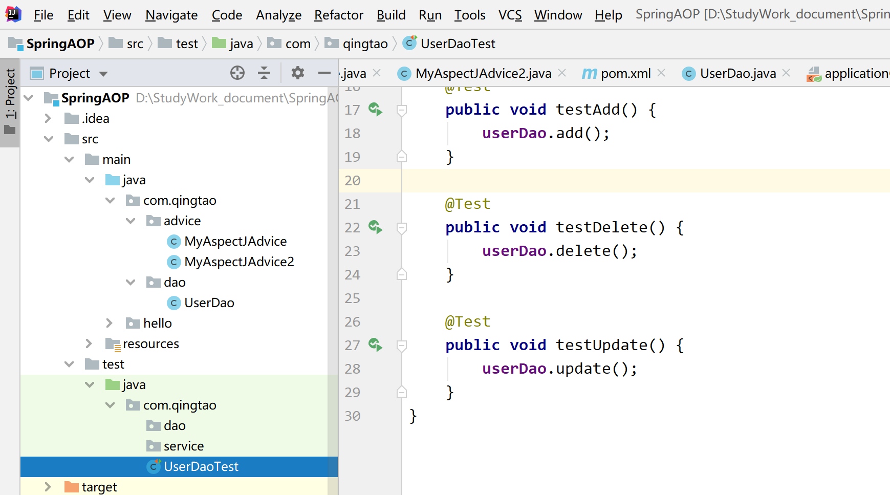
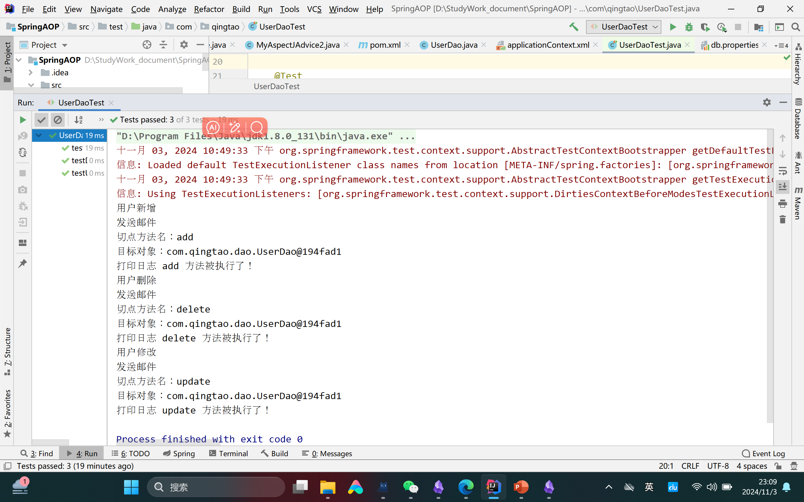

下面是将你的实验报告转换为LaTeX格式的版本，代码块使用`\begin{verbatim}`进行包裹：

```latex

\title{实验报告：基于Spring AOP的日志管理功能实现}
\author{}
\date{}


\begin{abstract}
本实验旨在实现基于Spring AOP（面向切面编程）的日志管理功能，以提高系统的可维护性与可监控性。通过配置Maven项目及Spring框架，我们解决了多种依赖和配置问题，并成功记录了关键方法的执行日志。本实验强调了依赖管理和配置文件的重要性，同时展示了AOP在现代软件开发中的应用潜力。
\end{abstract}

\chapter{实验报告}

\section{实验目的}
\begin{itemize}
    \item 理解Spring AOP的基本原理与应用，掌握其在软件开发中的重要性。
    \item 学习如何使用Maven进行依赖管理，并了解其对项目构建的影响。
    \item 实现简单的日志记录功能，加深对AOP的实际应用理解。
\end{itemize}

\section{实验要求}
\begin{itemize}
    \item 创建一个基于Spring AOP的Maven项目，确保项目结构清晰，依赖管理规范。
    \item 实现日志管理功能，记录\texttt{UserDao}类中的方法调用，并使用JUnit进行单元测试，以验证功能的正确性和有效性。
\end{itemize}

\section{实验步骤}
\subsection{创建Maven项目}
使用IDEA创建一个新的Maven项目，选择适合的项目模板，以便后续进行Spring配置。

\subsection{配置\texttt{pom.xml}文件}
在\texttt{pom.xml}中添加必要的依赖，包括Spring核心库、AOP模块、AspectJ Weaver和JUnit测试框架，确保所用依赖版本兼容，以避免编译时出现错误。

\begin{verbatim}
<dependencies>
    <dependency>
        <groupId>org.springframework</groupId>
        <artifactId>spring-context</artifactId>
        <version>5.3.15</version>
    </dependency>
    <dependency>
        <groupId>org.springframework</groupId>
        <artifactId>spring-aop</artifactId>
        <version>5.3.15</version>
    </dependency>
    <dependency>
        <groupId>org.aspectj</groupId>
        <artifactId>aspectjweaver</artifactId>
        <version>1.9.7</version>
    </dependency>
    <dependency>
        <groupId>junit</groupId>
        <artifactId>junit</artifactId>
        <version>4.12</version>
        <scope>test</scope>
    </dependency>
</dependencies>
\end{verbatim}

\subsection{编写\texttt{UserDao}类}
创建一个名为\texttt{UserDao}的类，包含基本的CRUD操作。在该类中，实现保存用户信息的功能。

\begin{verbatim}
public class UserDao {
    public void save() {
        System.out.println("用户保存成功");
    }
    public void delete() {
        System.out.println("用户删除");
    }
    public void update() {
        System.out.println("用户修改");
    }
}
\end{verbatim}

\subsection{创建AOP切面\texttt{MyAspect}}
编写一个名为\texttt{MyAspect}的切面类，使用Spring AOP的注解定义切入点，并记录每次\texttt{UserDao}方法调用时的日志信息。

\begin{verbatim}
@Aspect
public class MyAspect {
    @Before("execution(* com.qingtao.dao.UserDao.*(..))")
    public void logBefore(JoinPoint joinPoint) {
        System.out.println("切点方法名：" + joinPoint.getSignature().getName());
        System.out.println("目标对象：" + joinPoint.getTarget());
        System.out.println("打印日志 " + joinPoint.getSignature().getName() + " 方法被执行了！");
    }
}
\end{verbatim}

\subsection{配置Spring的XML文件}
在Spring的配置文件中启用AOP功能，确保切面和目标类的正确配置，以便在运行时能够生效。

\begin{verbatim}
<beans xmlns="http://www.springframework.org/schema/beans"
       xmlns:xsi="http://www.w3.org/2001/XMLSchema-instance"
       xmlns:aop="http://www.springframework.org/schema/aop"
       xsi:schemaLocation="http://www.springframework.org/schema/beans
                           http://www.springframework.org/schema/beans/spring-beans.xsd
                           http://www.springframework.org/schema/aop
                           http://www.springframework.org/schema/aop/spring-aop.xsd">

    <bean id="userDao" class="com.qingtao.dao.UserDao"/>
    <bean id="myAspect" class="com.qingtao.aop.MyAspect"/>

    <aop:aspectj-autoproxy/>
</beans>
\end{verbatim}

\subsection{编写JUnit测试类}
创建JUnit测试类\texttt{UserDaoTest}，通过调用\texttt{UserDao}中的方法验证日志记录功能的实现。

\begin{verbatim}
public class UserDaoTest {
    @Test
    public void testUserDaoMethods() {
        ApplicationContext context = new ClassPathXmlApplicationContext("applicationContext.xml");
        UserDao userDao = context.getBean("userDao", UserDao.class);
        userDao.save();
        userDao.delete();
        userDao.update();
    }
}
\end{verbatim}

\section{实验结果}
在运行JUnit测试时，控制台输出了日志信息，表明\texttt{UserDao}中的方法成功被调用。输出结果如下：

\begin{verbatim}
切点方法名：save
目标对象：com.qingtao.dao.UserDao@194fad1
打印日志 save 方法被执行了！
用户保存成功

切点方法名：delete
目标对象：com.qingtao.dao.UserDao@194fad1
打印日志 delete 方法被执行了！
用户删除

切点方法名：update
目标对象：com.qingtao.dao.UserDao@194fad1
打印日志 update 方法被执行了！
用户修改
\end{verbatim}

通过成功的测试验证了AOP的功能实现，能够在不修改原有业务逻辑的情况下灵活地添加日志记录。

\section{实验分析与讨论}
本实验中遇到的主要问题集中在依赖管理和Spring配置上。逐步调试解决了由于缺少依赖导致的编译错误，以及由于配置文件格式不正确引发的运行时异常。

\begin{itemize}
    \item \textbf{依赖管理的重要性}：依赖缺失直接导致编译错误，影响项目构建过程。因此，熟悉Maven的依赖管理机制至关重要。
    \item \textbf{Spring配置的细节}：在XML配置中，切面和目标类的定义需准确无误，确保AOP正常工作。细节决定成败，配置文件的规范性直接关系到项目的可运行性。
    \item \textbf{AOP的应用}：通过本次实验，清晰地看到了AOP在日志管理、事务控制等方面的应用前景，为今后的项目开发提供了宝贵的经验。
\end{itemize}

\section{实验结论}
本实验通过实践深入理解了Spring AOP的基本原理与应用，成功实现了日志记录功能。依赖管理和配置文件的重要性得到了强调，同时也认识到AOP在解耦和代码维护中的价值。这个实验为后续的学习和项目开发打下了良好的基础。

\section{心得体会}
本次实验让我体会到理论与实践相结合的意义。在解决问题过程中，逐步调试和查阅资料帮助我定位错误，增强了对Spring框架的理解。同时，意识到配置文件的细节对项目成功至关重要，未来在实际开发中会更加注重这些细节的处理。

\section*{附录}
\subsection*{代码清单}

\begin{verbatim}
<beans xmlns="http://www.springframework.org/schema/beans"
       xmlns:xsi="http://www.w3.org/2001/XMLSchema-instance"
       xmlns:aop="http://www.springframework.org/schema/aop"
       xsi:schemaLocation="http://www.springframework.org/schema/beans
                           http://www.springframework.org/schema/beans/spring-beans.xsd
                           http://www.springframework.org/schema/aop
                           http://www.springframework.org/schema/aop/spring-aop.xsd">

    <bean id="userDao" class="com.qingtao.dao.UserDao"/>
    <bean id="myAspect" class="com.qingtao.aop.MyAspect"/>

    <aop:aspectj-autoproxy/>
</beans>
\end{verbatim}


\subsection*{运行图}

\begin{figure}[h] 
\centering 
\includegraphics[width=0.8\textwidth]{assets/one.png} 
\caption{项目文件归置图} 
\end{figure}

\begin{figure}[h] 
\centering 
\includegraphics[width=0.8\textwidth]{assets/two.png} 
\caption{运行结果} 
\end{figure}

```

你可以将上述代码复制到一个`.tex`文件中，然后用LaTeX编辑器编译生成PDF。如果你需要进一步修改或添加内容，请随时告诉我！





---
---

```latex

\subsubsection{MyAspectJAdvice.java}
\begin{verbatim}
   package com.qingtao.advice;

   import org.aspectj.lang.JoinPoint;
   import org.aspectj.lang.annotation.AfterReturning;
   import org.aspectj.lang.annotation.Aspect;
   import org.springframework.stereotype.Component;

   @Aspect
   @Component
   public class MyAspectJAdvice {
       @AfterReturning
       public void myAfterReturning(JoinPoint joinPoint) {
           System.out.println("切点方法名：" + joinPoint.getSignature().getName());
           System.out.println("目标对象：" + joinPoint.getTarget());
           System.out.println("打印日志 " + joinPoint.getSignature().getName() + " 方法被执行了！");
       }
   }
  \end{verbatim}

\subsubsection{MyAspectJAdvice2.java}
\begin{verbatim}
   package com.qingtao.advice;

   import org.aspectj.lang.JoinPoint;
   import org.aspectj.lang.annotation.AfterReturning;
   import org.aspectj.lang.annotation.Aspect;
   import org.springframework.stereotype.Component;

   @Aspect
   @Component
   public class MyAspectJAdvice2 {
       @AfterReturning
       public void myAfterReturning(JoinPoint joinPoint) {
           System.out.println("发送邮件");
       }
   }
\end{verbatim}

\subsubsection{UserDao.java}
\begin{verbatim}
   package com.qingtao.dao;

   import org.springframework.stereotype.Repository;

   @Repository
   public class UserDao {
       public void add() {
           System.out.println("用户新增");
       }

       public void delete() {
           System.out.println("用户删除");
       }

       public void update() {
           System.out.println("用户修改");
       }
   }
\end{verbatim}

\subsubsection{applicationContext.xml}
\begin{verbatim}
   <?xml version="1.0" encoding="UTF-8"?>
   <beans xmlns="http://www.springframework.org/schema/beans"
          xmlns:context="http://www.springframework.org/schema/context"
          xmlns:aop="http://www.springframework.org/schema/aop"
          xmlns:xsi="http://www.w3.org/2001/XMLSchema-instance"
          xsi:schemaLocation="http://www.springframework.org/schema/beans
           http://www.springframework.org/schema/beans/spring-beans.xsd
           http://www.springframework.org/schema/context
           http://www.springframework.org/schema/context/spring-context.xsd
           http://www.springframework.org/schema/aop
           http://www.springframework.org/schema/aop/spring-aop.xsd">

       <context:component-scan base-package="com.qingtao"></context:component-scan>

       <bean id="myAspectJAdvice" class="com.qingtao.advice.MyAspectJAdvice"></bean>
       <bean id="myAspectJAdvice2" class="com.qingtao.advice.MyAspectJAdvice2"></bean>

       <aop:config>
           <aop:aspect ref="myAspectJAdvice">
               <aop:pointcut id="myPointcut" expression="execution(* com.qingtao.dao.UserDao.*(..))"/>
               <aop:after-returning method="myAfterReturning" pointcut-ref="myPointcut"/>
           </aop:aspect>
           <aop:aspect ref="myAspectJAdvice2">
               <aop:pointcut id="myPointcut" expression="execution(* com.qingtao.dao.UserDao.*(..))"/>
               <aop:after-returning method="myAfterReturning" pointcut-ref="myPointcut"/>
           </aop:aspect>
       </aop:config>
   </beans>
\end{verbatim}

\subsubsection{UserDaoTest.java}
\begin{verbatim}
   package com.qingtao;

   import com.qingtao.dao.UserDao;
   import org.junit.Test;
   import org.junit.runner.RunWith;
   import org.springframework.beans.factory.annotation.Autowired;
   import org.springframework.test.context.ContextConfiguration;
   import org.springframework.test.context.junit4.SpringJUnit4ClassRunner;

   @RunWith(SpringJUnit4ClassRunner.class)
   @ContextConfiguration(locations = "classpath:applicationContext.xml")
   public class UserDaoTest {
       @Autowired
       private UserDao userDao;

       @Test
       public void testAdd() {
           userDao.add();
       }

       @Test
       public void testDelete() {
           userDao.delete();
       }

       @Test
       public void testUpdate() {
           userDao.update();
       }
   }
\end{verbatim}
```


---
---