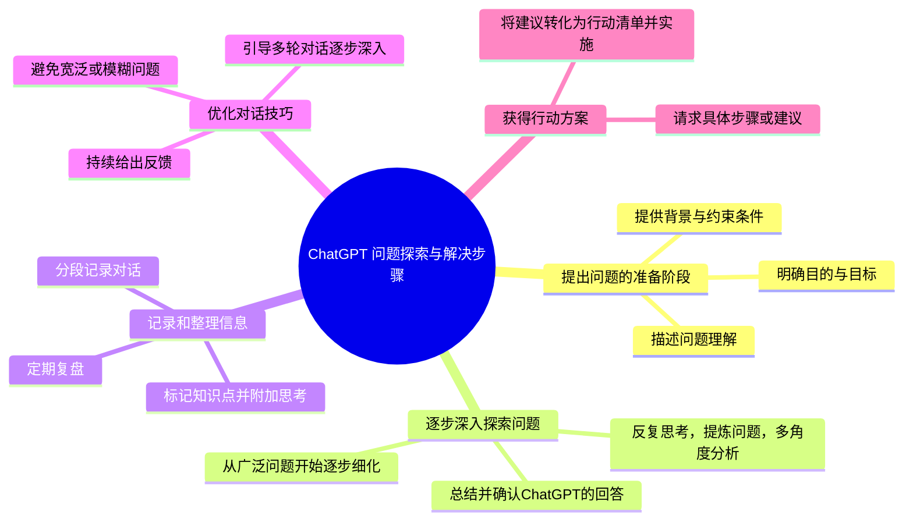

---
tags:
  - 思维导图
  - MDwriterTools
---



---

为了用代码轻松地生成思维导图，你可以使用一些热门的 GitHub 项目，这些工具和库能帮助你以编程的方式生成结构化的思维导图。下面我列出了一些热门且非常实用的 GitHub 开源项目，并详细说明它们的功能、优点以及如何使用它们生成思维导图：

### 一、热门 GitHub 仓库推荐

1. **MindMup 2.0 - [GitHub Repository](https://github.com/mindmup/mindmup)**
   - **简介**：MindMup 是一个非常受欢迎的在线思维导图工具，支持使用浏览器进行绘制。MindMup 的开源版本可以通过 API 来创建和操作思维导图。
   - **功能特点**：
     - 支持多种布局类型（包括树形、图形等）。
     - 通过集成 Google Drive 或 GitHub 轻松保存和共享。
   - **优点**：
     - 界面简洁，使用方便，可以直接在浏览器中使用。
     - 支持导出多种格式，如 PDF、PPT 等。
   - **如何使用**：
     - 可以在 GitHub 上 clone 下来然后在本地运行，或者集成 API 使用。
     - 如果希望用代码来生成，可以使用 JSON 格式定义节点结构，MindMup 会解析并生成思维导图。

2. **Mermaid - [GitHub Repository](https://github.com/mermaid-js/mermaid)**
   - **简介**：Mermaid 是一个强大的工具，可以将文本描述的代码块转换为流程图、甘特图、思维导图等多种图形。它非常适合 Markdown 用户，很多平台（如 Obsidian、GitHub、Notion 等）都支持 Mermaid 语法。
   - **功能特点**：
     - 支持 Markdown 格式嵌入思维导图的代码，非常适合在 Obsidian 中使用。
     - 用简单的文本语法生成复杂的图表，包括思维导图、流程图、实体关系图等。
   - **优点**：
     - 易于集成到 Markdown 中，可以直接在 Obsidian 等笔记工具中使用。
     - 只需简单的代码语法就能生成图形，降低了学习成本。
   - **如何使用**：
     - 你可以通过在 Markdown 中嵌入 Mermaid 代码来生成思维导图。例如：
       ```markdown
       ```mermaid
       mindmap
         root((ChatGPT 问题探索与解决步骤))
           提出问题的准备阶段
             描述问题理解
             明确目的与目标
             提供背景与约束条件
           逐步深入探索问题
             从广泛问题开始逐步细化
             总结并确认ChatGPT的回答
             反复思考，提炼问题，多角度分析
           记录和整理信息
             分段记录对话
             标记知识点并附加思考
             定期复盘
           优化对话技巧
             避免宽泛或模糊问题
             持续给出反馈
             引导多轮对话逐步深入
           获得行动方案
             请求具体步骤或建议
             将建议转化为行动清单并实施
       ```
     - 将以上代码块插入到支持 Mermaid 的 Markdown 编辑器（如 Obsidian）中，Mermaid 会自动渲染为思维导图。

3. **Draw.io (diagrams.net) - [GitHub Repository](https://github.com/jgraph/drawio)**
   - **简介**：Draw.io 是一个流行的开源绘图工具，可以轻松地通过图形界面拖放来生成思维导图，适合想要更自由绘制的人。
   - **功能特点**：
     - 支持各种图表类型，包括流程图、思维导图、网络图等。
     - 支持与 Google Drive、OneDrive 集成，便于云端保存。
   - **优点**：
     - 提供了可视化界面，也可以使用 API 或 XML 文件定义节点和关系。
     - 丰富的功能和模板，帮助用户快速构建各种类型的图表。
   - **如何使用**：
     - 在本地安装 Draw.io 桌面版，或者使用其在线版。
     - 通过 XML 文件编写数据来生成图表，适合自动化生成图表的需求。
     - 也可以使用 GitHub 上的代码库来定制功能或集成到其他系统中。

4. **MindMapGenerator - [GitHub Repository](https://github.com/jaeger25/MindMapGenerator)**
   - **简介**：MindMapGenerator 是一个基于 Python 的工具，可以生成思维导图。适合那些想要用脚本化的方式快速生成和调整思维导图的用户。
   - **功能特点**：
     - 通过 Python 编写的脚本定义思维导图的结构。
     - 可生成静态图像格式的思维导图，例如 PNG 或 SVG。
   - **优点**：
     - 可以轻松地结合其他 Python 脚本使用，自动生成思维导图。
     - 非常适合那些需要程序化生成或大量创建图表的场景。
   - **如何使用**：
     - 安装 Python 库后，通过编写 Python 脚本来定义节点和连接。
     - 示例代码：
       ```python
       from mindmapgenerator import MindMap

       map = MindMap(title="ChatGPT 问题探索与解决步骤")
       map.add_node("提出问题的准备阶段", ["描述问题理解", "明确目的与目标", "提供背景与约束条件"])
       map.add_node("逐步深入探索问题", ["从广泛问题开始逐步细化", "总结并确认ChatGPT的回答", "反复思考，提炼问题，多角度分析"])
       # 继续添加其他节点...
       map.render("output.png")
       ```

5. **XMind SDK - [GitHub Repository](https://github.com/xmindltd/xmind-sdk-python)**
   - **简介**：XMind 是一个流行的思维导图工具，提供了丰富的可视化工具和多平台支持。XMind 提供了 Python SDK，可以通过代码创建和操作思维导图文件。
   - **功能特点**：
     - 丰富的思维导图功能，支持自由设计和模板。
     - 可以直接生成 .xmind 格式文件，并通过 XMind 软件进行查看和编辑。
   - **优点**：
     - 可以轻松创建可交互的思维导图，并导出为多种格式。
     - 支持 Python SDK，便于与其他程序集成，生成复杂的图表。
   - **如何使用**：
     - 使用 Python SDK 编写脚本，定义思维导图的结构并生成 XMind 文件。
     - 安装 SDK 后，可以通过简单的脚本生成结构化思维导图：
     - 
     - ```python
       import xmind
       workbook = xmind.load("example.xmind")
       sheet = workbook.createSheet()
       sheet.setTitle("ChatGPT 问题探索与解决步骤")
       root_topic = sheet.getRootTopic()
       root_topic.setTitle("ChatGPT 问题探索与解决步骤")
       root_topic.addSubTopic("提出问题的准备阶段")
       # 添加更多子节点...
       xmind.save(workbook, path="output.xmind")


### 总结
- **Mermaid** 非常适合与 Markdown 集成，适合在 Obsidian 中使用。
- **Draw.io** 和 **MindMup** 更适合那些喜欢可视化拖放操作的人。
- **MindMapGenerator** 和 **XMind SDK** 更适合程序员，通过脚本实现自动化和批量生成思维导图。

这些工具各有优点，你可以根据自己的需求选择最合适的工具。例如，如果你喜欢使用 Markdown 并且想快速生成思维导图，Mermaid 是非常适合的；如果你希望用代码进行更复杂的控制，MindMapGenerator 或 XMind SDK 是不错的选择。你可以访问 GitHub，下载这些工具并试用，找到最符合自己需求的工具。


当然，除了 **MindMapGenerator** 和 **XMind SDK**，还有很多其他工具和库可以帮助程序员通过代码生成思维导图。以下是一些热门的开源项目和库，你可以根据需求选择合适的工具。

### 三、更多适合程序员的思维导图工具和库

1. **Graphviz - [GitHub Repository](https://github.com/xflr6/graphviz)**
   - **简介**：Graphviz 是一个非常强大的图形可视化工具，可以通过简单的脚本语言来生成多种类型的图，包括思维导图。它提供了 Python 包用于绘制各种图表。
   - **功能特点**：
     - 可以生成各种图形，包括思维导图、流程图、层次结构图等。
     - 支持图的布局和自动生成，可以快速绘制出清晰的结构图。
   - **优点**：
     - 适合需要更灵活控制和复杂结构的思维导图。
     - 能以 `.dot` 脚本的形式编写图的结构，或通过 Python 代码生成。
   - **如何使用**：
     - 安装 `graphviz` Python 库：
       ```bash
       pip install graphviz
       ```
     - 示例代码生成简单思维导图：
       ```python
       from graphviz import Digraph

       dot = Digraph(comment='ChatGPT 问题探索与解决步骤')
       dot.node('A', 'ChatGPT 问题探索与解决步骤')
       dot.node('B', '提出问题的准备阶段')
       dot.node('C', '逐步深入探索问题')
       dot.node('D', '记录和整理信息')
       dot.node('E', '优化对话技巧')
       dot.node('F', '获得行动方案')

       dot.edges(['AB', 'AC', 'AD', 'AE', 'AF'])
       dot.render('mindmap-output', format='png')
       ```
     - 生成的文件将存储在本地，你可以选择多种输出格式。

2. **PyDotPlus - [GitHub Repository](https://github.com/carlos-jenkins/pydotplus)**
   - **简介**：PyDotPlus 是 Graphviz 的一个 Python 封装，方便生成 DOT 格式文件，并通过 Python API 操作。
   - **功能特点**：
     - 提供了简单的 Python 接口来操作 DOT 格式文件并生成图。
     - 可以生成 PNG、PDF 等格式的输出，适合各种需求。
   - **优点**：
     - Python 化操作 Graphviz，易于理解和上手。
   - **如何使用**：
     - 安装 PyDotPlus：
       ```bash
       pip install pydotplus
       ```
     - 使用 PyDotPlus 生成思维导图：
       ```python
       import pydotplus

       graph = pydotplus.Dot(graph_type='digraph', label='ChatGPT 问题探索与解决步骤', fontsize='30', color='blue')
       nodes = {
           "A": "ChatGPT 问题探索与解决步骤",
           "B": "提出问题的准备阶段",
           "C": "逐步深入探索问题",
           "D": "记录和整理信息",
           "E": "优化对话技巧",
           "F": "获得行动方案"
       }
       for node_id, label in nodes.items():
           graph.add_node(pydotplus.Node(node_id, label=label))

       graph.add_edge(pydotplus.Edge('A', 'B'))
       graph.add_edge(pydotplus.Edge('A', 'C'))
       graph.add_edge(pydotplus.Edge('A', 'D'))
       graph.add_edge(pydotplus.Edge('A', 'E'))
       graph.add_edge(pydotplus.Edge('A', 'F'))

       graph.write_png('mindmap.png')
       ```

3. **MindMapLib - [GitHub Repository](https://github.com/CodeSardine/MindMapLib)**
   - **简介**：MindMapLib 是一个为 Python 用户设计的库，简化了思维导图的生成。它支持通过简单的语法快速定义节点和边关系，从而生成漂亮的思维导图。
   - **功能特点**：
     - 通过简单 Python 语法快速定义思维导图的结构。
     - 支持输出多种格式的静态思维导图（如 PNG）。
   - **优点**：
     - 简单易用，专注于思维导图的生成。
     - 易于在自动化生成思维导图或快速绘制简单结构时使用。
   - **如何使用**：
     - 安装 MindMapLib：
       ```bash
       pip install mindmaplib
       ```
     - 示例代码生成思维导图：
       ```python
       from mindmaplib import MindMap

       mindmap = MindMap(title="ChatGPT 问题探索与解决步骤")
       mindmap.add_node("提出问题的准备阶段", ["描述问题理解", "明确目的与目标", "提供背景与约束条件"])
       mindmap.add_node("逐步深入探索问题", ["从广泛问题开始逐步细化", "总结并确认ChatGPT的回答", "反复思考，提炼问题，多角度分析"])
       # 添加更多节点
       mindmap.render("mindmap.png")
       ```

4. **Diagram as Code - PlantUML - [GitHub Repository](https://github.com/plantuml/plantuml)**
   - **简介**：PlantUML 是一个图表生成工具，支持多种图形类型，包括思维导图。它可以使用简单的文本描述生成图形。
   - **功能特点**：
     - 支持 UML 图、甘特图、思维导图等多种类型图表。
     - 用 ASCII 文本定义图表，轻松生成 PNG 或 SVG 格式输出。
   - **优点**：
     - 集成度高，适用于软件设计文档和复杂结构图生成。
     - 支持 Markdown 和其他文本编辑器插件，易于整合。
   - **如何使用**：
     - 使用 PlantUML 描述思维导图：
       ```text
       @startmindmap
       * ChatGPT 问题探索与解决步骤
       ** 提出问题的准备阶段
       *** 描述问题理解
       *** 明确目的与目标
       *** 提供背景与约束条件
       ** 逐步深入探索问题
       *** 从广泛问题开始逐步细化
       *** 总结并确认ChatGPT的回答
       *** 反复思考，提炼问题，多角度分析
       ** 记录和整理信息
       ** 优化对话技巧
       ** 获得行动方案
       @endmindmap
       ```
     - 可以在 PlantUML 支持的平台上，自动渲染上述代码为思维导图。

5. **D3.js (JavaScript Visualization Library) - [GitHub Repository](https://github.com/d3/d3)**
   - **简介**：D3.js 是一个基于 JavaScript 的强大数据可视化库，可以用来创建复杂的交互式思维导图和树状结构图。
   - **功能特点**：
     - 用数据驱动生成可视化图形，适合大规模、复杂的数据图表。
     - 支持非常丰富的交互式效果，适合 Web 页面上的动态图表展示。
   - **优点**：
     - 可以在网页上动态呈现图形，且交互性强。
     - 适合用于展示实时数据或需要丰富交互效果的思维导图。
   - **如何使用**：
     - 使用 D3.js 需要 JavaScript 编程基础，可以用 HTML 和 JavaScript 构建思维导图。
     - 详细文档和示例可以参考 [D3.js 官方文档](https://d3js.org/)。

### 总结
- **Graphviz** 和 **PyDotPlus**：适合程序化生成图表，简单易用，支持灵活布局。
- **MindMapLib**：适合那些希望快速生成简单思维导图的用户，尤其适合 Python 环境。
- **PlantUML**：使用简单的文本描述生成图形，适合集成到文档和文本编辑工具中。
- **D3.js**：如果你需要在网页中呈现交互式的思维导图，可以使用这个 JavaScript 库。

根据你的需求，选择最适合的工具。如果你更倾向于 Python 脚本化生成图形，**MindMapLib** 和 **PyDotPlus** 是不错的选择；如果你更需要展示在网页上的交互效果，可以考虑 **D3.js**。这些工具都有丰富的文档，可以帮助你轻松上手。