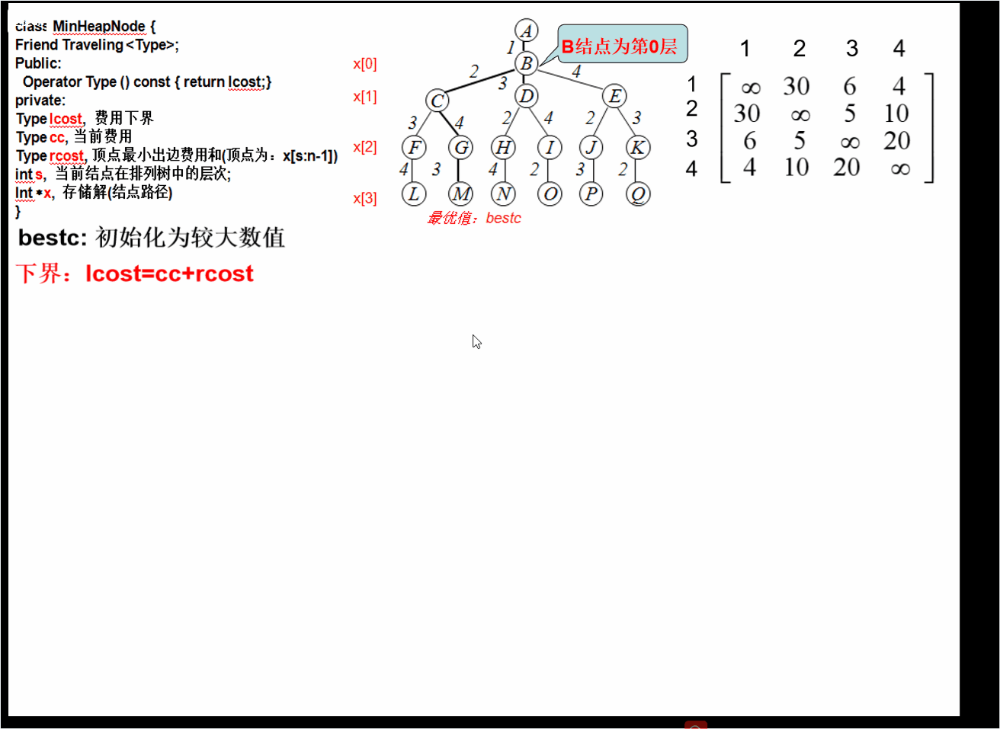

问题描述:
 某售货员要到若干城市去推销商品，已知各城市之间的路程，他要选定一条从驻地出发，经过每个城市一遍，最后回到住地的路线，使总的路程最短。
          
 结果为: 1 3 2 4 1
 
 
问题分析
解旅行售货员问题的优先队列式分支限界法用优先队列存储活结点表。
活结点m在优先队列中的优先级定义为：活结点m对应的子树费用下界lcost。
lcost=cc+rcost，其中，cc为当前结点费用，rcost为当前顶点最小出边费用加上剩余所有顶点的最小出边费用和。
优先队列中优先级最大的活结点成为下一个扩展结点。
排列树中叶结点所相应的载重量与其优先级（下界值）相同，即：叶结点所相应的回路的费用(bestc)等于子树费用下界lcost的值。
与子集树的讨论相似，实现对排列树搜索的优先队列式分支限界法也可以有两种不同的实现方式：(旅行售货员问题采用第一种实现方式。)
用优先队列来存储活结点。优先队列中每个活结点都存储从根到该活结点的相应路径。
用优先队列来存储活结点，并同时存储当前已构造出的部分排列树。优先队列中的活结点不必存储从根到该活结点的相应路径，该路径必要时从存储的部分排列树中获得。

令Minout[i]代表顶点i的最小出边费用。图中：

Minout[1]=4                 Minout[2]=5
Minout[3]=5                 Minout[4]=4


如，在扩展顶点D处：

 rcost=Minout[3]+Minout[2]+Minout[4]=14
  其中:Minout[3]:当前顶点最小出边
     Minout[2],Minout[4]:剩余所有顶点最小出边


算法描述
要找最小费用旅行售货员回路，选用最小堆表示活结点优先队列。
算法开始时创建一个最小堆，用于表示活结点优先队列。
堆中每个结点的优先级是子树费用的下界lcost值。
计算每个顶点i的最小出边费用并用minout[i]记录
如果所给的有向图中某个顶点没有出边，则该图不可能有回路，算法结束。


 基于优先队列式分支限界的旅行售货员问题求解算法，采用限界函数lcost ，作为优先级，不断调整搜索方向，选择最有可能取得最优解的子树优先搜索；同时，根据限界函数lcost进行剪枝，剪掉不包含最优解的分支。

算法的while循环完成对排列树内部结点的扩展。对于当前扩展结点，算法分两种情况进行处理。
令s表示结点在排列树中的层次（节点B为第0层）。考虑排列树层次s=n-2的情形，此时当前扩展结点是排列树中某个叶结点的父结点。
 (1).检测图G是否存在一条从顶点x[n-2]到顶点x[n-1]的边和一条从顶点x[n-1]到顶点1的边。
 (2). 如果这两条边都存在，则找到一条旅行员售货回路。
 (3).此时，算法还需要判断这条回路的费用是否优于已找到的当前最优回路的费用bestc。
 (4). 如果是，则必须更新当前最优值bestc和当前最优解bestx。
```c
if(cc + a[x[n-2]][x[n-1]] + a[x[n-1]][1] < bestc )
{    // 找到更优的旅行路径
	 for (int j = 0; j <= n-1; j++) bestx[j] = x[j];
	 bestc = cc + a[x[n-2]][x[n-1]] + a[x[n-1]][1];    
}
```


令x记录当前解，s表示结点在排列树中的层次（结点B为第0层）。当扩展结点所处的层次s<n-2时，算法依次产生当前扩展结点的所有儿子结点。
 (1). 由于当前扩展结点所相应的路径是x[0: s]，该扩展结点可行儿子结点是从剩余顶点x[s+1: n-1]中选取的顶点x[i]，且(x[s]，x[i])是所给有向图G中的一条边。
 (2).对于当前扩展结点的每一个可行儿子结点，计算出其前缀(x[0:s]，x[i])的费用cc和相应的下界lcost。
 (3).当lcost<bestc时，将这个可行儿子结点插入到活结点优先队列中,否则,将剪去以该儿子结点为根的子树。

while循环的终止条件：排列树的一个叶结点成为当前扩展结点, 算法结束。
当s=n-1时，已找到的回路是x[0: n-1]，它已包含图G的所有n个顶点。
因此，当s=n-1时，相应的扩展结点表示一个叶结点。该叶结点所相应的回路的费用(bestc)等于子树费用下界lcost的值。因为一旦一个叶结点成为当前扩展结点，剩余活结点的下界值(lcost值)，都大于等于当前叶子节点处已找到的回路的费用。它们都不可能导致费用更小的回路。
因此，已找到叶结点所相应的回路，是一个最小费用旅行售货员回路，算法结束。
算法结束时，返回找到的最小费用，相应的最优解由数组v给出


优先队列式分支限界法求解TSP问题
 s代表当前节点在排列树中层次，从排列树的根节点到当前结点的路径为x[0:s]，进一步搜索的顶点为x[s+1: n-1]

```c
class MinHeapNode {
Friend Traveling <Type>;
Public:
  	Operator Type () const { return lcost;}
private:
	Type lcost,  费用下界
	Type cc, 当前费用
	Type rcost, 顶点最小出边费用和(顶点为：x[s:n-1])
	int s,  当前结点在排列树中的层次;
	Int *x,  存储解（结点路径）
}
```
下界：lcost=cc+rcost
Minout[i]：顶点i的最小费用出边
初始化时：cc=0, s=0, x[0]=1, x[1: n-1]=(2,3,…, n)


初始化时:bestc为较大数值


样例


分析演示

代码
文章是本科期间写的，时间有点久了，看评论好多反应是回溯法，我再看了一下，发现确实是，参考了一些文献，以及本篇文章，重新写了代码。

```c
#include<iostream>
#include<cstring>
#include<queue>
#define INF 1e7
using namespace std;

int m[100][100];//存储路径，从1开始
int bestx[100];//最优解路径
int bestl;//最优解长度
int n;//城市数目

//排列树的节点定义
struct node
{
    int cl;//当前走过的路径长度
    int id;//处理的第几个城市
    int x[100];//记录当前路径，下标从1开始

    node() {}
    node(int cl_,int id_)
    {
        cl=cl_;
        id=id_;
        memset(x,0,sizeof(x));
    }
};


//用于构建最小堆
struct cl_cmp {
    //当前路径长度短的优先级高
    bool operator()(node n1, node n2)
    {
        return n1.cl > n2.cl;
    }
};

void bfs()
{
    //选用最小堆
    priority_queue<node,vector<node>,cl_cmp> q;
    //创建一个节点，从该节点开始，因为1是固定位，其实是从1开始探索
    node temp(0,2);
    //初始化解向量
    for(int i=1; i<=n; ++i)
        temp.x[i]=i;
    q.push(temp);
    node cur;//当前节点，也就是活节点
    int t;
    while(!q.empty())
    {
        cur=q.top();
        q.pop();
        t=cur.id;
        //处理到倒数第二个城市
        if(t==n)
        {
            //满足约束条件，有路径
            //检测图G是否存在一条从顶点x[n-1]到顶点x[n]的边和一条从顶点x[n]到顶点1的边
            //这里和前面的理论部分不同，因为这里是从1开始，而不是0开始
            if(m[cur.x[t-1]][cur.x[t]]!=INF&&m[cur.x[t]][1]!=INF)
            {
                if(cur.cl+m[cur.x[t-1]][cur.x[t]]+m[cur.x[t]][1]<bestl)
                {
                    //更新最优解和最优路径
                    bestl=cur.cl+m[cur.x[t-1]][cur.x[t]]+m[cur.x[t]][1];
                    for(int i=1; i<=n; ++i)
                        bestx[i]=cur.x[i];
                }
            }continue;
        }
        //大于等于最优路径，没必要继续探索了，从下一个节点开始
        if(cur.cl>=bestl)
            continue;
        //从当前节点开始探索t-1 -> t,t+1,t+2...
        for(int j=t; j<=n; ++j)
        {
            //满足约束条件和限界条件
            if(m[cur.x[t-1]][cur.x[j]]!=INF&&cur.cl+m[cur.x[t-1]][cur.x[j]]<bestl)
            {
                temp=node(cur.cl+m[cur.x[t-1]][cur.x[j]],t+1);
                //如果找到了一个下级节点，那么该节点到现在为止和同级的节点路径相同，除了当前这一级的不同
                for(int k=1; k<=n; ++k)
                    temp.x[k]=cur.x[k];
                swap(temp.x[t],temp.x[j]);
                q.push(temp);
            }
        }
    }
}

int main()
{
    cout<<"请输入城市数目:";
    cin>>n;

    //先进行初始化
    int i,j;
    for(i=1; i<=n; ++i)
        for(j=1; j<=n; ++j)
            m[i][j]=INF;
    memset(bestx,0,n);
    bestl=INF;

    for(int i=1;i<=n;i++) {
        cout << "请输入第" << i << "座城市的路程信息(不通请输入-1):";
        for (int j = 1; j <= n; j++) {
            int temp;
            cin>>temp;
            if(temp==-1){
                continue;
            }
            m[i][j] = temp;
        }
    }
    //进行探索
    bfs();
    cout<<"最优值为："<<bestl<<endl;
    cout<<"最优解为：";
    for(int i=1; i<=n; ++i)
        cout<<bestx[i]<<" ";
    cout<<bestx[1]<<endl;
    return 0;
}
```
测试样例
数据与例子中的数据相同。

输入:
4
-1 30 6 4
30 -1 5 10
6 5 -1 20
4 10 20 -1

输出
最优值为:25
最优解为:13241


---

好的，分支限界算法是一种用于解决优化问题的有效方法，特别是在组合优化问题中。旅行商问题（TSP, Traveling Salesman Problem）是一个经典的组合优化问题，目标是找到一条最短的路径，使得旅行商能够访问每个城市恰好一次并返回起点城市。

### 分支限界算法的基本思想
1. **分支**：将问题分解成子问题。
2. **限界**：通过一些启发式方法或上下界来剪枝，减少搜索空间。

### TSP 问题的分支限界算法步骤

#### 1. 初始化
- 定义一个优先队列（通常使用最小堆），用于存储待处理的子问题。
- 计算初始下界（通常是贪心算法得到的解）。
- 将初始问题加入优先队列。

#### 2. 分支
- 从优先队列中取出当前最优的子问题。
- 对当前子问题进行分支，生成新的子问题。
- 计算每个新子问题的下界。

#### 3. 限界
- 如果某个子问题的下界大于当前已知的最优解，则剪枝（不继续处理该子问题）。
- 否则，将新的子问题加入优先队列。

#### 4. 更新最优解
- 如果某个子问题已经是一个完整的解，并且其代价小于当前最优解，则更新最优解。

#### 5. 终止条件
- 当优先队列为空时，算法终止。

### 逻辑分析与步骤讲解

| 步骤 | 描述 |
|------|------|
| 1. 初始化 | 定义优先队列，计算初始下界，将初始问题加入优先队列。 |
| 2. 分支 | 从优先队列中取出当前最优的子问题，生成新的子问题，计算每个新子问题的下界。 |
| 3. 限界 | 如果某个子问题的下界大于当前已知的最优解，则剪枝；否则，将新的子问题加入优先队列。 |
| 4. 更新最优解 | 如果某个子问题已经是一个完整的解，并且其代价小于当前最优解，则更新最优解。 |
| 5. 终止条件 | 当优先队列为空时，算法终止。 |

### 示例树状图

```
初始问题 (下界: L0)
├── 子问题1 (下界: L1)
│   ├── 子问题1.1 (下界: L1.1) - 剪枝
│   └── 子问题1.2 (下界: L1.2) - 加入队列
├── 子问题2 (下界: L2) - 剪枝
└── 子问题3 (下界: L3)
    ├── 子问题3.1 (下界: L3.1) - 剪枝
    └── 子问题3.2 (下界: L3.2) - 完整解，更新最优解
```

### 代码实现

以下是一个简单的 Python 代码示例，展示了如何使用分支限界算法解决 TSP 问题：

```python
import heapq
import numpy as np

def tsp_branch_and_bound(dist_matrix):
    n = len(dist_matrix)
    best_path = None
    best_cost = float('inf')
    priority_queue = []

    # Initial lower bound using a greedy approach
    initial_path = [0]
    for i in range(1, n):
        next_city = min(range(n), key=lambda x: dist_matrix[initial_path[-1]][x] if x not in initial_path else float('inf'))
        initial_path.append(next_city)
    initial_path.append(0)
    initial_cost = sum(dist_matrix[initial_path[i]][initial_path[i+1]] for i in range(n))

    # Push the initial problem to the priority queue
    heapq.heappush(priority_queue, (initial_cost, initial_path))

    while priority_queue:
        current_cost, current_path = heapq.heappop(priority_queue)

        if current_cost >= best_cost:
            continue

        if len(current_path) == n + 1:
            if current_cost < best_cost:
                best_cost = current_cost
                best_path = current_path
            continue

        last_city = current_path[-1]
        for next_city in range(n):
            if next_city not in current_path:
                new_path = current_path + [next_city]
                new_cost = current_cost + dist_matrix[last_city][next_city]

                # Calculate the lower bound for the new path
                lower_bound = new_cost + min(dist_matrix[next_city][i] for i in range(n) if i not in new_path)
                lower_bound += min(dist_matrix[i][0] for i in range(n) if i not in new_path)

                if lower_bound < best_cost:
                    heapq.heappush(priority_queue, (lower_bound, new_path))

    return best_path, best_cost

# Example usage
dist_matrix = np.array([
    [0, 10, 15, 20],
    [10, 0, 35, 25],
    [15, 35, 0, 30],
    [20, 25, 30, 0]
])

best_path, best_cost = tsp_branch_and_bound(dist_matrix)
print("Best Path:", best_path)
print("Best Cost:", best_cost)
```

### 解释
- `dist_matrix` 是城市之间的距离矩阵。
- `tsp_branch_and_bound` 函数实现了分支限界算法。
- 使用优先队列（最小堆）来管理待处理的子问题。
- 通过贪心算法计算初始下界。
- 在每次迭代中，从优先队列中取出当前最优的子问题，生成新的子问题，并计算新的下界。
- 如果新的下界大于当前最优解，则剪枝；否则，将新的子问题加入优先队列。
- 最终返回最优路径和最优成本。

希望这个解释和代码示例对你有帮助！如果有任何问题，请随时问我。