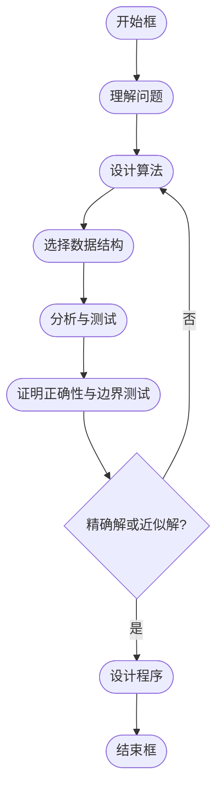

# 算法设计与分析

## 问题1: 我们为什么要了解算法设计与分析？

算法是计算机理论和实践的核心，在信息化社会中，算法的基本知识、方法和思想日益融入人们的社会生活各个方面，已经成为现代人应具备的基本素质。

### 理由1

算法学习有助于我们全面理解运算能力。

### 理由2

- **输入**: 正整数 `m`, `n`
- **输出**: `m`, `n` 的最大公因子

```c
int euclid(int m, int n) 
{ 
    int r; 
    do { 
        r = m % n; // 计算余数
        m = n;     // 更新m为n
        n = r;     // 更新n为余数
    } while (r); 
    return m; // 返回最大公因子
}
```

#### 例1 欧几里德算法: 求两个数的最大公因子

公元5世纪末，古代数学家张丘建在《算经》中提出问题：

> 鸡翁一，值钱五；鸡母一，值钱三；鸡雏三，值钱一。百钱买百鸡，问鸡翁、母、雏各几何？

设 `a` 为公鸡只数，`b` 为母鸡只数，`c` 为小鸡只数，根据题意建立方程：

```
a + b + c = 100
5a + 3b + c/3 = 100
c % 3 = 0
```

这类问题用解析法求解有困难，但可采用穷举法求解。

#### 例2 百鸡问题

```c
void chicken_question(int n) 
{ 
    int a, b, c; 
    for(a = 0; a <= n; a++) { 
        for(b = 0; b <= n; b++) { 
            for(c = 0; c <= n; c++) { 
                if((a + b + c == n) && (5 * a + 3 * b + c / 3 == 100) && (c % 3 == 0)) 
                    printf("%d, %d, %d\n", a, b, c); 
            } 
        } 
    } 
}
```

**分析**: 执行时间取决于内循环执行次数。外循环执行次数 `n + 1` 次；中间循环执行次数 `n + 1`；内循环执行次数 `n + 1`。当 `n = 100` 时，总执行次数为 `101^3 = 1,030,301` 次。

### 改进算法

```c
void chicken_question(int n) 
{ 
    int a, b, c; 
    for(a = 0; a <= n / 5; a++) { // 公鸡最多 n/5 只
        for(b = 0; b <= n / 3; b++) { // 母鸡最多 n/3 只
            c = n - a - b; // 计算小鸡只数
            if((a + b + c == n) && (c % 3 == 0)) 
                printf("%d, %d, %d\n", a, b, c); 
        } 
    } 
}
```

**分析**: 内循环执行次数 `(n / 5 + 1) * (n / 3 + 1)`。当 `n = 100` 时，总执行次数为 `21 * 34 = 714` 次。

### 例3 货郎担问题

某售货员要到若干个城市销售货物，已知各城市间距离，要求售货员选择出发的城市及旅行路线，使每个城市只经过一遍，最后回到出发地，而总路程最短。

**分析**: 每一条路线对应于城市编号 `1, 2, …, n` 的一个排列。`n` 个城市有 `n!` 个不同的路线，只需列举出每条路线并分别计算相应的费用，从中找出最小费用及对应的路线。

```c
void salesman_problem(int n, float c[][n], int t[], float *min) 
{ 
    float cost; 
    int p[n]; 
    *min = maxCost; 
    int i = 1;
    while(i <= factorial(n)) { 
        generate_permutation(p, n); // 生成城市排列
        cost = calculate_route_cost(p, c, n); // 计算路线费用
        if(cost < *min){ 
            copy_route(p, t, n); // 复制当前路线到t
            *min = cost; // 更新最小费用
        } 
        i++; 
    } 
}
```

**复杂性分析**:
- `n = 6`: 720 μs
- `n = 9`: 362 ms
- `n = 10`: 3.62 s
- `n = 13`: 1.72 h
- `n = 16`: 242 days
- `n = 20`: 77,146 years

**假设**: 每次执行需要 1 μs。

### 理由3

算法学习能够培养学生的逻辑思维能力。

**求解**: `ax + b = 0`

### 理由4

**解决实际问题**:
- 自驾游
- 装修材料选择
- 其他实际应用场景

### 理由5

**案例分析**: Chris McKinlay，UCLA（加利福尼亚大学洛杉矶分校）

**项目**: OkCupid

1. 利用12个账户基于Python的脚本自动搜索。
2. 编写软件模拟人的点击率和打字速度以欺骗OkCupid。
3. 收集了600多个问题的答案，数据来自全美数万个女性。
4. 使用贝尔实验室的K-Modes算法对女性进行分类。
5. 根据分类结果获得相应的喜好，提出“perfect”自己，提高匹配度。
6. 编写程序，自动在对方主页上踩下痕迹（超匹配+被踩过）。
7. 开始一一约会，A组的女性约会不太成功（通过算法分析A组女性常有很多纹身，且多居住在洛杉矶东面），转向B组。
8. 附加“约会守则”：约会定在下午，不一起吃饭；一天可约会两个对象；不去看电影或听音乐会等（与算法无关）。
9. 第89次约会，真爱到来。。。Christine Tien Wang，UCLA Master。
10. 编写程序，帮助计算机挑选黄道吉日举行婚礼。

## Optimal Cupid: Mastering the Hidden Logic of OkCupid

[http://christophermckinlay.net/](http://christophermckinlay.net/)

### 设计算法的步骤

1. 设计算法
2. 表示算法
3. 确认算法
4. 分析算法
5. 验证算法

## 问题2: 算法课程学习什么？

### 学习内容

1. **第1章 算法引论**
2. **第2章 递归与分治策略**
3. **第3章 动态规划**
4. **第4章 贪心算法**
5. **第5章 回溯法**
6. **第6章 分支限界法**

#### 主要内容（续）

7. **第8章 NP完全性理论**
8. **第9章 近似算法**
9. **第10章 算法优化策略**

## 问题3: 如何学习本课程？

不能仅停留在代码和程序等表现上，要追根溯源，学习并掌握算法设计的方法，独立进行算法设计，解决实际问题。

### 参考书目

1. 《算法导论》Thomas H. Cormen, Charles E. Leiserson, Ronald L. Rivest, Clifford Stein著
2. 《算法与数据结构》，王晓东

## 第1章 算法引论

### 1.1 算法与程序

- **输入**: 有零个或多个外部量作为算法的输入。
- **输出**: 算法产生至少一个量作为输出。
- **确定性**: 组成算法的每条指令清晰、无歧义。
- **有限性**: 算法中每条指令的执行次数有限，执行每条指令的时间也有限。

**区别**:
- **算法**: 满足上述性质的指令序列。
- **程序**: 算法用某种程序设计语言的具体实现，程序可以不满足算法的有限性。

### 1.3 描述算法

算法的描述方法可以归纳为以下几种：

1. 自然语言
2. 图形，如流程图，图的描述与算法语言的描述对应
3. 算法语言，即计算机语言、程序设计语言、伪代码
4. 形式语言，用数学的方法，可以避免自然语言的二义性

### 1.4 算法复杂性分析

算法复杂性是算法运行所需要的计算机资源的量，包括：

- **时间复杂性**: 需要时间资源的量
- **空间复杂性**: 需要的空间资源的量

这个量只依赖于算法要解的问题的规模、算法的输入和算法本身的函数。

#### 表达式

- 设 `N` 为规模，`I` 为输入，`A` 为算法，`C` 为复杂性。
- 则: `C = F(N, I, A)`
  - 时间复杂性: `T = T(N, I)`
  - 空间复杂性: `S = S(N, I)`

#### 复杂性函数具体化

- 假设有 `k` 种元运算：`O1, O2, …, Ok`
- 执行元运算所需时间分别为：`t1, t2, …, tk`
- `Oi` 运算次数为 `ei`
- 则 `T(N, I) = Σ ti * ei`
- 简化后 `T = T(N, I)` 仅与规模有关

#### 算法复杂性函数示例

```java
Algorithm lcsLength(x, y, b) 
1: m ← x.length - 1; 
2: n ← y.length - 1; 
3: c[i][0] = 0; c[0][i] = 0; 
4: for (int i = 1; i <= m; i++) 
5:     for (int j = 1; j <= n; j++) 
6:         if (x[i] == y[j]) 
7:             c[i][j] = c[i-1][j-1] + 1; 
8:             b[i][j] = 1; 
9:         else if (c[i-1][j] >= c[i][j-1]) 
10:             c[i][j] = c[i-1][j]; 
11:             b[i][j] = 2; 
12:         else 
13:             c[i][j] = c[i][j-1]; 
14:             b[i][j] = 3; 
```

### 最坏、最好、平均情况下的时间复杂性

- **最坏情况**: `Tmax(N)`
- **最好情况**: `Tmin(N)`
- **平均情况**: 根据输入概率 `P(I)`

#### 渐进性态与渐进表达式

- **渐进性态**: 当 `N` 单调增加且趋于 ∞ 时，`T(N)` 也将单调增加趋于 ∞。
- **渐进表达式**: 如果存在函数 `T'(N)`，使得 `T(N) - T'(N) / T(N) → 0`，则 `T'(N)` 是 `T(N)` 的渐进表达式。

**示例**: `3N² + 4N logN + 7` 与 `3N²`

### 大O符号的定义与运算规则

#### 定义

对于所有 `N`，`f(N) ≥ 0`，`g(N) ≥ 0`，如果存在常数 `C` 和自然数 `N0`，使得当 `N ≥ N0` 时:

```
f(N) ≤ C * g(N)
```

则称 `f(N)` 的阶至多是 `O(g(N))`，记为 `f(N) = O(g(N))`

#### 运算规则

1. `O(f) + O(g) = O(max(f, g))`
2. `O(f) + O(g) = O(f + g)`
3. `O(f) * O(g) = O(fg)`
4. 如果 `g(N) = O(f(N))`，则 `O(f) + O(g) = O(f)`
5. `O(Cf(N)) = O(f(N))`，其中 `C` 是一个正的常数
6. `O(f) = O(f)`

#### 例子

- `f(n) = 20n² + 9n + 33`
  - 取 `n0 = 10`，则当 `n ≥ n0` 时，`f(n) ≤ 21n²`
  - 令 `C = 21`, `g(n) = n²`
  - 所以 `f(n) = O(n²)`

### Ω符号的定义

如果存在正的常数 `C` 和自然数 `N0`，使得当 `N ≥ N0` 时:

```
f(N) ≥ C * g(N)
```

则称函数 `f(N)` 的阶不低于 `Ω(g(N))`。

**例子**:

- `f(n) = 5n + 2`
  - 令 `n0 = 0`
  - 当 `n ≥ n0` 时，有 `f(n) ≥ 5n = C1 * g(n)`，其中 `C1 = 5`, `g(n) = n`
  - 所以 `f(n) = Ω(n)`

### θ符号的定义

`f(N) = θ(g(N))` 当且仅当 `f(N) = O(g(N))` 且 `f(N) = Ω(g(N))`，此时称 `f(N)` 与 `g(N)` 同阶。

**例子**:

- `f(n) = 5n + 2`
  - `f(n) = Ω(n)`
  - `f(n) = O(n)`
  - 所以 `f(n) = θ(n)`

### o符号的定义

对于任意给定的 `ε > 0`，存在正整数 `N0`，使得当 `N ≥ N0` 时有:

```
f(N) / (C * g(N)) ≤ ε
```

则称 `f(N) = o(g(N))`。

**例子**:

- `4N logN + 7 = o(3N² + 4N logN + 7)`

### 常见复杂性函数


- **小规模数据复杂性增长图**


- **中等规模数据复杂性增长图**

### 非递归算法

1. **for / while 循环**
   - 循环体内计算时间 * 循环次数
2. **嵌套循环**
   - 循环体内计算时间 * 所有循环次数
3. **顺序语句**
   - 各语句计算时间相加
4. **if-else语句**
   - 取 `if` 和 `else` 语句计算时间的较大者

### 最优算法

- 问题的计算时间下界为 `Ω(f(n))`，则计算时间复杂性为 `O(f(n))` 的算法是最优算法。
  - 例如，排序问题的计算时间下界为 `Ω(n log n)`，计算时间复杂性为 `O(n log n)` 的排序算法是最优算法。堆排序算法是最优算法。

### 算法设计与分析的其他内容

---




---

### 小结

- **算法与程序的区别**: 算法是解决问题的步骤和方法，程序是算法的具体实现。
- **算法设计**: 包括设计算法、选择合适的数据结构、应用设计策略等。
- **算法分析**: 评估算法的时间复杂性和空间复杂性，确保其在实际应用中的有效性和效率。
