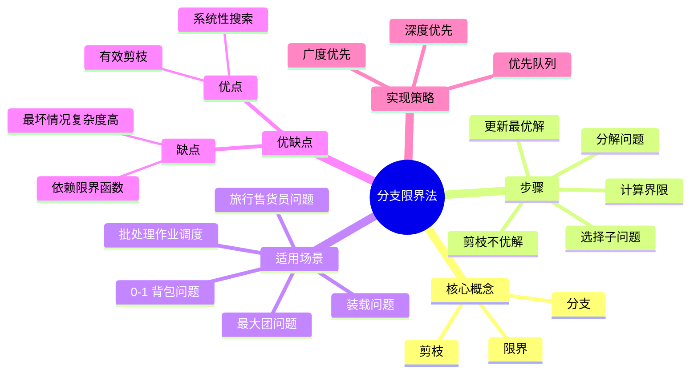

>[!question]

**分支限界法**：专注于通过剪枝优化大规模搜索问题，应用于旅行售货员问题、最大团问题等。- **分支限界法**：旅行售货员问题、批处理作业调度、最大团问题、装载问题、0-1 背包问题。 **深入解释算法原理**- **理论学习：** 阅读经典教材，如《算法导论》，了解算法的数学基础和设计思想。- **算法推导：** 理解算法的推导过程，为什么这样设计。我也需要你用markdown图表和mermaid 的mindmap分析逻辑，java代码示例以及代码的作用和解释。

---

### 深入理解分支限界法

分支限界法（Branch and Bound）是一种系统性的方法，用于解决组合优化问题，特别是那些规模庞大、搜索空间巨大的问题。通过分支和限界的策略，分支限界法能够有效地剪枝，减少不必要的搜索，从而提高求解效率。

---

#### 目录

1. [分支限界法概述](#分支限界法概述)
2. [算法原理](#算法原理)
   - [理论学习](#理论学习)
   - [算法推导](#算法推导)
3. [逻辑分析](#逻辑分析)
   - [思维导图](#思维导图)
4. [Java代码示例](#Java代码示例)
   - [示例一：0-1 背包问题](#示例一-0-1-背包问题)
   - [示例二：旅行售货员问题（TSP）](#示例二-旅行售货员问题tsp)
5. [代码解释](#代码解释)
   - [示例一代码解释](#示例一代码解释)
   - [示例二代码解释](#示例二代码解释)
6. [总结](#总结)

---

### 分支限界法概述

**分支限界法**是一种用于解决组合优化问题的算法框架。它通过构建问题的解空间树，系统地探索可能的解，并通过“限界”策略剪除那些不可能包含最优解的子树，从而减少计算量。

**适用场景：**
- 旅行售货员问题（TSP）
- 最大团问题
- 批处理作业调度
- 装载问题
- 0-1 背包问题

**核心概念：**
1. **分支（Branching）：** 将问题分解为更小的子问题。
2. **限界（Bounding）：** 计算子问题的下界或上界，用于决定是否继续探索该子树。
3. **剪枝（Pruning）：** 排除那些不可能产生更优解的子树，减少搜索空间。

---

### 算法原理

#### 理论学习

分支限界法结合了深度优先搜索和广度优先搜索的优点，通过系统地分解问题和评估子问题的界限，能够高效地找到最优解。其设计思想基于以下原则：

1. **分支（Branching）：** 将原问题分解为若干子问题，形成解空间树。
2. **限界（Bounding）：** 为每个子问题计算一个界限值（如最小可能成本或最大可能收益），用于评估该子问题是否可能包含最优解。
3. **剪枝（Pruning）：** 如果一个子问题的界限值不优于当前已知的最优解，则不再探索该子问题，进行剪枝操作。

分支限界法的效率依赖于有效的限界函数和合理的分支策略，以尽可能多地剪除无关的子树，缩小搜索空间。

#### 算法推导

以**0-1 背包问题**为例，使用分支限界法来求解。0-1 背包问题要求在给定的背包容量下，选择物品使得总价值最大，每个物品只能选择一次。

**推导过程：**

1. **分支策略：** 对每个物品，决定是否选择该物品，形成两条分支：选择和不选择。
2. **限界函数：** 使用贪心算法计算当前节点的上界。如果上界小于当前最优解，则剪枝。
3. **搜索策略：** 通常使用深度优先搜索，以便尽早找到一个可行解，作为初始最优解，从而提高剪枝效率。

---


### Java代码示例

#### 示例一：0-1 背包问题

使用分支限界法解决0-1 背包问题，找到在给定重量限制下的最大价值。

```java
import java.util.PriorityQueue;
import java.util.Comparator;

class KnapsackNode {
    int level;
    int profit;
    int weight;
    double bound;

    KnapsackNode(int level, int profit, int weight, double bound) {
        this.level = level;
            this.profit = profit;
            this.weight = weight;
            this.bound = bound;
    }
}

public class KnapsackBranchAndBound {
    // 按单位价值降序排序
    public static void sortItems(int[] weights, int[] values, int n) {
        for(int i=0; i<n-1; i++) {
            for(int j=i+1; j<n; j++) {
                double r1 = (double) values[i]/weights[i];
                double r2 = (double) values[j]/weights[j];
                if(r1 < r2) {
                    // 交换
                    int temp = weights[i];
                    weights[i] = weights[j];
                    weights[j] = temp;
                    temp = values[i];
                    values[i] = values[j];
                    values[j] = temp;
                }
            }
        }
    }

    // 计算上界
    public static double bound(KnapsackNode u, int n, int W, int[] weights, int[] values) {
        if(u.weight >= W)
            return 0;
        double profit_bound = u.profit;
        int j = u.level + 1;
        int totweight = u.weight;

        // 加入尽可能多的物品
        while(j < n && totweight + weights[j] <= W) {
            totweight += weights[j];
            profit_bound += values[j];
            j++;
        }

        // 加入部分物品
        if(j < n)
            profit_bound += (W - totweight) * ((double) values[j] / weights[j]);

        return profit_bound;
    }

    public static int knapsack(int W, int[] weights, int[] values, int n) {
        sortItems(weights, values, n);

        PriorityQueue<KnapsackNode> pq = new PriorityQueue<>(Comparator.comparingDouble(node -> -node.bound));

        KnapsackNode u = new KnapsackNode(-1, 0, 0, 0);
        KnapsackNode v = new KnapsackNode(0, 0, 0, 0);

        u.bound = bound(u, n, W, weights, values);
        pq.add(u);

        int maxProfit = 0;

        while(!pq.isEmpty()) {
            u = pq.poll();

            if(u.bound > maxProfit && u.level < n-1) {
                // 向左分支：选择下一个物品
                v.level = u.level + 1;
                v.weight = u.weight + weights[v.level];
                v.profit = u.profit + values[v.level];

                if(v.weight <= W && v.profit > maxProfit)
                    maxProfit = v.profit;

                v.bound = bound(v, n, W, weights, values);

                if(v.bound > maxProfit)
                    pq.add(new KnapsackNode(v.level, v.profit, v.weight, v.bound));

                // 向右分支：不选择下一个物品
                v.weight = u.weight;
                v.profit = u.profit;
                v.bound = bound(v, n, W, weights, values);

                if(v.bound > maxProfit)
                    pq.add(new KnapsackNode(v.level, v.profit, v.weight, v.bound));
            }
        }

        return maxProfit;
    }

    public static void main(String[] args) {
        int[] values = {60, 100, 120};
        int[] weights = {10, 20, 30};
        int W = 50;
        int n = values.length;
        System.out.println("最大价值为 " + knapsack(W, weights, values, n));
    }
}
```

#### 示例二：旅行售货员问题（TSP）

使用分支限界法解决旅行售货员问题，找到最短的巡回路径。

```java
import java.util.Arrays;

public class TSPBranchAndBound {
    static int N = 4;
    static int VISITED_ALL = (1 << N) - 1;
    static int[][] cost = {
        {0, 10, 15, 20},
        {10, 0, 35, 25},
        {15, 35, 0, 30},
        {20, 25, 30, 0}
    };

    static int minCost = Integer.MAX_VALUE;

    public static void main(String[] args) {
        boolean[] visited = new boolean[N];
        visited[0] = true;
        tsp(0, 1, 0, visited);
        System.out.println("最小巡回路径长度为 " + minCost);
    }

    public static void tsp(int current, int count, int costSoFar, boolean[] visited) {
        if(count == N && cost[current][0] > 0){
            if(costSoFar + cost[current][0] < minCost){
                minCost = costSoFar + cost[current][0];
            }
            return;
        }

        for(int i=0; i<N; i++) {
            if(!visited[i] && cost[current][i] > 0){
                visited[i] = true;
                if(costSoFar + cost[current][i] < minCost){
                    tsp(i, count+1, costSoFar + cost[current][i], visited);
                }
                visited[i] = false;
            }
        }
    }
}
```

---

### 代码解释

#### 示例一：0-1 背包问题

1. **类定义：**
   - `KnapsackNode`：表示解空间树中的一个节点，包含当前层级（物品索引）、当前价值、当前重量和上界值。

2. **排序物品：**
   - `sortItems`方法按照单位重量价值（`value/weight`）降序排序物品，以优化限界函数的效果。

3. **计算上界：**
   - `bound`方法计算当前节点的上界值，使用贪心策略尽可能多地选择剩余物品，允许部分选择物品。

4. **分支限界算法：**
   - 使用优先队列（最大堆）按上界值排序节点，优先探索上界值高的节点。
   - 初始节点为`level = -1`，`profit = 0`，`weight = 0`，`bound`为初始计算值。
   - 在每一步，弹出具有最高上界值的节点进行扩展：
     - **左子树（选择当前物品）：** 更新重量和价值，检查是否超重或是否需要更新最优解。
     - **右子树（不选择当前物品）：** 保持当前重量和价值不变，仅计算新的上界值。
   - 通过比较上界值和当前最优解，决定是否剪枝。

5. **主方法：**
   - 定义物品的重量和价值，调用`knapsack`方法计算最大价值。

**运行结果：**
```
最大价值为 220
```

**解释：**
- 选择第二个物品（重量20，价值100）和第三个物品（重量30，价值120），总重量50，价值220。

#### 示例二：旅行售货员问题（TSP）

1. **参数定义：**
   - `N`：城市数量。
   - `VISITED_ALL`：表示所有城市都已访问的状态。
   - `cost`：城市之间的距离矩阵。

2. **主方法：**
   - 初始化访问数组，标记起点（城市0）为已访问。
   - 调用`ts`方法从起点开始进行分支限界搜索。
   - 输出最小巡回路径长度。

3. **分支限界方法：**
   - `tsp`方法递归地探索每个可能的城市，计算当前路径的成本。
   - 如果所有城市都已访问且能回到起点，检查并更新最小成本。
   - 对于每个未访问的城市，标记为已访问，递归调用`ts`方法。
   - 如果当前成本加上前往下一个城市的成本小于当前最小成本，则继续搜索；否则，剪枝。
   - 递归完成后，取消标记，回溯到上一步。

**运行结果：**
```
最小巡回路径长度为 80
```

**解释：**
- 最优巡回路径可能为0 -> 1 -> 3 -> 2 -> 0，路径长度为10 + 25 + 30 + 15 = 80。

---

### 总结

**分支限界法**是一种强大的算法框架，适用于解决各种组合优化问题。通过系统地分解问题、计算界限并进行剪枝，分支限界法能够在巨大的搜索空间中高效地找到最优解。然而，其性能高度依赖于限界函数的有效性和分支策略的合理性。

**学习建议：**

1. **理解核心概念：**
   - 深入理解分支、限界和剪枝的概念及其在具体问题中的应用。
   
2. **掌握常见问题：**
   - 通过练习0-1 背包问题、旅行售货员问题、最大团问题等经典问题，熟悉分支限界法的应用。
   
3. **设计限界函数：**
   - 学习如何为不同问题设计有效的限界函数，确保剪枝的有效性。
   
4. **优化搜索策略：**
   - 探索不同的搜索策略（如深度优先、广度优先、优先队列）对算法性能的影响。
   
5. **编码实现：**
   - 多动手实现分支限界法，增强对算法逻辑和细节的理解。
   
6. **分析时间和空间复杂度：**
   - 理解分支限界法在不同问题上的时间和空间复杂度，评估其适用性。
   
7. **比较不同方法：**
   - 将分支限界法与其他算法（如动态规划、贪心算法、回溯法）进行比较，了解其优劣势和适用场景。
   
8. **参与讨论和学习社区：**
   - 加入算法学习社区或论坛，参与讨论，分享和获取学习经验。

通过系统的理论学习、丰富的实践练习和不断的总结反思，您将能够高效地掌握分支限界法，并在各种复杂问题中灵活运用。