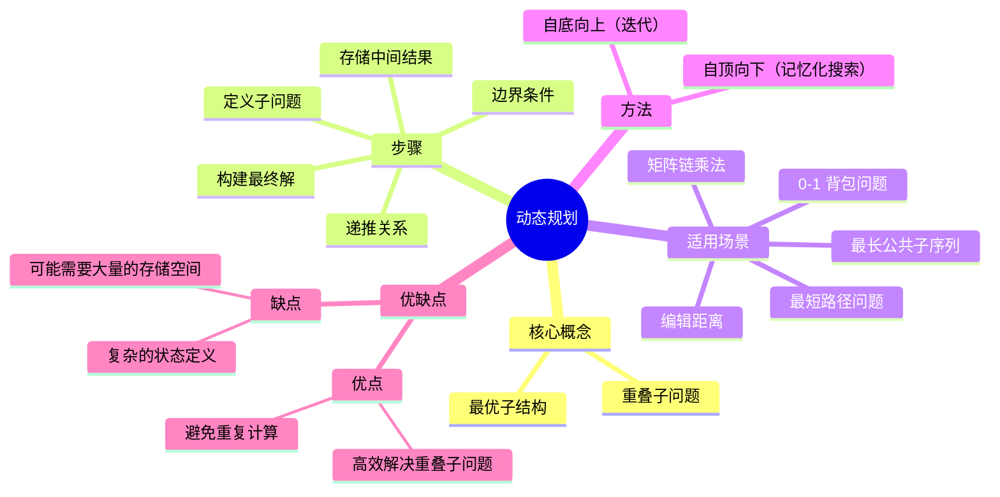

>[!question]

**动态规划**：0-1 背包问题、最长公共子序列。常用于涉及重叠子问题和最优子结构的场景，如 0-1 背包、最长公共子序列等。  **深入解释算法原理**- **理论学习：** 阅读经典教材，如《算法导论》，了解算法的数学基础和设计思想。- **算法推导：** 理解算法的推导过程，为什么这样设计。我也需要你用markdown图表和mermaid 的mindmap分析逻辑，java代码示例以及代码的作用和解释。

---

### 深入理解动态规划

动态规划（Dynamic Programming，简称DP）是一种用于解决具有重叠子问题和最优子结构性质的问题的高效算法设计方法。通过将复杂问题分解为更简单的子问题，并保存这些子问题的结果以避免重复计算，动态规划能够显著提高算法的效率。

---

#### 目录

1. [动态规划概述](#动态规划概述)
2. [算法原理](#算法原理)
   - [理论学习](#理论学习)
   - [算法推导](#算法推导)
3. [逻辑分析](#逻辑分析)
   - [思维导图](#思维导图)
4. [Java代码示例](#Java代码示例)
   - [示例一：0-1 背包问题](#示例一-0-1-背包问题)
   - [示例二：最长公共子序列（LCS）](#示例二-最长公共子序列lcs)
5. [代码解释](#代码解释)
6. [总结](#总结)

---

### 动态规划概述

**动态规划**是一种通过将问题分解为相互重叠的子问题，并存储其结果以避免重复计算，从而高效解决复杂问题的方法。动态规划通常用于优化问题，尤其是那些可以通过最优子结构来描述的问题。

**适用场景：**
- 0-1 背包问题
- 最长公共子序列（LCS）
- 最短路径问题（如 Floyd-Warshall 算法）
- 矩阵链乘法
- 编辑距离
- 分割问题（如分割等和子集）

**核心概念：**
1. **重叠子问题（Overlapping Subproblems）：** 问题可以分解为相同的子问题，这些子问题会被多次计算。
2. **最优子结构（Optimal Substructure）：** 问题的最优解包含其子问题的最优解。

---

### 算法原理

#### 理论学习

动态规划的设计基于以下两个主要原则：

1. **重叠子问题：**
   - 将原问题分解为多个相互重叠的子问题，且这些子问题会被重复计算。
   - 通过存储子问题的结果（通常使用表格或数组），避免重复计算，提高效率。

2. **最优子结构：**
   - 原问题的最优解可以由其子问题的最优解构建而成。
   - 这意味着解决子问题的最优解是构建原问题最优解的必要部分。

**动态规划的步骤：**
1. **定义子问题：** 明确如何将原问题分解为子问题。
2. **递推关系：** 找出子问题之间的关系，通常用递归式表示。
3. **边界条件：** 确定递归的终止条件。
4. **存储中间结果：** 使用记忆化或表格来存储子问题的解，避免重复计算。
5. **构建最终解：** 从存储的子问题结果中构建原问题的解。

#### 算法推导

以**0-1 背包问题**为例，动态规划通过构建一个二维数组`dp[i][w]`来表示前`i`个物品在重量不超过`w`的情况下能够获得的最大价值。

**推导过程：**
- **状态定义：** `dp[i][w]`表示前`i`个物品，容量不超过`w`时的最大价值。
- **状态转移方程：**
  - 如果第`i`个物品重量大于`w`，则不能选择该物品：
    ```
    dp[i][w] = dp[i-1][w]
    ```
  - 否则，选择最大值：
    ```
    dp[i][w] = max(dp[i-1][w], dp[i-1][w - weight[i]] + value[i])
    ```
- **边界条件：** `dp[0][w] = 0`（没有物品时，价值为0）

这种方法确保了通过解决所有子问题来构建原问题的最优解。

---
### Java代码示例

#### 示例一：0-1 背包问题

0-1 背包问题要求在不超过背包容量的情况下，选择物品使得总价值最大。每个物品只能选择一次。

```java
public class Knapsack01 {
    // 方法：0-1 背包问题的动态规划解法
    public static int knapsack(int W, int[] weights, int[] values, int n) {
        // 创建二维DP数组
        int[][] dp = new int[n + 1][W + 1];
        
        // 填充DP表
        for(int i = 0; i <= n; i++) {
            for(int w = 0; w <= W; w++) {
                if(i == 0 || w == 0) {
                    dp[i][w] = 0;
                }
                else if(weights[i-1] <= w) {
                    dp[i][w] = Math.max(values[i-1] + dp[i-1][w - weights[i-1]], dp[i-1][w]);
                }
                else {
                    dp[i][w] = dp[i-1][w];
                }
            }
        }
        
        return dp[n][W];
    }
    
    public static void main(String[] args) {
        int[] values = {60, 100, 120};
        int[] weights = {10, 20, 30};
        int W = 50;
        int n = values.length;
        System.out.println("最大价值为 " + knapsack(W, weights, values, n));
    }
}
```

#### 示例二：最长公共子序列（LCS）

最长公共子序列问题旨在找到两个序列中最长的公共子序列，其元素在两个序列中保持相对顺序。

```java
public class LongestCommonSubsequence {
    // 方法：计算两个字符串的最长公共子序列长度
    public static int lcs(String X, String Y, int m, int n) {
        // 创建二维DP数组
        int[][] dp = new int[m+1][n+1];
        
        // 填充DP表
        for(int i=0; i<=m; i++) {
            for(int j=0; j<=n; j++) {
                if(i == 0 || j == 0) {
                    dp[i][j] = 0;
                }
                else if(X.charAt(i-1) == Y.charAt(j-1)) {
                    dp[i][j] = dp[i-1][j-1] + 1;
                }
                else {
                    dp[i][j] = Math.max(dp[i-1][j], dp[i][j-1]);
                }
            }
        }
        
        return dp[m][n];
    }
    
    public static void main(String[] args) {
        String X = "AGGTAB";
        String Y = "GXTXAYB";
        int m = X.length();
        int n = Y.length();
        System.out.println("最长公共子序列长度为 " + lcs(X, Y, m, n));
    }
}
```

---

### 代码解释

#### 示例一：0-1 背包问题

1. **函数定义：**
   - `knapsack(int W, int[] weights, int[] values, int n)`：
     - `W`：背包的最大容量。
     - `weights`：物品的重量数组。
     - `values`：物品的价值数组。
     - `n`：物品的数量。

2. **DP数组构建：**
   - 创建一个二维数组`dp[n+1][W+1]`，其中`dp[i][w]`表示前`i`个物品在容量不超过`w`时的最大价值。
   
3. **填充DP表：**
   - **初始化：** 当`i`或`w`为0时，`dp[i][w]`为0。
   - **选择或不选择物品：**
     - 如果当前物品的重量小于等于`w`，则有两种选择：
       - 选择该物品：价值为`values[i-1] + dp[i-1][w - weights[i-1]]`
       - 不选择该物品：价值为`dp[i-1][w]`
     - 取两者的最大值作为`dp[i][w]`。
   - **否则：** 不能选择该物品，`dp[i][w] = dp[i-1][w]`。

4. **最终结果：** `dp[n][W]`即为最大价值。

**运行结果：**
```
最大价值为 220
```

**解释：**
- 选择第二个物品（重量20，价值100）和第三个物品（重量30，价值120），总重量50，价值220。

#### 示例二：最长公共子序列（LCS）

1. **函数定义：**
   - `lcs(String X, String Y, int m, int n)`：
     - `X`和`Y`：需要比较的两个字符串。
     - `m`和`n`：分别为字符串`X`和`Y`的长度。

2. **DP数组构建：**
   - 创建一个二维数组`dp[m+1][n+1]`，其中`dp[i][j]`表示`X`的前`i`个字符和`Y`的前`j`个字符的最长公共子序列长度。

3. **填充DP表：**
   - **初始化：** 当`i`或`j`为0时，`dp[i][j]`为0。
   - **字符匹配：**
     - 如果`X.charAt(i-1) == Y.charAt(j-1)`，则`dp[i][j] = dp[i-1][j-1] + 1`。
   - **字符不匹配：**
     - `dp[i][j] = Math.max(dp[i-1][j], dp[i][j-1])`。

4. **最终结果：** `dp[m][n]`即为最长公共子序列的长度。

**运行结果：**
```
最长公共子序列长度为 4
```

**解释：**
- 字符串`"AGGTAB"`和`"GXTXAYB"`的最长公共子序列是`"GTAB"`，长度为4。

---

### 总结

**动态规划**是一种强大的算法设计方法，适用于具有**重叠子问题**和**最优子结构**性质的复杂问题。通过系统地分解问题、构建递推关系并存储中间结果，动态规划能够高效地找到最优解。

**学习建议：**

1. **理解核心概念：**
   - 深入理解重叠子问题和最优子结构的定义及其在具体问题中的体现。
   
2. **掌握常见问题：**
   - 通过练习0-1 背包问题、最长公共子序列、最短路径等经典问题，熟悉动态规划的应用。

3. **练习状态定义和转移方程：**
   - 学会如何为不同问题定义合适的状态，以及如何推导状态转移方程。

4. **优化空间复杂度：**
   - 学习如何通过滚动数组等方法优化动态规划的空间使用。

5. **编码实现：**
   - 多动手实现动态规划算法，增强对算法逻辑的理解。

6. **分析时间和空间复杂度：**
   - 理解动态规划算法的时间和空间复杂度，评估其在不同场景下的适用性。

7. **比较不同方法：**
   - 将动态规划与其他算法（如回溯法、贪心算法）进行比较，了解其优劣势和适用场景。

8. **参与讨论和学习社区：**
   - 加入算法学习社区或论坛，参与讨论，分享和获取学习经验。

通过系统的理论学习、丰富的实践练习和不断的总结反思，您将能够高效地掌握动态规划，并在各种复杂问题中灵活运用。