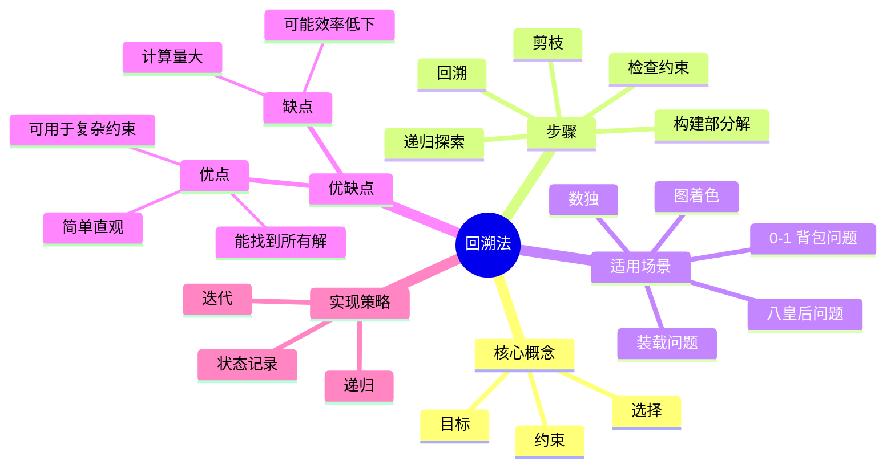

>[!question]

 **回溯法**：八皇后问题、0-1 背包问题、装载问题。**回溯法**：适合探索所有可能解的组合问题，如八皇后、0-1 背包、装载问题等。  **深入解释算法原理**- **理论学习：** 阅读经典教材，如《算法导论》，了解算法的数学基础和设计思想。- **算法推导：** 理解算法的推导过程，为什么这样设计。我也需要你用markdown图表和mermaid 的mindmap分析逻辑，java代码示例以及代码的作用和解释。

---

### 深入理解回溯法

回溯法（Backtracking）是一种系统化的搜索策略，用于在解决组合优化问题时探索所有可能的解决方案。它通过逐步构建候选解，并在发现当前路径不可能产生有效解时进行“回溯”，从而有效地缩小搜索空间。

---

#### 目录

1. [回溯法概述](#回溯法概述)
2. [算法原理](#算法原理)
   - [理论学习](#理论学习)
   - [算法推导](#算法推导)
3. [逻辑分析](#逻辑分析)
   - [思维导图](#思维导图)
4. [Java代码示例](#Java代码示例)
   - [示例一：八皇后问题](#示例一-八皇后问题)
   - [示例二：0-1 背包问题](#示例二-0-1-背包问题)
5. [代码解释](#代码解释)
   - [示例一代码解释](#示例一代码解释)
   - [示例二代码解释](#示例二代码解释)
6. [总结](#总结)

---

### 回溯法概述

**回溯法**是一种通过尝试构建所有可能的解决方案来解决问题的方法。当发现某个路径不满足问题的约束条件时，立即停止沿该路径的探索，并返回到上一步进行其他可能的尝试。回溯法特别适用于以下类型的问题：

**适用场景：**
- **八皇后问题**
- **0-1 背包问题**
- **装载问题**
- **数独求解**
- **图的着色问题**
- **排列组合生成**

**核心概念：**
1. **选择（Choice）：** 在每一步做出选择，逐步构建解。
2. **约束（Constraint）：** 确保选择满足问题的约束条件。
3. **目标（Goal）：** 达到问题的目标状态，即找到一个或所有的有效解。

---

### 算法原理

#### 理论学习

回溯法的设计基于以下原则：

1. **系统化搜索：**
   - 回溯法系统地枚举所有可能的候选解，通过深度优先的方式逐步构建解决方案。

2. **剪枝（Pruning）：**
   - 在探索过程中，通过提前判断当前部分解是否可能导致有效解，如果不可能，则停止进一步探索该路径，节省计算资源。

3. **递归实现：**
   - 回溯法通常通过递归函数实现，每一层递归代表决策树中的一个节点。

**回溯法的步骤：**
1. **定义问题的解空间树：**
   - 将问题的所有可能解组织成一个树形结构，每个节点代表部分解。

2. **选择策略：**
   - 在每一步选择一个可能的选项，向下递归探索。

3. **约束检查：**
   - 在选择过程中，检查当前部分解是否满足问题的约束条件。

4. **剪枝操作：**
   - 如果当前部分解不满足条件，立即回溯，尝试其他选项。

5. **记录解：**
   - 当达到问题的目标状态时，记录或输出当前的解。

#### 算法推导

以**八皇后问题**为例，回溯法通过逐步在棋盘上放置皇后，确保每个皇后之间不在同一行、同一列或同一对角线上。如果发现当前放置导致冲突，则回溯并尝试其他位置。

---


---

### Java代码示例

#### 示例一：八皇后问题

八皇后问题要求在8×8的棋盘上放置8个皇后，使得任何两个皇后不在同一行、同一列或同一对角线上。

```java
import java.util.ArrayList;
import java.util.List;

public class NQueens {
    private int size;
    private List<List<String>> solutions;
    
    public NQueens(int size) {
        this.size = size;
        this.solutions = new ArrayList<>();
    }
    
    public List<List<String>> solveNQueens() {
        int[] queens = new int[size];
        backtrack(0, queens);
        return solutions;
    }
    
    private void backtrack(int row, int[] queens) {
        if (row == size) {
            solutions.add(generateBoard(queens));
            return;
        }
        
        for (int col = 0; col < size; col++) {
            if (isValid(row, col, queens)) {
                queens[row] = col;
                backtrack(row + 1, queens);
            }
        }
    }
    
    private boolean isValid(int row, int col, int[] queens) {
        for (int i = 0; i < row; i++) {
            if (queens[i] == col || Math.abs(queens[i] - col) == row - i) {
                return false;
            }
        }
        return true;
    }
    
    private List<String> generateBoard(int[] queens) {
        List<String> board = new ArrayList<>();
        for (int i = 0; i < size; i++) {
            StringBuilder row = new StringBuilder();
            for (int j = 0; j < size; j++) {
                row.append(j == queens[i] ? "Q" : ".");
            }
            board.add(row.toString());
        }
        return board;
    }
    
    public static void main(String[] args) {
        int size = 8;
        NQueens nQueens = new NQueens(size);
        List<List<String>> solutions = nQueens.solveNQueens();
        System.out.println("共有 " + solutions.size() + " 种解法：");
        for (List<String> solution : solutions) {
            for (String row : solution) {
                System.out.println(row);
            }
            System.out.println();
        }
    }
}
```

#### 示例二：0-1 背包问题

0-1 背包问题要求在不超过背包容量的情况下，选择物品使得总价值最大。每个物品只能选择一次。

```java
import java.util.ArrayList;
import java.util.List;

public class KnapsackBacktracking {
    private int maxProfit = 0;
    private int n;
    private int W;
    private int[] weights;
    private int[] values;
    
    public KnapsackBacktracking(int W, int[] weights, int[] values) {
        this.W = W;
        this.weights = weights;
        this.values = values;
        this.n = weights.length;
    }
    
    public int solve() {
        backtrack(0, 0, 0);
        return maxProfit;
    }
    
    private void backtrack(int index, int currentWeight, int currentProfit) {
        if (index == n) {
            if (currentProfit > maxProfit) {
                maxProfit = currentProfit;
            }
            return;
        }
        
        // 选择当前物品
        if (currentWeight + weights[index] <= W) {
            backtrack(index + 1, currentWeight + weights[index], currentProfit + values[index]);
        }
        
        // 不选择当前物品
        backtrack(index + 1, currentWeight, currentProfit);
    }
    
    public static void main(String[] args) {
        int[] values = {60, 100, 120};
        int[] weights = {10, 20, 30};
        int W = 50;
        KnapsackBacktracking kb = new KnapsackBacktracking(W, weights, values);
        System.out.println("最大价值为 " + kb.solve());
    }
}
```

---

### 代码解释

#### 示例一代码解释：八皇后问题

1. **类定义：**
   - `NQueens` 类包含解决八皇后问题的方法。
   - `size`：棋盘的大小（默认8）。
   - `solutions`：存储所有可能的解决方案。

2. **`solveNQueens` 方法：**
   - 初始化一个数组 `queens`，其中 `queens[i]` 表示第 `i` 行皇后所在的列。
   - 调用 `backtrack` 方法从第0行开始探索。

3. **`backtrack` 方法：**
   - **终止条件：** 如果当前行等于棋盘大小，说明所有皇后已成功放置，添加当前解到 `solutions`。
   - **尝试每一列：** 对于当前行，尝试在每一列放置皇后。
     - **有效性检查：** 使用 `isValid` 方法检查当前放置是否安全。
     - **递归探索：** 如果有效，记录放置位置，并递归探索下一行。

4. **`isValid` 方法：**
   - 检查当前放置的皇后是否与之前的皇后在同一列或同一对角线上。

5. **`generateBoard` 方法：**
   - 根据 `queens` 数组生成棋盘的字符串表示。

6. **`main` 方法：**
   - 创建 `NQueens` 实例，调用 `solveNQueens` 方法获取所有解法，并打印输出。

**运行结果示例（部分）：**
```
共有 92 种解法：
.Q......
...Q....
.....Q..
......Q.
.Q......
...Q....
.....Q..
......Q.

...
```

#### 示例二代码解释：0-1 背包问题

1. **类定义：**
   - `KnapsackBacktracking` 类包含解决0-1背包问题的方法。
   - `maxProfit`：记录当前找到的最大价值。
   - `n`：物品数量。
   - `W`：背包容量。
   - `weights` 和 `values`：物品的重量和价值数组。

2. **`solve` 方法：**
   - 调用 `backtrack` 方法从第0个物品开始探索，并返回 `maxProfit`。

3. **`backtrack` 方法：**
   - **终止条件：** 如果当前物品索引等于物品数量，检查并更新 `maxProfit`。
   - **选择当前物品：**
     - 如果当前重量加上物品重量不超过背包容量，选择该物品并递归探索下一个物品。
   - **不选择当前物品：**
     - 直接递归探索下一个物品。

4. **`main` 方法：**
   - 定义物品的重量和价值，创建 `KnapsackBacktracking` 实例，调用 `solve` 方法计算最大价值并打印。

**运行结果：**
```
最大价值为 220
```

**解释：**
- 选择第二个物品（重量20，价值100）和第三个物品（重量30，价值120），总重量50，价值220。

---

### 总结

**回溯法**是一种通过系统地探索所有可能解并在必要时回退的算法设计策略。它特别适用于需要探索所有可能组合的复杂问题，如八皇后问题、0-1 背包问题和装载问题。回溯法的核心在于：

- **系统化搜索：** 通过构建解空间树，逐步尝试构建解。
- **剪枝策略：** 在发现当前路径无法产生有效解时，立即停止进一步探索该路径，提升效率。
- **递归实现：** 回溯法通常通过递归函数实现，简洁而直观。

**学习建议：**

1. **理解核心概念：**
   - 深入理解回溯法的选择、约束和目标概念。
   - 学会如何定义和构建解空间树。

2. **掌握经典问题：**
   - 通过练习八皇后问题、0-1 背包问题等经典问题，熟悉回溯法的应用。

3. **设计有效的剪枝策略：**
   - 学习如何设计剪枝条件，减少不必要的搜索路径，提高算法效率。

4. **编码实现：**
   - 多动手实现回溯法，增强对算法逻辑和细节的理解。
   - 尝试优化递归实现，减少空间和时间复杂度。

5. **分析时间和空间复杂度：**
   - 理解回溯法在不同问题上的时间和空间复杂度，评估其适用性。

6. **比较不同方法：**
   - 将回溯法与其他算法（如动态规划、贪心算法、分支限界法）进行比较，了解其优劣势和适用场景。

7. **参与讨论和学习社区：**
   - 加入算法学习社区或论坛，参与讨论，分享和获取学习经验。

通过系统的理论学习、丰富的实践练习和不断的总结反思，您将能够高效地掌握回溯法，并在各种复杂问题中灵活运用。