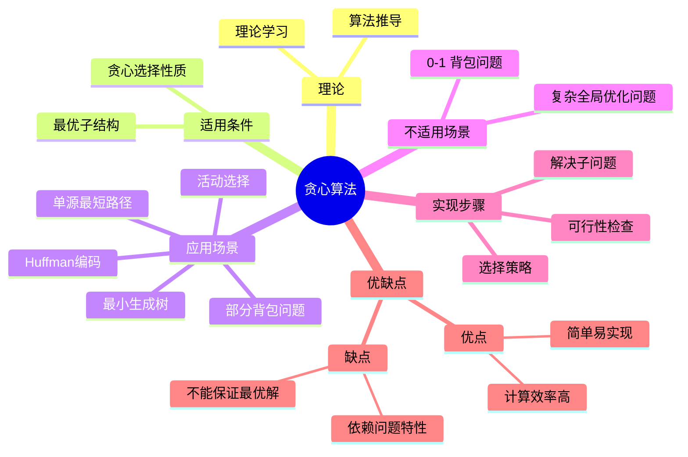

>[!question]

**贪心算法**：适合部分背包问题、最小生成树、单源最短路径等，但不适合解决需要全局最优解的复杂问题，如 0-1 背包。  **深入解释算法原理**- **理论学习：** 阅读经典教材，如《算法导论》，了解算法的数学基础和设计思想。- **算法推导：** 理解算法的推导过程，为什么这样设计。我也需要你用markdown图表和mermaid 的mindmap分析逻辑，java代码示例以及代码的作用和解释。

---

### 深入理解贪心算法

贪心算法是一种在每一步选择中都采取在当前状态下最好或最优（即最有利）的选择，从而希望导致结果是全局最好或最优的算法。贪心算法在解决某些特定类型的问题时非常有效，但并不适用于所有问题。

---

#### 目录

1. [贪心算法概述](#贪心算法概述)
2. [算法原理](#算法原理)
   - [理论学习](#理论学习)
   - [算法推导](#算法推导)
3. [逻辑分析](#逻辑分析)
   - [思维导图](#思维导图)
4. [Java代码示例](#Java代码示例)
   - [示例：贪心算法解决部分背包问题](#示例-贪心算法解决部分背包问题)
5. [代码解释](#代码解释)
6. [总结](#总结)

---

### 贪心算法概述

**贪心算法**（Greedy Algorithm）是一种在每一步选择中都采取在当前状态下最好或最优（即最有利）的选择的算法。贪心算法无法保证在所有问题上都能得到最优解，但对于某些具有特定性质的问题，它能够有效地找到全局最优解。

[表](../REVIEW/表.md)

**适用场景：**
- 部分背包问题
- 最小生成树（Kruskal算法、Prim算法）
- 单源最短路径（Dijkstra算法）
- 活动选择问题
- Huffman编码

**不适用场景：**
- 0-1 背包问题
- 需要全局最优解的复杂问题

---

### 算法原理

#### 理论学习

贪心算法的核心在于每一步都选择当前看起来最优的选项，期望通过一系列局部最优选择达到全局最优。为了确保贪心算法能找到全局最优解，问题必须满足以下两个性质：

1. **贪心选择性质（Greedy Choice Property）：**
   通过局部最优的选择，可以得到全局最优解。
   
2. **最优子结构性质（Optimal Substructure）：**
   问题的最优解包含其子问题的最优解。

这些性质确保了贪心算法在每一步的选择不会影响最终的全局最优解。

#### 算法推导

以**部分背包问题**为例，贪心算法通过选择单位价值最高的物品尽可能多地装入背包，直到背包容量耗尽。这种方法适用于部分背包问题，因为可以将物品分割。但对于**0-1 背包问题**，物品不可分割，贪心选择可能导致无法达到全局最优。

---

### Java代码示例

#### 示例：贪心算法解决部分背包问题

部分背包问题（Fractional Knapsack Problem）允许将物品拆分。贪心算法通过选择单位重量价值最高的物品来最大化总价值。

```java
import java.util.Arrays;
import java.util.Comparator;

class Item {
    int weight;
    int value;
    
    Item(int weight, int value){
        this.weight = weight;
        this.value = value;
    }
}

public class FractionalKnapsack {
    public static double getMaxValue(int W, Item[] items) {
        // 按单位重量价值降序排序
        Arrays.sort(items, new Comparator<Item>() {
            public int compare(Item a, Item b) {
                double r1 = (double) a.value / a.weight;
                double r2 = (double) b.value / b.weight;
                return Double.compare(r2, r1);
            }
        });
        
        double totalValue = 0.0;
        for(Item item : items) {
            if(W >= item.weight){
                W -= item.weight;
                totalValue += item.value;
            }
            else{
                totalValue += item.value * ((double) W / item.weight);
                break;
            }
        }
        return totalValue;
    }
    
    public static void main(String[] args) {
        Item[] items = {
            new Item(10, 60),
            new Item(20, 100),
            new Item(30, 120)
        };
        int W = 50;
        double maxValue = getMaxValue(W, items);
        System.out.println("Maximum value in Knapsack = " + maxValue);
    }
}
```

---

### 代码解释

1. **Item类：**
   - 定义物品的重量和价值。

2. **getMaxValue方法：**
   - **排序：** 首先按照单位重量价值（`value/weight`）对物品进行降序排序。这样可以确保每次选择单位价值最高的物品。
   - **选择物品：** 遍历排序后的物品列表，尽可能多地选择单位价值最高的物品。
     - 如果当前物品可以完全装入背包（`W >= item.weight`），则将其全部装入，并更新剩余容量和总价值。
     - 如果当前物品不能完全装入背包，则按比例装入剩余容量，并结束循环。

3. **main方法：**
   - 创建物品列表和背包容量。
   - 调用`getMaxValue`方法计算最大价值并输出。

**运行结果：**
```
Maximum value in Knapsack = 240.0
```

**解释：**
- 选择第一个物品（重量10，价值60），剩余容量40，总价值60。
- 选择第二个物品（重量20，价值100），剩余容量20，总价值160。
- 部分选择第三个物品（重量20/30），增加价值80，总价值240。

---

### 总结

**贪心算法**是一种通过在每一步选择局部最优解来期望达到全局最优解的策略。它适用于那些满足**贪心选择性质**和**最优子结构性质**的问题，如部分背包问题、最小生成树和单源最短路径等。然而，对于需要全局最优解的复杂问题，如0-1 背包问题，贪心算法可能无法提供最优解。

**学习建议：**

1. **理解核心原理：** 深入理解贪心算法的选择策略及其适用条件。
2. **实践应用：** 通过编码实现贪心算法，解决实际问题，加深理解。
3. **比较分析：** 将贪心算法与其他算法（如动态规划、回溯法）进行比较，了解各自的优劣和适用场景。
4. **复习与总结：** 制作算法流程图和思维导图，定期复习，加固记忆。

通过系统的理论学习、实践编码和逻辑分析，您将能够高效地掌握贪心算法，并在适当的场景中灵活运用。