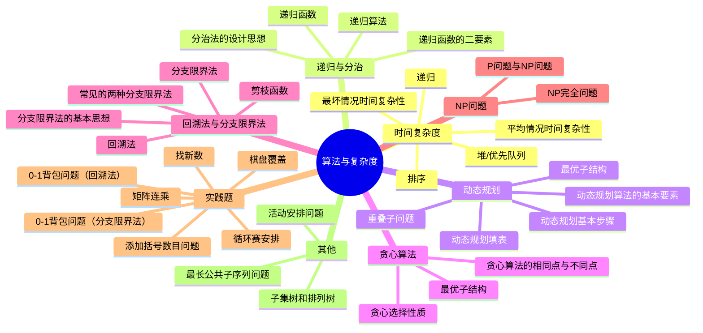

# 记忆解答题的分析与理解

为了帮助记忆这些解答题，下面将对每个问题的内容、逻辑结构以及相关知识点进行分析，并提供相应的记忆方法。此外，还将通过思维导图（使用Mermaid）来展示问题之间的关系。

## 思维导图

## 问题分析与记忆方法

### 一、问答题

#### 1．什么是最坏情况时间复杂性？什么是平均情况时间复杂性？

- **问题分析**：区分算法在最坏和平均情况下的运行时间。
- **知识点拓展**：
  - **最好情况时间复杂性**：算法在最理想输入下的运行时间。
  - **渐进符号**：Big O（上界）、Big Ω（下界）、Big Θ（紧界）。
- **理解与记忆**：
  - **最坏情况**：想象考试中最难的题目，需要最多时间解决。
  - **平均情况**：日常练习中常见题目的平均解题时间。
- **关键点**：
  - 最坏情况关注所有可能输入中耗时最长的情况。
  - 平均情况假设所有输入出现的概率相等，计算平均耗时。

#### 2．什么是递归算法？什么是递归函数？

- **问题分析**：理解递归的定义及其在算法中的应用。
- **知识点拓展**：
  - **递归与迭代的区别**。
  - **递归树**：可视化递归调用的结构。
- **理解与记忆**：
  - 递归如同俄罗斯套娃，一个问题包含一个更小的同类问题。
- **关键点**：
  - **递归算法**：直接或间接调用自身的算法。
  - **递归函数**：使用自身定义的函数。

#### 3．递归函数的二要素是什么？

- **问题分析**：识别递归函数的基础组成部分。
- **知识点拓展**：
  - **基准情况**：确保递归能终止。
  - **递归步**：问题规模逐步缩小。
- **理解与记忆**：
  - 记住“边界条件”和“递归方程”。
- **关键点**：
  - **边界条件**：停止递归的条件。
  - **递归方程**：通过递归调用解决子问题。

#### 4．分治法的设计思想是什么？

- **问题分析**：理解分治法如何解决复杂问题。
- **知识点拓展**：
  - **分解**：将问题分成更小的部分。
  - **解决**：分别解决子问题。
  - **合并**：将子问题的解合并成原问题的解。
- **理解与记忆**：
  - 想象分治法如切披萨，将大块切成小块再组合。
- **关键点**：
  - 将大问题分解为更小的子问题，递归解决，直到问题足够小。

#### 5．什么叫问题的最优子结构性质？

- **问题分析**：理解最优解如何依赖子问题的最优解。
- **知识点拓展**：
  - **最优子结构**：动态规划与贪心算法的核心属性。
- **理解与记忆**：
  - 记住“整体最优依赖于局部最优”。
- **关键点**：
  - 问题的最优解包含其子问题的最优解。

#### 6．动态规划基本步骤是什么？

- **问题分析**：掌握动态规划解决问题的流程。
- **知识点拓展**：
  - **记忆化搜索**：递归与动态规划的结合。
- **理解与记忆**：
  - **四步法**：分解、定义最优值、计算最优值、自底向上构建解。
- **关键点**：
  1. 分解问题。
  2. 递归定义最优值。
  3. 自底向上计算。
  4. 构造最优解。

#### 7．动态规划算法的基本要素是什么？举例说明一些可以用动态规划算法解决的问题。

- **问题分析**：识别动态规划的核心属性及应用场景。
- **知识点拓展**：
  - **记忆化**与**表格填充**。
- **理解与记忆**：
  - 动态规划如搭积木，利用已完成的小块构建大块。
- **关键点**：
  - **最优子结构**。
  - **重叠子问题**。
- **示例问题**：
  - 矩阵连乘
  - 最长公共子序列（LCS）
  - 0-1背包问题

#### 8．说明分治法与动态规划法的相同点和不同之处？

- **问题分析**：比较分治法与动态规划法的异同。
- **知识点拓展**：
  - **Memoization**：动态规划的记忆化技术。
- **理解与记忆**：
  - 分治是切披萨，动态规划是记住每一块的味道，避免重复切割。
- **关键点**：
  - **相同点**：都将问题分解为更小的子问题。
  - **不同点**：动态规划处理有重叠的子问题，分治处理独立的子问题。

#### 9．贪心算法的两个重要要素是什么？举例说明一些可以用贪心算法解决的问题。

- **问题分析**：理解贪心算法的核心属性及应用场景。
- **知识点拓展**：
  - **局部最优**与**全局最优**的关系。
- **理解与记忆**：
  - 贪心算法如贪吃的小鸟，每次选择眼前最美的种子。
- **关键点**：
  1. **贪心选择性质**。
  2. **最优子结构性质**。
- **示例问题**：
  - 活动安排问题
  - 最优装载问题
  - 单源最短路径问题（如Dijkstra算法）

#### 10．什么叫贪心选择性质？

- **问题分析**：深入理解贪心选择的机制。
- **知识点拓展**：
  - **无后效性**：选择当前最优不影响未来选择。
- **理解与记忆**：
  - 每次选择眼前最好的，不考虑未来。
- **关键点**：
  - 整体最优解可通过一系列局部最优选择得到。

#### 11．贪心算法与动态规划算法的相同点和不同之处？

- **问题分析**：比较贪心算法与动态规划的异同。
- **知识点拓展**：
  - **适用场景**：何时选择贪心，何时选择动态规划。
- **理解与记忆**：
  - 贪心如短跑，动态规划如长跑。
- **关键点**：
  - **相同点**：都具有最优子结构，解决最优化问题。
  - **不同点**：
    - 贪心具有贪心选择性质，依赖局部最优。
    - 动态规划具有重叠子问题性质，需保存中间结果。

#### 12．背包问题与0－1背包问题有何区别？

- **问题分析**：区分背包问题的不同类型。
- **知识点拓展**：
  - **完全背包问题**：每种物品可以无限次选取。
- **理解与记忆**：
  - 0-1背包如选择是否携带某件物品，要么全带，要么全不带。
  - 背包问题（如分数背包）允许部分选择。
- **关键点**：
  - **0-1背包**：物品选择是二元的（0或1）。
  - **背包问题**：允许分割物品，选择部分。

#### 13．回溯法与分支限界法之间的相同点是什么？不同之处在哪些方面？

- **问题分析**：比较回溯法与分支限界法的异同。
- **知识点拓展**：
  - **剪枝策略**：如何优化搜索。
- **理解与记忆**：
  - 回溯法如深潜，逐步探索路径；分支限界法如广域搜索，优先探索有潜力的路径。
- **关键点**：
  - **相同点**：都构造解空间树并进行搜索。
  - **不同点**：
    - 回溯法采用深度优先，避免不必要的分支。
    - 分支限界法采用广度优先或优先级策略，剪枝不利的分支。

#### 14．分支限界法基本思想是什么？

- **问题分析**：理解分支限界法的工作机制。
- **知识点拓展**：
  - **优先队列**：如何选择扩展节点。
- **理解与记忆**：
  - 分支限界法如图书馆管理员，按优先级处理书籍，避免无用查找。
- **关键点**：
  - 使用广度优先或最小耗费优先策略。
  - 扩展所有子节点，剪去不可能的分支。

#### 15．常用的剪枝函数有哪两类？

- **问题分析**：识别剪枝策略的类型。
- **知识点拓展**：
  - **剪枝的重要性**：提高算法效率。
- **理解与记忆**：
  - 记住“约束”和“限界”两类剪枝。
- **关键点**：
  - **约束函数剪枝**。
  - **限界函数剪枝**。

#### 16．约束函数的功能是什么？

- **问题分析**：理解约束函数的作用。
- **知识点拓展**：
  - **约束满足问题（CSP）**。
- **理解与记忆**：
  - 约束函数如门卫，阻挡不符合规则的路径。
- **关键点**：
  - 剪去不满足约束的子树，保留可行解点。

#### 17．限界函数的功能是什么？

- **问题分析**：理解限界函数的作用。
- **知识点拓展**：
  - **估价函数**：评估节点是否有潜力成为最优解。
- **理解与记忆**：
  - 限界函数如路障，阻挡无法达到最优解的路径。
- **关键点**：
  - 剪去可行但无法达到最优解的子树。

#### 18．常见的两种分支限界法是什么？

- **问题分析**：识别分支限界法的具体实现方式。
- **知识点拓展**：
  - **优先级队列的实现**。
- **理解与记忆**：
  - **队列式**：如排队买票，先来先服务。
  - **优先队列式**：如急诊优先处理重症病人。
- **关键点**：
  1. **队列式 (FIFO)**：先进先出原则。
  2. **优先队列式**：按照优先级选取节点。

#### 19．什么是P问题和NP问题？

- **问题分析**：理解复杂性理论中的P与NP类问题。
- **知识点拓展**：
  - **NP-完全问题**。
  - **NP-难问题**。
- **理解与记忆**：
  - **P问题**：容易解决的问题，如基础排序。
  - **NP问题**：容易验证的问题，如图的着色问题。
- **关键点**：
  - **P问题**：存在多项式时间算法。
  - **NP问题**：存在多项式时间验证算法。

#### 20．回溯法中剪枝函数有哪几类？各有何用途？

- **问题分析**：识别回溯法中的剪枝策略。
- **知识点拓展**：
  - **启发式剪枝**：利用问题特性进行优化。
- **理解与记忆**：
  - 约束函数如筛子，筛除不符合条件的解。
  - 限界函数如天平，判断当前解是否可能达到最优。
- **关键点**：
  - **约束函数**：剪去不满足约束的子树，保留可行节点。
  - **限界函数**：剪去得不到最优解的子树。

#### 21．什么是NP完全问题？

- **问题分析**：深入理解NP完全问题的定义与重要性。
- **知识点拓展**：
  - **归约**：将一个问题转化为另一个问题。
  - **Cook-Levin定理**：NP完全性的基础。
- **理解与记忆**：
  - NP完全问题是“难以破解但易于验证”的问题。
- **关键点**：
  - 同时满足：
    1. 属于NP问题。
    2. 所有NP问题都可以归约到它。

#### 22．子集树和排列树。

- **问题分析**：理解子集树与排列树在回溯法中的应用。
- **知识点拓展**：
  - **状态空间树**：所有可能解的树形表示。
- **理解与记忆**：
  - **子集树**：如列出所有可能的组合。
  - **排列树**：如生成所有可能的排列。
- **关键点**：
  - **子集树**：用于组合问题。
  - **排列树**：用于排列问题。

### 二、时间复杂度计算

#### 1. 动态规划、贪心

- **分析**：关注算法的最内层循环次数。
- **公式**：通常表示为算法的时间复杂度上界。
- **记忆方法**：识别嵌套循环或递归调用的层数。

#### 2. 排序

- **分析**：常见排序算法的时间复杂度。
- **公式**：
  $$ T(n) = O(n \log n) $$
- **记忆方法**：记住快速排序、归并排序的平均时间复杂度均为$O(n \log n)$。

#### 3. 堆/优先队列

- **分析**：堆操作的时间复杂度。
- **公式**：
  $$ T(n) = O(\log n) $$
- **记忆方法**：堆是一种完全二叉树，每次操作最多需要调整树的高度。

#### 4. 回溯法、分支限界法解背包问题

- **分析**：这些方法在最坏情况下的时间复杂度。
- **公式**：
  $$ T(n) = O(n \cdot 2^n) $$
- **记忆方法**：背包问题属于NP问题，解空间指数级增长。

#### 5. 递归

- **分析**：递归算法的时间复杂度。
- **公式**：
  $$ 
  T(n) = n^{\log_m k} + \sum_{j=0}^{\log_m n - 1} k^j f\left(\frac{n}{m^j}\right) 
  $$
  （主定理）
  
  **典型情况**：
  $$
  T(k) = m \cdot T(k-1) + O(1) 
  $$
  $$
  T(k) = O(m^k)
  $$
- **记忆方法**：掌握递归关系的求解方法，如主定理、递归树法等。

### 三、证明

#### 活动安排问题

- **问题分析**：证明贪心算法在活动安排问题中的正确性。
- **知识点拓展**：
  - **反证法**：通过假设相反情况来证明结论。
  - **数学归纳法**：用于逐步验证命题。
- **理解与记忆**：
  - 选择最早结束的活动，确保剩余时间最大化。
- **关键点**：
  - 通过比较不同活动的结束时间，证明贪心选择的最优性。

#### 最长公共子序列问题

- **问题分析**：证明LCS问题具有最优子结构性质。
- **知识点拓展**：
  - **动态规划的应用**：构建DP表格求解LCS。
- **理解与记忆**：
  - 将问题分解为前缀子问题，逐步构建解。
- **关键点**：
  - 通过递归定义和反证法证明最优子结构。

### 四、动态规划填表

#### 最长公共子序列

- **更新顺序**：从左至右、从上往下更新。
- **记忆方法**：按行或按列填表，确保依赖的子问题已解决。

#### 0-1背包

- **更新顺序**：从左至右、从下往上更新。
- **变量**：
  - $w$：重量/体积
  - $v$：价值
- **记忆方法**：逆序遍历重量，确保每个物品只选一次。
- **注意**：
  - 不要使用不正确的DP公式，遵循正确的状态转移。

#### 矩阵连乘

- **方法**：
  - 使用$p_{0..n}$存放矩阵$A_{1..n}$的维数。
  - $A_i$的维数为$p_{i-1} \times p_i$。
- **记忆方法**：理解矩阵链的分割点，优化乘法顺序。

### 五、实践题

1. **棋盘覆盖**  
   算法设计与分析/数据结构与算法实验1：棋盘覆盖问题

2. **循环赛安排**  
   算法设计与分析/数据结构与算法实验2：循环赛安排问题

3. **矩阵连乘**  
   算法设计与分析/数据结构与算法实验3：矩阵连乘问题

4. **添加括号数目问题**  
   算法设计与分析/数据结构与算法实验4：添加括号数目问题

5. **找新数**  
   算法设计与分析/数据结构与算法实验5：找新数最小的删除方案

6. **0-1背包问题（回溯法）**  
   算法设计与分析/数据结构与算法实验6：0-1背包问题（回溯法）

7. **0-1背包问题（分支限界法）**  
   算法设计与分析/数据结构与算法实验7：0-1背包问题（分支限界法）

- **理解与记忆**：
  - **实践题**：通过动手实验，加深对算法的理解。
  - **分类记忆**：将实践题按照算法类型分类，便于联想。

## 总结与记忆技巧

1. **分类记忆**：将问题按算法类型（递归、动态规划、贪心等）分类，形成知识树。
2. **联想记忆**：通过类比日常生活中的事物，帮助记忆抽象概念。
3. **思维导图**：利用思维导图可视化知识点，理解它们之间的关系。
4. **反复练习**：通过实践题和习题加深记忆，理解应用场景。
5. **递归理解**：将递归看作是问题的缩小版本，逐步理解其本质。

## 进一步的知识点拓展

- **复杂性理论**：
  - **NP-完全性**：理解问题的难度及其在计算机科学中的重要性。
  - **多项式时间归约**：如何将一个问题转化为另一个问题。

- **高级算法设计**：
  - **启发式算法**：在无法找到精确解时，寻找近似解。
  - **随机化算法**：利用随机性提高算法效率或简化设计。

- **数据结构**：
  - **树和图**：理解解空间树的构建与遍历。
  - **堆和优先队列**：深入了解堆的实现及其应用。

通过系统地分析和理解这些问题，并结合有效的记忆方法，可以更好地掌握算法与复杂度的核心概念，为考试和实际应用打下坚实的基础。
