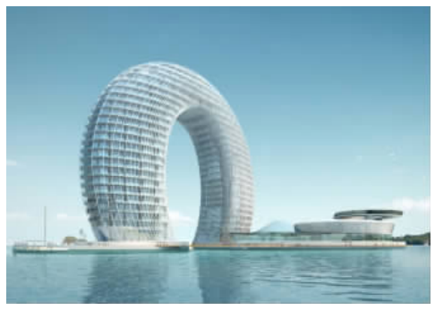
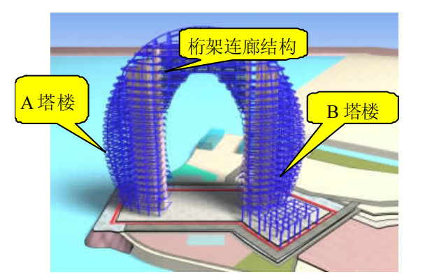
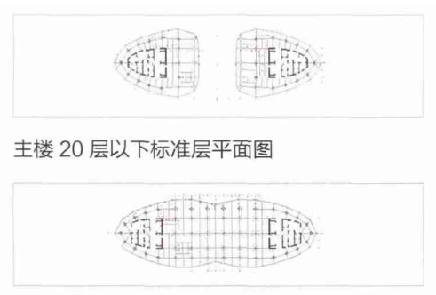
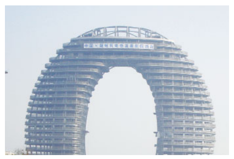

# 结构概念和体系课程论文

## 摘要
本文以湖州喜来登温泉度假酒店为案例，系统分析其结构概念与体系。湖州喜来登酒店采用**钢筋混凝土核心筒与钢框架混合结构体系**，通过高空桁架连廊连接双塔楼，提升了建筑的整体刚度和稳定性。本文涵盖了**高宽比校核与水平地震力计算**，并结合相关施工经验分析该建筑的**水平体系与竖向体系**。通过对结构设计与施工技术的深入探讨，本文旨在为高层建筑结构体系的设计与施工提供参考与借鉴。

**关键词**：高层建筑；结构体系；抗震设计；施工管理

---

## 一、项目概况

湖州喜来登温泉度假酒店位于浙江省湖州市南太湖南岸，以独特的指环形结构成为地标性建筑。该建筑采用**钢框架与钢筋混凝土核心筒**的混合结构体系，并通过桁架连廊在高空将双塔楼连接为一个整体。

- **建筑高度**：101.2 米  
- **建筑宽度**：116 米  
- **总建筑面积**：65,000 m²  
- **层数**：地上 23 层，地下 2 层  
- **设计使用年限**：50 年  
- **抗震设防烈度**：7 度  
- **最大桁架跨度**：48 米  
- **主要材料**：Q345B 钢材、C30 混凝土  

**图1：湖州喜来登温泉度假酒店效果图**

### 1.1 项目背景

湖州喜来登温泉度假酒店由马岩松主创设计，精工钢构集团负责酒店钢结构的施工。该项目于2008年5月18日开工，2012年9月28日竣工，总投资约为15亿元。该酒店以其独特的指环形造型和高难度的连廊钢结构安装获得了2014年安波利斯摩天楼奖，是当年唯一获奖的中国项目。

### 1.2 施工特点

该酒店工程以指环型造型作为南太湖沿岸的标志性工程，连廊钢结构部分更是其画龙点睛之笔，成为钢结构工程的安装难点。精工钢构集团通过节点的优化设计、加工制作等工艺，合理选用和利用钢材，节约工程造价约100万元，占总造价的2.5%。

---

## 二、整体计算

### 2.1 高宽比计算与校核

高宽比是高层建筑设计中评估抗倾覆稳定性的重要指标。根据《高层建筑混凝土结构技术规程》（JGJ 3-2010）中的规定：

\[
\frac{h}{d} \leq 
\begin{cases} 
4 & \text{对框架-剪力墙结构} \\
5 & \text{对筒体结构}
\end{cases}
\]

其中：  
- \( h \)：建筑总高度（101.2 米）  
- \( d \)：建筑最小宽度（116 米）  

计算高宽比：

\[
\frac{h}{d} = \frac{101.2}{116} = 0.872 < 5
\]

由于湖州喜来登酒店采用**筒体结构**（钢筋混凝土核心筒与钢框架混合体系），其高宽比为0.872，远小于规范要求的最大限值5，满足稳定性要求。

### 2.2 水平地震力计算

根据《建筑抗震设计规范》（GB 50011-2010），水平地震作用可按照底部剪力法计算，总地震剪力计算公式为：

\[
V = C_e \cdot W
\]

其中：  
- \( V \)：总地震剪力  
- \( C_e \)：地震影响系数，根据7度抗震设防，选取 \( C_e = 0.16 \)  
- \( W \)：建筑总重力荷载  

**计算步骤：**

1. **计算总重力荷载 \( W \)：**

   \[
   W = G + Q = 60,000 \, \text{kN} + 20,000 \, \text{kN} = 80,000 \, \text{kN}
   \]

2. **计算总地震剪力 \( V \)：**

   \[
   V = 0.16 \times 80,000 = 12,800 \, \text{kN}
   \]

**结果分析：**

该建筑在地震作用下需承受12,800 kN的水平地震力。设计时必须确保核心筒与钢框架共同承受此荷载，保证建筑的抗震安全。

---

## 三、水平体系分析

### 3.1 水平体系组成

根据《高层建筑结构设计》（教材）中的相关内容，湖州喜来登酒店的水平抗侧力体系由以下部分组成：

1. **钢筋混凝土核心筒：**  
   - 提供主要的抗侧刚度和抗扭刚度。  
   - 作为建筑的抗侧力核心，抵抗风荷载和地震荷载。

2. **钢框架结构：**  
   - 由外围的钢柱和钢梁组成。  
   - 分担部分水平荷载，提高结构的整体刚度和延性。

3. **高空桁架连廊：**  
   - 在高层部分连接双塔楼，形成封闭的环形结构。  
   - 提高结构的整体性，增强抗侧刚度和抗扭性能。

**图2：钢结构三维图**
### 3.2 水平体系特点

1. **整体性强：**  
   通过桁架连廊的连接，双塔楼形成一个整体，增强了结构的整体稳定性。

2. **抗侧刚度高：**  
   核心筒提供主要的抗侧刚度，钢框架和桁架连廊辅助，提高了结构的抗侧力能力。

3. **抗扭性能优良：**  
   环形结构和对称布局使建筑在水平荷载作用下具有良好的抗扭转能力。

4. **延性好：**  
   钢框架结构的应用提高了结构的延性，能更好地耗散地震能量。

5. **多道抗震防线：**  
   核心筒、钢框架和桁架连廊共同组成多道抗震防线，提高了结构的抗震可靠性。

**图3：主楼 20 层以上标准层平面图**

---

## 四、竖向体系分析

### 4.1 竖向体系组成

根据《高层建筑结构设计》（教材）中的相关内容，湖州喜来登酒店的竖向承重体系主要包括：

1. **钢筋混凝土核心筒：**  
   - 承担主要的竖向荷载。  
   - 包含电梯井道、楼梯间和设备管道井。

2. **外围钢框架柱与钢梁：**  
   - 承担外部楼板的竖向荷载。  
   - 与核心筒共同组成竖向承重体系。

3. **桁架支撑体系：**  
   - 在高层部分通过桁架结构将竖向荷载传递至核心筒和钢柱。  
   - 确保连廊部分的竖向承载能力。

### 4.2 竖向体系特点

1. **承载力高：**  
   核心筒和钢框架共同承担竖向荷载，提供了高承载能力。

2. **刚柔相济：**  
   核心筒具有高刚度，钢框架具有一定的柔性，组合后提高了结构的抗震性能。

3. **受力明确：**  
   竖向荷载传递路径清晰，减少了结构的不确定性和复杂性。

4. **构件截面优化：**  
   通过合理设计，钢柱和钢梁的截面得以优化，节约材料成本。

5. **施工便利：**  
   钢结构构件预制化程度高，现场安装方便，提高了施工效率。
   
**图4：工程完工照片**

---

## 五、学习心得与感悟

通过对湖州喜来登酒店的结构体系学习与分析，我对高层建筑的结构设计有了更深刻的理解。这座建筑巧妙地结合了**美学设计与结构创新**，实现了美观与功能的统一。以下是我的几点感悟：

1. **结构体系的选择与组合：**  
   合理的结构体系选择对于高层建筑至关重要。混合结构体系可以充分发挥各材料的优势，提升整体性能。

2. **水平与竖向体系的协同作用：**  
   在高层建筑中，水平抗侧力体系和竖向承重体系必须协调设计，确保在风荷载和地震作用下保持稳定。

3. **抗震设计的重要性：**  
   高层建筑处于地震多发地区时，抗震设计尤为关键。通过多道抗震防线和延性设计，可显著提高结构的抗震性能。

4. **施工技术与管理：**  
   复杂结构形式对施工提出了更高要求。先进的施工技术和科学的管理方法是确保工程质量的关键。

5. **美学与功能的统一：**  
   建筑设计应在满足功能需求的前提下，追求美学上的创新，实现形式与功能的完美结合。

---

## 六、参考文献
 
郭俊生.浅析高层建筑施工管理[J].今日科苑,2009(14).

胡香丹, 孔祥东. 加强高层建筑施工管理的必要性[J]. 民营科技, 2010(04).

王太 中. 高 层建 筑 施工 管 理 存 在 的 普 遍问题及对策[J]. 黑龙江科技信息, 2011(02).

GB 50205-2001 钢结构工程施工质量验收规范[S].

JGJ 81-2002 建筑钢结构焊接技术规程[S].

JGJ 99-98 高层民用建筑钢结构技术规范[S].

GB 50026-2007 工程测量规范[S]

