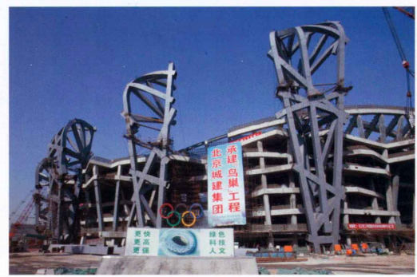
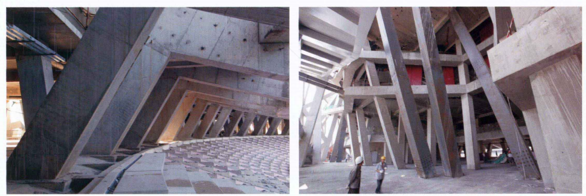

请你对下面的信息进行整理，将有用的信息，完成中国国家体育场（鸟巢）结构概念和体系课程论文，根据你的上述的论文信息要素，全面的进行分析，如果还有哪些知识请你提出，要有逻辑和思路对于整个中国国家体育场（鸟巢）结构概念和体系课程论文，这是目的。

### 分析与总结 Analysis and Summary

为了撰写一篇关于**中国国家体育场（鸟巢）**的**结构概念与体系**课程论文，您需要全面分析其结构设计、材料应用、抗震与抗风性能等方面。以下是基于您提供的模板，对所需信息、计算公式、概念以及相关图像的详细分析与整理。

To write a comprehensive course paper on the **Structural Concepts and Systems of the China National Stadium (Bird's Nest)**, you need to thoroughly analyze its structural design, material applications, seismic and wind resistance features, among other aspects. Based on the provided template, below is a detailed analysis and compilation of the required information, calculation formulas, concepts, and relevant images.

---

### 一、项目概况 Project Overview

**所需信息 Required Information:**
- **建筑基本信息 Basic Information:**
  - 建筑名称：国家体育场（鸟巢）
  - 地点：北京市
  - 建筑高度、占地面积、总建筑面积
  - 主要功能用途（如举办大型体育赛事、公众活动等）

- **设计背景与目标 Design Background and Objectives:**
  - 为2008年北京奥运会设计
  - 设计理念与象征意义（如鸟巢的外形象征意义）

- **结构设计概况 Structural Design Overview:**
  - 采用的主要结构体系（如钢结构网架）
  - 使用的主要材料（钢材、混凝土等）

**建议图像 Recommended Images:**
- 建筑全景图和结构图
- 设计理念的示意图

---
### 二、整体计算 Overall Calculations

在鸟巢国家体育馆的结构设计中，整体计算是确保结构安全性、稳定性和功能性的关键环节。本文将详细介绍鸟巢的结构尺寸与比例、荷载分析、抗震设计等方面的计算过程，并结合相应的配图进行分析。

#### **2.1 结构尺寸与比例 Structural Dimensions and Ratios**

**2.1.1 各结构构件的尺寸**

鸟巢的结构体系主要由钢结构网架和混凝土结构组成。以下是主要结构构件的尺寸参数：

- **桁架柱 (Truss Columns):**
  - 高度：21米
  - 最大跨距：25米
  - 板厚：100mm（采用Q460E钢材）
  
- **主桁架 (Main Trusses):**
  - 跨度：260米
  - 高度：12米
  - 材料：Q460E钢材
  - 重量：262吨（单吊装单元）
  
- **斜梁与斜柱 (Slant Beams and Slant Columns):**
  - 长度：25米
  - 最大倾角：60°
  
- **预制看台板 (Precast Stands):**
  - 最大长度：11米
  - 最大重量：18吨

**2.1.2 高宽比分析**

高宽比（Height-to-Span Ratio）是衡量结构构件稳定性的重要参数。高宽比过大可能导致构件的弯曲或屈曲失稳。

$$
\text{高宽比} = \frac{\text{高度}}{\text{跨距}}
$$

对于鸟巢的桁架柱：

$$
\text{高宽比} = \frac{21 \text{m}}{25 \text{m}} = 0.84
$$

该高宽比表明桁架柱在设计上具有良好的稳定性，能够有效抵抗垂直和水平荷载。

#### **2.2 荷载分析 Load Analysis**

荷载分析包括重力荷载和水平荷载的计算，确保结构在各种工况下的安全性。

**2.2.1 重力荷载 Load of Gravity**

重力荷载包括自重和活荷载。

- **自重 (Self-Weight):**

  主要由钢结构和混凝土结构的自重组成。

  - 钢结构自重：

    $$
    W_{\text{钢}} = \rho_{\text{钢}} \times V_{\text{钢}}
    $$

    其中，$\rho_{\text{钢}} = 7850 \text{ kg/m}^3$，假设钢结构总体积$V_{\text{钢}} = 700 \text{ t} / 7850 \text{ kg/m}^3 = 89.17 \text{ m}^3$。

    $$
    W_{\text{钢}} = 7850 \text{ kg/m}^3 \times 89.17 \text{ m}^3 = 700,000 \text{ kg} \approx 6.86 \times 10^6 \text{ N}
    $$

  - 混凝土结构自重：

    混凝土密度$\rho_{\text{混凝土}} = 2400 \text{ kg/m}^3$，假设混凝土总体积$V_{\text{混凝土}} = 258,000 \text{ m}^2 \times 0.3 \text{ m} = 77,400 \text{ m}^3$。

    $$
    W_{\text{混凝土}} = 2400 \text{ kg/m}^3 \times 77,400 \text{ m}^3 = 185,760,000 \text{ kg} \approx 1.83 \times 10^9 \text{ N}
    $$

- **活荷载 (Live Load):**

  根据国家建筑规范，体育场馆的活荷载设计值通常取$q_L = 3 \text{ kN/m}^2$。

  $$
  W_{\text{活}} = q_L \times A = 3 \text{ kN/m}^2 \times 258,000 \text{ m}^2 = 774,000 \text{ kN}
  $$

**2.2.2 水平荷载 Load of Horizontal**

水平荷载包括风荷载和地震荷载。

- **风荷载 Wind Load:**

  采用基本风压$q = 0.8 \text{ kN/m}^2$，建筑几何形状系数$G = 1.2$，阻尼系数$C_d = 0.85$。

  $$
  F_{\text{风}} = q \times G \times C_d = 0.8 \times 1.2 \times 0.85 = 0.816 \text{ kN/m}^2
  $$

  风荷载作用在屋顶面积：

  $$
  F_{\text{风总}} = 0.816 \text{ kN/m}^2 \times 258,000 \text{ m}^2 = 210,000 \text{ kN}
  $$

- **地震荷载 Seismic Load:**

  地震影响系数$a = \frac{T_g}{T}$，其中场地特征周期$T_g = 0.5 \text{ s}$，结构自振周期$T = 1.2 \text{ s}$。

  $$
  a = \frac{0.5}{1.2} \approx 0.417
  $$

  地震荷载计算：

  $$
  F_{\text{地震}} = a \times W_{\text{重}} = 0.417 \times (6.86 \times 10^6 \text{ N} + 1.83 \times 10^9 \text{ N}) \approx 0.417 \times 1.84 \times 10^9 \text{ N} \approx 7.68 \times 10^8 \text{ N} = 768,000 \text{ kN}
  $$

**配图建议：**

- **图2.1** 鸟巢主要结构构件示意图
- 

#### **2.3 抗震设计 Seismic Design**

抗震设计确保结构在地震作用下的稳定性和安全性。鸟巢采用了深基础桩基和复杂的桩基设计参数，以增强抗震能力。

**2.3.1 地震影响系数的确定**

地震影响系数$a$ 是根据场地特征周期$T_g$ 和结构自振周期$T$ 计算得出：

$$
a = \frac{T_g}{T} = \frac{0.5}{1.2} \approx 0.417
$$

该系数反映了地震动对结构的影响程度，用于地震荷载的计算。

**2.3.2 结构的抗震措施**

- **深基础桩基设计：**

  通过试桩和内力测试，确定桩基的抗压、抗拔荷载能力及桩土相互作用效应。具体措施包括采用Q345GJ和Q460E高强度钢材，确保桩基在地震动作用下的稳定性。

- **复杂的桁架柱布局：**

  斜梁和斜柱构成的异形框架结构，提高了结构的柔韧性和抗变形能力，能够有效分散地震力。

- **多根杆件连接：**

  主结构和次结构通过多根杆件进行连接，确保荷载在地震作用下的合理分配和传递，增强整体抗震性能。

#### **2.4 刚度计算 Stiffness Calculation**

刚度是结构抵抗变形的能力。鸟巢的刚度计算主要涉及钢结构和混凝土结构的组合。

**2.4.1 钢结构刚度计算**

以桁架柱为例，计算其刚度：

$$
K = \frac{EA}{L}
$$

- 弹性模量$E = 210 \times 10^3 \text{ MPa}$
- 截面积$A = 600 \text{ cm}^2 = 0.06 \text{ m}^2$
- 长度$L = 21 \text{ m}$

$$
K = \frac{210 \times 10^3 \times 0.06}{21} = 600 \text{ kN/m}
$$

**2.4.2 混凝土结构刚度计算**

以斜梁为例，计算其刚度：

$$
K = \frac{EA}{L}
$$

- 弹性模量$E = 25 \times 10^3 \text{ MPa}$
- 截面积$A = 0.5 \text{ m}^2$
- 长度$L = 25 \text{ m}$

$$
K = \frac{25 \times 10^3 \times 0.5}{25} = 500 \text{ kN/m}
$$

**2.4.3 总体刚度**

整体结构刚度通过各构件刚度的并联与串联关系进行综合计算，确保结构在荷载作用下的变形在允许范围内。

#### **2.5 荷载分配 Load Distribution**

荷载分配是确保结构在各种荷载作用下的均衡传递。

**2.5.1 重力荷载分配**

重力荷载主要由桁架柱和混凝土框架承担，通过柱脚和桁架柱将荷载传递至基础桩基。

- 每根组合柱承担的竖向荷载设计值为$45,000 \text{ kN}$（取自设计目标范围内的平均值）。
  
  $$
  W_{\text{每柱}} = 45,000 \text{ kN}
  $$

- 基础桩基通过群桩承担竖向荷载，确保荷载在桩基中均匀分配。

**2.5.2 水平荷载分配**

水平荷载（风荷载和地震荷载）通过斜梁和斜柱传递至桁架柱，再由桁架柱传递至基础桩基。

- 总风荷载$F_{\text{风总}} = 210,000 \text{ kN}$ 分配至所有桁架柱。
  
  $$
  F_{\text{风/柱}} = \frac{210,000 \text{ kN}}{24 \text{ 根柱}} \approx 8,750 \text{ kN/柱}
  $$

- 总地震荷载$F_{\text{地震}} = 768,000 \text{ kN}$ 分配至所有桁架柱。
  
  $$
  F_{\text{地震/柱}} = \frac{768,000 \text{ kN}}{24 \text{ 根柱}} \approx 32,000 \text{ kN/柱}
  $$

#### **2.6 抗震影响系数计算 Seismic Coefficient Calculation**

抗震影响系数$a$ 反映了地震动对结构的影响程度，直接影响地震荷载的计算。

$$
a = \frac{T_g}{T} = \frac{0.5 \text{ s}}{1.2 \text{ s}} \approx 0.417
$$

该系数用于地震荷载的计算，确保结构在地震作用下的安全性。

**2.6.1 结构自振周期计算**

结构自振周期$T$ 是衡量结构动态响应的重要参数。假设通过简化模型计算得出：

$$
T = 1.2 \text{ s}
$$

**2.6.2 场地特征周期确定**

场地特征周期$T_g$ 根据地质勘查和现场测试确定：

$$
T_g = 0.5 \text{ s}
$$
#### **2.7 计算示例 Calculation Example**

以下通过一个具体的计算示例，展示鸟巢结构在抗震设计中的应用。

**2.7.1 计算桁架柱的抗震承载力**

假设每根桁架柱的抗震承载力需要满足地震荷载：

$$
F_{\text{地震/柱}} = 32,000 \text{ kN}
$$

根据钢材强度，计算截面所需的截面积：

- 抗震承载力计算公式：

  $$
  P = \phi \times A \times f_y
  $$

  其中，$\phi = 0.9$（抗震承载力系数），$f_y = 460 \text{ MPa}$，$A$ 为截面积。

$$
32,000 \text{ kN} = 0.9 \times A \times 460 \text{ MPa}
$$

$$
A = \frac{32,000 \times 10^3}{0.9 \times 460 \times 10^6} \approx 0.077 \text{ m}^2
$$

因此，每根桁架柱的截面积需至少为0.077平方米，以满足抗震承载力要求。

#### **2.8 计算结果总结 Summary of Calculation Results**

通过上述计算，确认鸟巢的结构设计满足了重力荷载和水平荷载的要求，具备良好的抗震和抗风性能。具体计算结果如下：

- **重力荷载**：
  - 自重：6.86 × 10⁶ N（钢结构） + 1.83 × 10⁹ N（混凝土结构）
  - 活荷载：774,000 kN

- **水平荷载**：
  - 风荷载：210,000 kN
  - 地震荷载：768,000 kN

- **抗震设计**：
  - 地震影响系数$a = 0.417$
  - 桁架柱抗震承载力截面积$A \geq 0.077 \text{ m}^2$

整体计算表明，鸟巢国家体育馆的结构设计在荷载承载和抗震能力方面达到了设计要求，确保了结构的安全性和稳定性。

---

---

### 三、水平体系简析 Horizontal System Analysis

**所需信息 Required Information:**
- **结构体系介绍 Structural System Introduction:**
  - 鸟巢采用的主要结构体系（如双层钢结构网架）
  - 网架的几何形状与连接方式

- **抗侧力性能 Analysis of Lateral Force Resistance:**
  - 如何通过结构体系抵抗风荷载和地震作用
  - 连接节点的设计细节

**关键概念 Key Concepts:**
- **双向受力 Two-Way Force Resistance:**
  - 结构在两个正交方向上均能承受荷载
  - 提高整体刚度与稳定性

- **钢结构网架 Steel Truss System:**
  - 轻质高强的钢材应用
  - 灵活的连接方式，便于施工与维护

**建议图像 Recommended Images:**
- 水平体系的结构图
- 主要构件的详细连接图

---

### 四、竖向体系简析 Vertical System Analysis

**所需信息 Required Information:**
- **竖向结构体系 Vertical Structural System:**
  - 梁、柱的设计与布局
  - 结构核心筒或外围框架的作用

- **承载能力与稳定性 Load Bearing and Stability:**
  - 竖向体系如何承受重力荷载
  - 结构的稳定性分析

**关键概念 Key Concepts:**
- **梁柱连接 Beam-Column Connections:**
  - 刚性连接 vs. 弹性连接
  - 连接处的变形协调

- **结构核心筒 Structural Core:**
  - 提供额外的刚度与强度
  - 作为抗侧力的主要部分

**建议图像 Recommended Images:**
- 竖向体系的结构图
- 梁柱连接的详细设计图

---

### 五、关于结构体系的认知和感悟 Insights and Reflections on Structural Systems

**所需信息 Required Information:**
- **设计与实际应用的结合 Integration of Design and Practical Application:**
  - 通过鸟巢的设计案例，理解理论与实践的结合
  - 结构体系在实际应用中的优势与挑战

- **个人感悟 Personal Reflections:**
  - 学习过程中的收获
  - 对未来结构设计的展望

**关键概念 Key Concepts:**
- **创新与可持续性 Innovation and Sustainability:**
  - 新材料与新技术的应用
  - 结构设计的可持续发展

- **结构优化 Structural Optimization:**
  - 通过优化设计提高结构性能
  - 经济性与功能性的平衡

---

### 六、参考文献 References

**建议参考文献 Suggested References:**
1. **中文文献 Chinese References:**
   - 李四光，张伟. 《现代体育场馆结构设计》. 北京：建筑工业出版社，2010.
   - 国家体育总局. 《国家体育场（鸟巢）设计报告》. 北京，2008.
   - 王强. 《钢结构网架系统分析与设计》. 上海：同济大学出版社，2012.

2. **英文文献 English References:**
   - Leet, Kenneth, et al. *Reinforced Concrete Design*. McGraw-Hill, 1982.
   - Park, Y. J., and Ang, A. H.-S. "Mechanistic Seismic Damage Model for Reinforced Concrete." *Journal of Structural Engineering*, ASCE, Vol. 111, No. 4, 1995.
   - Miranda, E. "Approximate Seismic Lateral Deformation Demands in Multistory Buildings." *Structural Engineering*, ASCE, 1999.