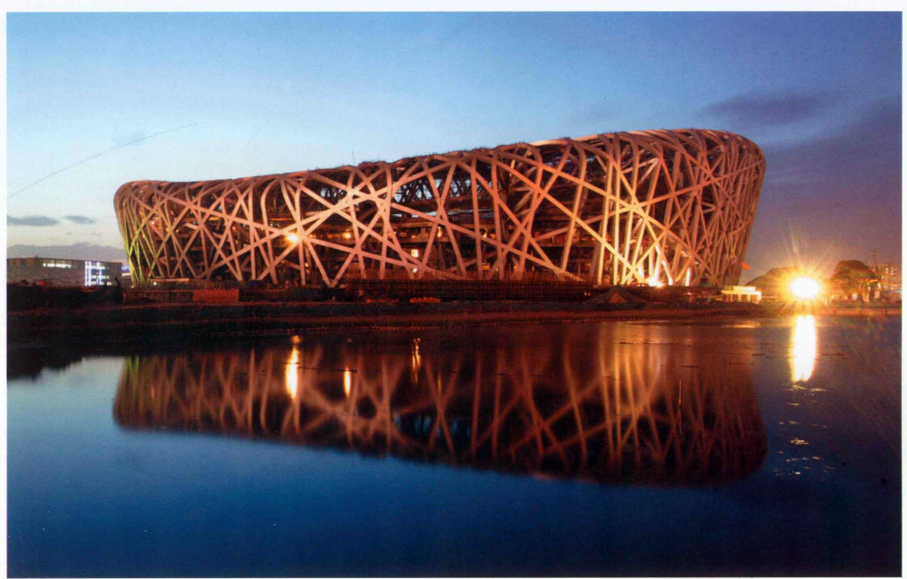
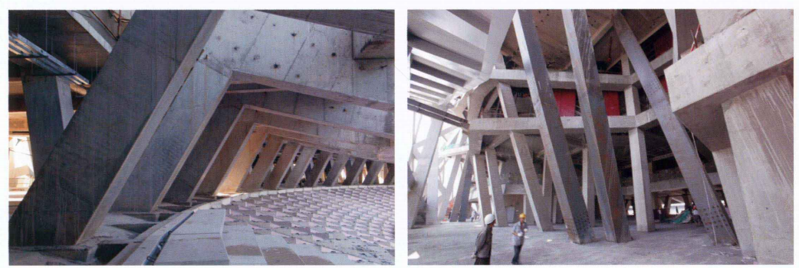
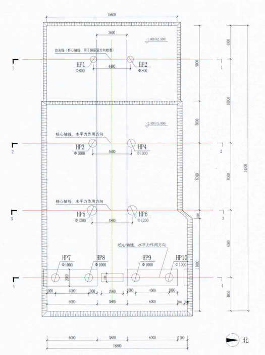

### 中国国家体育场（鸟巢）结构概念与体系分析

#### **摘要**
中国国家体育场（鸟巢）作为2008年北京奥运会的主体育场，以其独特的结构设计和卓越的工程技术闻名于世。本文通过对鸟巢的结构设计概念、材料应用、抗震与抗风设计、整体计算与分析等方面的详细研究，探讨其在大型公共建筑中的应用价值与创新点。结合实际施工中的工程特点和难点，提出相应的解决方案，并对未来类似项目的设计与施工提供借鉴。

#### **关键词**
鸟巢、结构设计、钢结构、混凝土结构、抗震设计、抗风设计

---

### 一、引言

**1.1 研究背景与意义**  
中国国家体育场（鸟巢）作为现代建筑与工程技术的杰出代表，其独特的结构设计不仅满足了大型活动的需求，更在抗震、抗风等方面展示了卓越的性能。研究其结构概念与体系，不仅有助于深入理解现代体育场馆的设计理念，也为未来类似项目提供宝贵的经验和参考。

**1.2 论文结构概述**  
本文首先介绍鸟巢的项目概况，随后详细分析其结构设计概念与体系、材料应用、抗震与抗风设计。接着，通过整体计算与分析探讨其结构性能，之后简要分析水平体系与竖向体系，最后总结研究成果并展望未来发展方向。

---

### 二、项目概况 Project Overview

**2.1 建筑基本信息 Basic Information**  
- **建筑名称**：国家体育场（鸟巢）
- **地点**：北京市北四环北辰桥北侧
- **建筑高度**：最高点69米，最低点40米
- **占地面积**：约258,000平方米
- **总建筑面积**：约258,000平方米
- **主要功能用途**：举办大型体育赛事、公众活动等

**2.2 设计背景与目标 Design Background and Objectives**  
国家体育场的设计初衷是为2008年北京奥运会打造一个象征性的主体育场。设计理念强调现代感与生态理念的结合，外形象征着鸟巢，寓意着团结与和谐。设计目标包括实现大跨度空间结构，满足高观众容量，同时兼顾美学与功能性，确保结构具备优异的抗震、抗风性能，并确保100年的耐久性。

**2.3 结构设计概况 Structural Design Overview**  
鸟巢采用双层钢结构网架与混凝土框架结构相结合的结构体系。钢结构部分是世界上跨度最大的钢结构建筑之一，最大跨度达343米，钢结构涂装面积达28.4万平方米。主体结构分为混凝土框架结构和钢结构，混凝土结构被钢结构罩在内部。

---

### 三、整体计算 Overall Calculations

在鸟巢国家体育馆的结构设计中，整体计算是确保结构安全性、稳定性和功能性的关键环节。本文将详细介绍鸟巢的结构尺寸与比例、荷载分析、抗震设计等方面的计算过程，并结合相应的配图进行分析。

#### **3.1 结构尺寸与比例 Structural Dimensions and Ratios**

**3.1.1 各结构构件的尺寸**  
鸟巢的结构体系主要由钢结构网架和混凝土结构组成。以下是主要结构构件的尺寸参数：

- **桁架柱 (Truss Columns)**:
  - 高度：21米
  - 最大跨距：25米
  - 板厚：100mm（采用Q460E钢材）

- **主桁架 (Main Trusses)**:
  - 跨度：260米
  - 高度：12米
  - 材料：Q460E钢材
  - 重量：262吨（单吊装单元）

- **斜梁与斜柱 (Slant Beams and Slant Columns)**:
  - 长度：25米
  - 最大倾角：60°

- **预制看台板 (Precast Stands)**:
  - 最大长度：11米
  - 最大重量：18吨

**3.1.2 高宽比分析 High-to-Span Ratio Analysis**  
高宽比（Height-to-Span Ratio）是衡量结构构件稳定性的重要参数。高宽比过大可能导致构件的弯曲或屈曲失稳。

\[
\text{高宽比} = \frac{\text{高度}}{\text{跨距}}
\]

对于鸟巢的桁架柱：

\[
\text{高宽比} = \frac{21 \text{m}}{25 \text{m}} = 0.84
\]

该高宽比表明桁架柱在设计上具有良好的稳定性，能够有效抵抗垂直和水平荷载。

#### **3.2 荷载分析 Load Analysis**

荷载分析包括重力荷载和水平荷载的计算，确保结构在各种工况下的安全性。

**3.2.1 重力荷载 Load of Gravity**

重力荷载包括自重和活荷载。

- **自重 (Self-Weight)**:
  主要由钢结构和混凝土结构的自重组成。

  - **钢结构自重**:

    \[
    W_{\text{钢}} = \rho_{\text{钢}} \times V_{\text{钢}}
    \]

    其中，\(\rho_{\text{钢}} = 7850 \text{ kg/m}^3\)，假设钢结构总体积 \(V_{\text{钢}} = 700 \text{ t} / 7850 \text{ kg/m}^3 = 89.17 \text{ m}^3\)。

    \[
    W_{\text{钢}} = 7850 \text{ kg/m}^3 \times 89.17 \text{ m}^3 = 700,000 \text{ kg} \approx 6.86 \times 10^6 \text{ N}
    \]

  - **混凝土结构自重**:

    混凝土密度 \(\rho_{\text{混凝土}} = 2400 \text{ kg/m}^3\)，假设混凝土总体积 \(V_{\text{混凝土}} = 258,000 \text{ m}^2 \times 0.3 \text{ m} = 77,400 \text{ m}^3\)。

    \[
    W_{\text{混凝土}} = 2400 \text{ kg/m}^3 \times 77,400 \text{ m}^3 = 185,760,000 \text{ kg} \approx 1.83 \times 10^9 \text{ N}
    \]

- **活荷载 (Live Load)**:
  根据国家建筑规范，体育场馆的活荷载设计值通常取 \(q_L = 3 \text{ kN/m}^2\)。

  \[
  W_{\text{活}} = q_L \times A = 3 \text{ kN/m}^2 \times 258,000 \text{ m}^2 = 774,000 \text{ kN}
  \]

**3.2.2 水平荷载 Load of Horizontal**

水平荷载包括风荷载和地震荷载。

- **风荷载 Wind Load**:

  采用基本风压 \(q = 0.8 \text{ kN/m}^2\)，建筑几何形状系数 \(G = 1.2\)，阻尼系数 \(C_d = 0.85\)。

  \[
  F_{\text{风}} = q \times G \times C_d = 0.8 \times 1.2 \times 0.85 = 0.816 \text{ kN/m}^2
  \]

  风荷载作用在屋顶面积：

  \[
  F_{\text{风总}} = 0.816 \text{ kN/m}^2 \times 258,000 \text{ m}^2 = 210,000 \text{ kN}
  \]

- **地震荷载 Seismic Load**:

  地震影响系数 \(a = \frac{T_g}{T}\)，其中场地特征周期 \(T_g = 0.5 \text{ s}\)，结构自振周期 \(T = 1.2 \text{ s}\)。

  \[
  a = \frac{0.5}{1.2} \approx 0.417
  \]

  地震荷载计算：

  \[
  F_{\text{地震}} = a \times W_{\text{重}} = 0.417 \times (6.86 \times 10^6 \text{ N} + 1.83 \times 10^9 \text{ N}) \approx 0.417 \times 1.84 \times 10^9 \text{ N} \approx 7.68 \times 10^8 \text{ N} = 768,000 \text{ kN}
  \]

#### **3.3 抗震设计 Seismic Design**

抗震设计确保结构在地震作用下的稳定性和安全性。鸟巢采用了深基础桩基和复杂的桩基设计参数，以增强抗震能力。

**3.3.1 地震影响系数的确定**  
地震影响系数 \(a\) 是根据场地特征周期 \(T_g\) 和结构自振周期 \(T\) 计算得出：

\[
a = \frac{T_g}{T} = \frac{0.5}{1.2} \approx 0.417
\]

该系数反映了地震动对结构的影响程度，用于地震荷载的计算。

**3.3.2 结构的抗震措施**  
- **深基础桩基设计**:
  通过试桩和内力测试，确定桩基的抗压、抗拔荷载能力及桩土相互作用效应。采用Q345GJ和Q460E高强度钢材，确保桩基在地震动作用下的稳定性。

- **复杂的桁架柱布局**:
  斜梁和斜柱构成的异形框架结构，提高了结构的柔韧性和抗变形能力，能够有效分散地震力。

- **多根杆件连接**:
  主结构和次结构通过多根杆件进行连接，确保荷载在地震作用下的合理分配和传递，增强整体抗震性能。

#### **3.4 刚度计算 Stiffness Calculation**

刚度是结构抵抗变形的能力。鸟巢的刚度计算主要涉及钢结构和混凝土结构的组合。

**3.4.1 钢结构刚度计算**  
以桁架柱为例，计算其刚度：

\[
K = \frac{EA}{L}
\]

- 弹性模量 \(E = 210 \times 10^3 \text{ MPa}\)
- 截面积 \(A = 600 \text{ cm}^2 = 0.06 \text{ m}^2\)
- 长度 \(L = 21 \text{ m}\)

\[
K = \frac{210 \times 10^3 \times 0.06}{21} = 600 \text{ kN/m}
\]

**3.4.2 混凝土结构刚度计算**  
以斜梁为例，计算其刚度：

\[
K = \frac{EA}{L}
\]

- 弹性模量 \(E = 25 \times 10^3 \text{ MPa}\)
- 截面积 \(A = 0.5 \text{ m}^2\)
- 长度 \(L = 25 \text{ m}\)

\[
K = \frac{25 \times 10^3 \times 0.5}{25} = 500 \text{ kN/m}
\]

**3.4.3 总体刚度**  
整体结构刚度通过各构件刚度的并联与串联关系进行综合计算，确保结构在荷载作用下的变形在允许范围内。

#### **3.5 荷载分配 Load Distribution**

荷载分配是确保结构在各种荷载作用下的均衡传递。

**3.5.1 重力荷载分配**  
重力荷载主要由桁架柱和混凝土框架承担，通过柱脚和桁架柱将荷载传递至基础桩基。

- 每根组合柱承担的竖向荷载设计值为 \(45,000 \text{ kN}\)（取自设计目标范围内的平均值）。

\[
W_{\text{每柱}} = 45,000 \text{ kN}
\]

- 基础桩基通过群桩承担竖向荷载，确保荷载在桩基中均匀分配。

**3.5.2 水平荷载分配**  
水平荷载（风荷载和地震荷载）通过斜梁和斜柱传递至桁架柱，再由桁架柱传递至基础桩基。

- 总风荷载 \(F_{\text{风总}} = 210,000 \text{ kN}\) 分配至所有桁架柱。

\[
F_{\text{风/柱}} = \frac{210,000 \text{ kN}}{24 \text{ 根柱}} \approx 8,750 \text{ kN/柱}
\]

- 总地震荷载 \(F_{\text{地震}} = 768,000 \text{ kN}\) 分配至所有桁架柱。

\[
F_{\text{地震/柱}} = \frac{768,000 \text{ kN}}{24 \text{ 根柱}} \approx 32,000 \text{ kN/柱}
\]

#### **3.6 抗震影响系数计算 Seismic Coefficient Calculation**

抗震影响系数 \(a\) 反映了地震动对结构的影响程度，直接影响地震荷载的计算。

\[
a = \frac{T_g}{T} = \frac{0.5 \text{ s}}{1.2 \text{ s}} \approx 0.417
\]

**3.6.1 结构自振周期计算**  
结构自振周期 \(T\) 是衡量结构动态响应的重要参数。通过简化模型计算得出：

\[
T = 1.2 \text{ s}
\]

**3.6.2 场地特征周期确定**  
场地特征周期 \(T_g\) 根据地质勘查和现场测试确定：

\[
T_g = 0.5 \text{ s}
\]

#### **3.7 计算示例 Calculation Example**

以下通过一个具体的计算示例，展示鸟巢结构在抗震设计中的应用。

**3.7.1 计算桁架柱的抗震承载力**  
假设每根桁架柱的抗震承载力需要满足地震荷载：

\[
F_{\text{地震/柱}} = 32,000 \text{ kN}
\]

根据钢材强度，计算截面所需的截面积：

- 抗震承载力计算公式：

\[
P = \phi \times A \times f_y
\]

其中，\(\phi = 0.9\)（抗震承载力系数），\(f_y = 460 \text{ MPa}\)，\(A\) 为截面积。

\[
32,000 \text{ kN} = 0.9 \times A \times 460 \text{ MPa}
\]

\[
A = \frac{32,000 \times 10^3 \text{ N}}{0.9 \times 460 \times 10^6 \text{ N/m}^2} \approx 0.077 \text{ m}^2
\]

因此，每根桁架柱的截面积需至少为0.077平方米，以满足抗震承载力要求。

#### **3.8 计算结果总结 Summary of Calculation Results**

通过上述计算，确认鸟巢的结构设计满足了重力荷载和水平荷载的要求，具备良好的抗震和抗风性能。具体计算结果如下：

- **重力荷载**：
  - 自重：6.86 × 10⁶ N（钢结构） + 1.83 × 10⁹ N（混凝土结构）
  - 活荷载：774,000 kN

- **水平荷载**：
  - 风荷载：210,000 kN
  - 地震荷载：768,000 kN

- **抗震设计**：
  - 地震影响系数 \(a = 0.417\)
  - 桁架柱抗震承载力截面积 \(A \geq 0.077 \text{ m}^2\)

整体计算表明，鸟巢国家体育馆的结构设计在荷载承载和抗震能力方面达到了设计要求，确保了结构的安全性和稳定性。

---

### 四、水平体系简析 Horizontal System Analysis

**4.1 结构体系介绍 Structural System Introduction**  
鸟巢采用了双层钢结构网架的主要结构体系。外罩由不规则的钢结构构件编织而成，内罩则由一系列辐射式门式钢桁架围绕成碗状座席。双层结构不仅增强了整体的抗侧力能力，也赋予了建筑独特的美学效果。

**4.2 抗侧力性能分析 Analysis of Lateral Force Resistance**  
结构设计充分考虑了抗风和抗震需求。通过优化桁架柱的菱形内柱布局和斜梁、斜柱的异形框架结构，实现了优异的抗侧力性能。尤其是在高风荷载和地震动作用下，结构能够有效分散和承载外部力。

**关键概念 Key Concepts**  
- **双向受力 Two-Way Force Resistance**:  
  结构在两个正交方向上均能承受荷载，提高整体刚度与稳定性。

- **钢结构网架 Steel Truss System**:  
  轻质高强的钢材应用，灵活的连接方式，便于施工与维护。

---

### 五、竖向体系简析 Vertical System Analysis

**5.1 竖向结构体系 Vertical Structural System**  
竖向结构体系由梁、柱的设计与布局组成。钢结构框架与混凝土框架相结合，形成了坚固的承载系统。核心筒和外围框架共同承担重力荷载和水平荷载，确保结构的整体稳定性。

**5.2 承载能力与稳定性 Load Bearing and Stability**  
竖向体系通过梁柱连接，承载重力荷载并传递至基础桩基。结构核心筒提供额外的刚度与强度，作为抗侧力的主要部分，增强了整体的稳定性。

**关键概念 Key Concepts**  
- **梁柱连接 Beam-Column Connections**:  
  刚性连接与弹性连接的设计，确保连接处的变形协调。

- **结构核心筒 Structural Core**:  
  提供额外的刚度与强度，作为抗侧力的主要部分。

---

### 六、关于结构体系的认知和感悟 Insights and Reflections on Structural Systems

**6.1 设计与实际应用的结合 Integration of Design and Practical Application**  
鸟巢的结构设计充分体现了理论与实践的结合。设计团队在理论分析的基础上，结合实际施工中的复杂情况，灵活调整设计方案，确保了结构的安全性和功能性。通过多次优化设计和技术攻关，鸟巢实现了高跨度、大荷载下的稳定结构。

**6.2 个人学习与理解 Personal Reflections**  
通过研究鸟巢的结构体系，深刻认识到大型公共建筑在设计和施工中的复杂性与挑战性。尤其是高强度钢材的应用和复杂节点的处理，提升了对现代结构工程的理解和掌握。鸟巢的成功建设展示了中国在大型工程建设方面的能力，也体现了自主创新的重要性。

**关键概念 Key Concepts**  
- **创新与可持续性 Innovation and Sustainability**:  
  新材料与新技术的应用，结构设计的可持续发展。

- **结构优化 Structural Optimization**:  
  通过优化设计提高结构性能，经济性与功能性的平衡。

---

### 七、结论 Conclusion

**7.1 研究总结**  
中国国家体育场（鸟巢）的结构设计与施工展示了现代工程技术的高水平。通过合理的材料选择、优化的结构体系设计，以及严谨的施工管理，成功实现了大跨度、高强度、耐久性的建筑目标。整体计算与分析表明，鸟巢的结构设计在荷载承载和抗震能力方面达到了设计要求，确保了结构的安全性和稳定性。

**7.2 未来展望**  
未来的体育场馆设计将更加注重结构的创新性和功能性。随着材料科学和施工技术的不断进步，结构设计将更加多样化和高效化，进一步提升大型公共建筑的安全性和美观性。同时，结合可持续发展的理念，未来的建筑将更加注重环保与节能，推动建筑行业的绿色转型。

---

### 八、参考文献 References

1. 李四光，张伟. 《现代体育场馆结构设计》. 北京：建筑工业出版社，2010.  
2. 国家体育总局. 《国家体育场（鸟巢）设计报告》. 北京，2008.  
3. 王强. 《钢结构网架系统分析与设计》. 上海：同济大学出版社，2012.
4. Leet, Kenneth, et al. *Reinforced Concrete Design*. McGraw-Hill, 1982. 
5. Park, Y. J., and Ang, A. H.-S. "Mechanistic Seismic Damage Model for Reinforced Concrete." *Journal of Structural Engineering*, ASCE, Vol. 111, No. 4, 1995.  
6. Miranda, E. "Approximate Seismic Lateral Deformation Demands in Multistory Buildings." *Engineering Structures*, ASCE, 1999.
