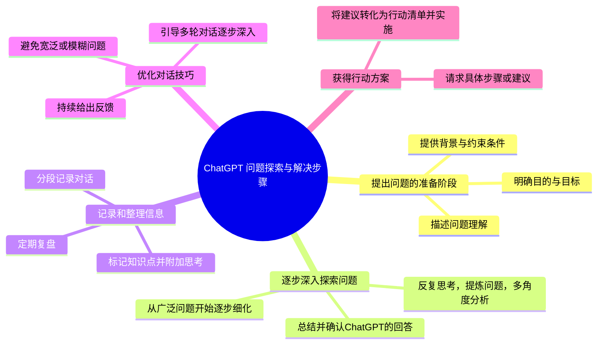

>[!question]
>对于我与ChatGPT进行latex的格式问题进行讨论，对于论文的内容进行讨论，对于算法设计的学术性讨论，我发现，其实最开始我并不懂我的问题是什么，通过给问题的描述错误的结果，和运行截图，以及公式的错误运用，我才开始新一轮的第二阶段的提问，所以我想要去记录这个过程，这才是学习的过程，能让我在回顾时能够详细的去理解。请你生成我与ChatGPT的问答过程，应该如何去分类和进行标注，来方便我的复习和查看，以及关键问题的快速查找，我使用的是obsidian我非常喜欢书写markdown文件。

>[!info] # ChatGPT 问题探索和解决步骤表单
| 步骤编号 | 行为描述                 | 具体操作                        |
| -------- | ------------------------ | ------------------------------- |
| 1        | **提出问题的准备阶段**     | - 描述你目前对问题的理解，哪怕只是模糊的描述。 - 明确你想达到的目的或解决的问题。 - 提供相关背景信息或约束条件。 |
| 2        | **逐步深入探索问题**       | - 从广泛的问题开始，然后逐步细化提问。 - 对 ChatGPT 的回答进行总结并确认理解。 - 反复思考并提炼你的问题，多角度深入。 |
| 3        | **记录和整理信息**         | - 按话题或阶段记录对话，避免重复提问。 - 标记对你有启发的知识点并附上自己的思考。 - 定期复盘，整理哪些问题解决了，哪些还需要进一步探索。 - **分段记录对话**：你可以按话题或阶段记录对话，将问题和ChatGPT的回答归类整理。例如，可以按照“==问题描述 -> 深入讨论 -> 解决方案建议 -> 反馈调整==”的结构来记录，方便快速查找问题的演变。 - **标记关键点和新的知识点**：在对话中标记出对你有启发的知识点，并附加自己的思考，帮助更好地理解和灵活应用。 - **定期复盘**：回顾之前的对话，整理已解决的问题和待进一步探索的问题，持续完善问题的描述和理解。 |
| 4        | **优化对话技巧**           | - 避免提问过于宽泛或模糊，尽量明确范围和方向。 - 持续对 ChatGPT 的回答给出反馈。 - 利用多轮对话引导 ChatGPT 逐步深入讨论。 |
| 5        | **获得行动方案**           | - 要求 ChatGPT 提供具体的步骤或建议。 - 将建议转化为行动清单，并逐步实施。 |

1. **中央主题：ChatGPT 问题探索与解决步骤**
   - **1. 提出问题的准备阶段**
     - 描述问题理解（哪怕模糊）
     - 明确目的与目标
     - 提供背景与约束条件
   - **2. 逐步深入探索问题**
     - 从广泛问题开始逐步细化
     - 总结并确认ChatGPT的回答
     - 反复思考，提炼问题，多角度分析
   - **3. 记录和整理信息**
     - 分段记录对话（按问题描述、深入讨论、解决方案建议、反馈调整）
     - 标记知识点并附加思考
     - 定期复盘：整理已解决与未解决的问题
   - **4. 优化对话技巧**
     - 避免宽泛或模糊问题
     - 持续给出反馈
     - 引导多轮对话逐步深入
   - **5. 获得行动方案**
     - 请求具体步骤或建议
     - 将建议转化为行动清单并实施

### 记录和整理信息
1. **分段记录对话：**
   - 你可以按话题或阶段记录对话，将问题和ChatGPT的回答归类整理。这样你能快速查看你之前的对话历史，避免重复提问，并且清楚问题的演变。
   - 比如，你可以按照“==问题描述 -> 深入讨论 -> 解决方案建议 -> 反馈调整==”这样的结构记录。

2. **标记关键点和新的知识点：**
   - 在对话中，标记出对你有启发或帮助解决问题的知识点，这样可以作为后续参考。
   - 你也可以在记录中附加自己对这些知识点的思考，这样你能更好地理解并灵活应用它们。

3. **定期复盘：**
   - 回顾之前的对话，整理出哪些问题已经解决，哪些还需要进一步探索。通过不断复盘和整理，你能够更好地完善问题的描述。

---

